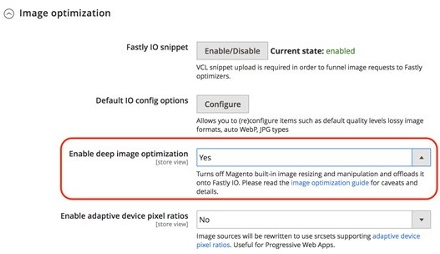

# Optimera Adobe Commerce-prestanda

## Geografisk plats för infrastruktur för AEM och Adobe Commerce

För att minska fördröjningen mellan den AEM utgivaren och Adobe Commerce GraphQL när du skapar sidor, bör den första etableringen av de två separata infrastrukturerna vara värd inom samma AWS-region (eller Azure-region). Den geografiska plats som väljs för båda molnen bör också vara närmast huvuddelen av kundbasen, så att GraphQL-begäranden på klientsidan hanteras från en geografiskt nära plats till majoriteten av era kunder.

## GraphQL-cachelagring i Adobe Commerce

När användarens webbläsare eller AEM utgivare anropar Adobe Commerce GraphQL cachelagras vissa anrop
i snabb takt. De frågor som cachelagras är vanligtvis de som innehåller icke-personuppgifter och som sannolikt inte ändras så ofta. Dessa är till exempel: kategorier, categoryList och produkter. De som uttryckligen inte cachelagras är de som ändras regelbundet och om de cachelagras kan medföra risker för personuppgifter och webbplatsåtgärder, t.ex. frågor som cart och customerPaymentTokens.

Med GraphQL kan du göra flera frågor i ett enda anrop. Det är viktigt att komma ihåg att om du anger en enda fråga som inte cachelagras med många andra som inte är cachelagrade, kommer Adobe Commerce att kringgå cacheminnet för alla frågor i samtalet. Detta bör beaktas av utvecklare när de kombinerar flera frågor för att säkerställa att frågor som kan vara tillgängliga inte oavsiktligt kringgås‡.

>[!NOTE]
>
> Mer information om cachelagrade och icke cachelagrade frågor finns i Adobe Commerce [dokumentation för utvecklare](https://devdocs.magento.com/guides/v2.4/graphql/caching.html).

## Platt tabell för katalog

Användning av platta tabeller för produkter och kategorier rekommenderas inte. Användning av den här funktionen kan leda till prestandadegraderingar och indexeringsproblem, och därför bör plattkatalog inaktiveras via Adobe Commerce-administratören i butiksdelen. Vissa tredjepartsmoduler och anpassningar kräver platta tabeller för att fungera korrekt - det rekommenderas att man gör en utvärdering för att förstå påverkan och risker som är förknippade med att man måste använda platta tabeller när man väljer att använda dessa tillägg eller anpassningar.

## Avskärning med fast ursprung

Som standard är Skärmsläckning med nollpunkt inte aktiverat. Syftet med att skydda Fastly:s ursprung är att minska trafiken direkt till Adobe handelns ursprung: När en begäran tas emot, söker en snabbkantsplats (eller &quot;point of presence&quot;/POP) efter cachelagrat innehåll och tillhandahåller det. Om den inte cachelagras fortsätter den till sköldens POP för att kontrollera om den cachelagras där (om innehållet tidigare har begärts även från en annan global POP cachelagras det). Om den inte cachelagras på Shield POP fortsätter den bara till origin-servern.

Skärmläge med snabb ursprung kan aktiveras i inställningarna för backend-konfigurationen för Adobe Commerce-administratören. Du bör välja en sköldplats som ligger närmast datacentralen för Adobe Commerce för bästa prestanda.

## Snabb bildoptimering

När du har aktiverat skärmsläckning med nollpunkt kan du även aktivera snabbbildsoptimering. Där produktkatalogbilder lagras i Adobe Commerce ger den här tjänsten möjlighet att avlasta alla resurskrävande omformningsprocesser för produktkatalogbilder till snabb och avslagen från Adobe Commerce. Svarstiderna för slutanvändarens sidor förbättras också för sidinläsningstider, eftersom bilderna omvandlas vid kantpositionen, vilket eliminerar fördröjning genom att minska antalet förfrågningar tillbaka till Adobe Commerce origin.

Snabb bildoptimering kan aktiveras genom&quot;aktivera djupbildsoptimering&quot; i Snabb konfiguration i admin, men först efter att originalskyddet har aktiverats. Mer information om konfigurationer för snabbbildsoptimering finns i Adobe Commerce [utvecklardokumentation](https://devdocs.magento.com/cloud/cdn/fastly-image-optimization.html).



## Inaktivera oanvända moduler

Om du kör Adobe Commerce utan huvud, endast betjänar begäranden via GraphQL-slutpunkten och inga frontlagersidor hanteras direkt från Adobe Commerce, blir många moduler överflödiga och används inte. Genom att inaktivera oanvända moduler blir kodbasen för Adobe Commerce mindre, mindre komplex och kan därför ge prestandaförbättringar. Inaktivering av moduler i Adobe Commerce kan hanteras med hjälp av disposition. Vilka moduler som kan inaktiveras beror på kraven för er webbplats och därför kan ingen rekommenderad lista anges eftersom den är specifik för varje kunds implementering av Adobe Commerce.

## Aktivera MySQL- och Redis-anslutning

Som standard är MySQL- och Redis Slave-anslutningar inte aktiverade i Adobe Commerce i molnet. Det beror på att de här inställningarna bara passar kunder som förväntar sig mycket hög belastning. Cross-AZ-fördröjningen (cross-Availability Zones) är högre med slavanslutningar aktiverade, och den här inställningen minskar i själva verket prestanda för en Adobe Commerce i molninstans om instansen bara får regelbundna lastnivåer.

Om en extrem belastning förväntas vid instansen av Adobe Commerce, kommer aktivering av den överordnad slavfunktionen för MySQL och Redis att hjälpa till med prestandan genom att sprida ut belastningen på MySQL-databasen eller Redis över olika noder.

Som vägledning kan du när du aktiverar slavanslutningar i miljöer med normal belastning sänka prestanda med 10-15 %. Men i kluster med hög belastning och trafik ökar prestandan med cirka 10-15 %. Därför är det viktigt att du läser in testmiljön med förväntade trafiknivåer för att utvärdera om den här inställningen skulle vara bra för prestandatiderna under belastningen.

Om du vill aktivera/inaktivera slavanslutningar för mysql och redis bör du redigera din `.magento.env.yaml`-fil så att den innehåller följande:

```
stage:
  deploy:
    MYSQL_USE_SLAVE_CONNECTION: true
    REDIS_USE_SLAVE_CONNECTION: true
```

För skalad arkitektur (delad arkitektur - se nedan) bör Redis-slavanslutningar inte aktiveras eftersom detta orsakar fel. Om arkitekturen är delad bör du istället implementera L2-cachning för Redis.

## Byta till en Adobe Commerce på en skalad (delad) molnarkitektur

Om, efter alla konfigurationer ovan, lasttestresultat eller analys av den aktiva infrastrukturens prestanda fortfarande visar att lastnivåerna till Adobe Commerce ligger på en nivå som konsekvent maximerar CPU och andra systemresurser, bör en övergång till en skalad (delad) arkitektur övervägas.

Med en Pro-standardarkitektur finns det tre noder, som vart och ett innehåller en fullständig teknisk stack. Genom att konvertera till en arkitektur med delad nivå ändras detta till minst 6 noder: varav 3 innehåller Elasticsearch, MariaDB, Redis och andra bastjänster. de andra 3 för bearbetning av webbtrafik innehåller phppm och NGINX. Det finns större skalningsmöjligheter med delad nivå: Kärnnoder som innehåller databaser kan skalas lodrätt. webbnoder kan skalas vågrätt och lodrätt, vilket ger stor flexibilitet att utöka infrastrukturen on demand under en viss period med hög belastning och på noder där de extra resurserna behövs.

Om du har beslutat att byta till en arkitektur med delad nivå på grund av stora lastförväntningar för din webbplats, bör du diskutera med din Customer Success Manager vilka steg som ska aktiveras.