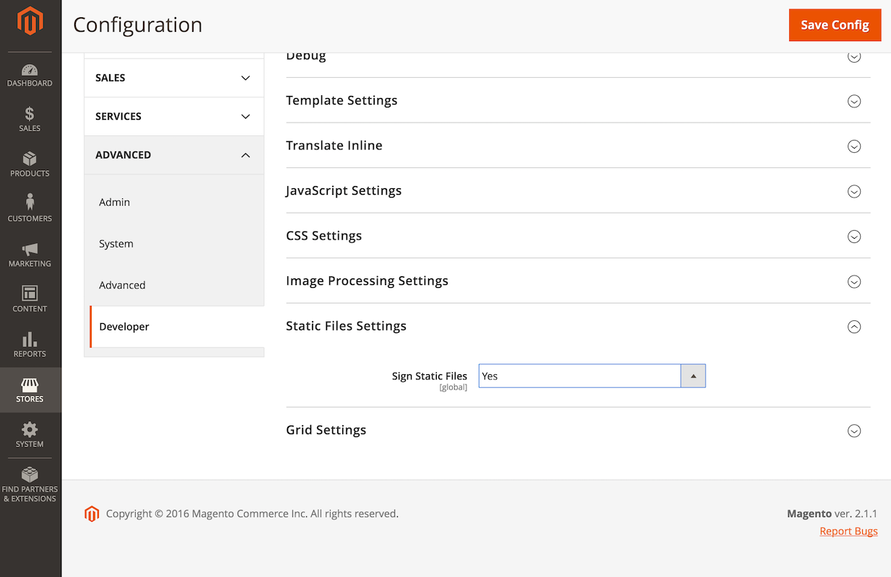

# Cache för statiskt innehåll

För att förbättra prestanda anger Commerce `Expires` rubriker för statiska resurser, som bilder, JavaScript och CSS-filer.
Ange `Expires` för en statisk resurs anger för webbläsaren att cachelagra resursen på den URL:en och skicka den cachelagrade versionen tills den går ut.
Detta är en vanlig [bästa praxis](https://developer.yahoo.com/performance/rules.html#expires=) för cachelagring av statiska resurser.

När webbläsaren cachelagrar en statisk resurs och resursändringarna på servern måste du rensa webbläsarens cache så att den kan hämta den nya versionen.
Manuell rensning av webbläsarens cache fungerar om du är en [webbplats](https://glossary.magento.com/website) -administratör, men det här är inte en lämplig förfrågan till dina användare när du vill att de ska hämta nya versioner av en statisk resurs.

## Statisk innehållssignering

[Statiskt innehåll](https://glossary.magento.com/static-content) signering är en Commerce-funktion som gör att du kan göra webbläsarcachen ogiltig för statiska resurser.
Commerce uppnår detta genom att lägga till en distributionsversion till URL:en för [statiska filer](https://glossary.magento.com/static-files).

Följande är ett exempel på en URL som signerats med en version:

```terminal
http://magento2.com/pub/static/version1475604434/frontend/Magento/luma/en_US/images/logo.svg
```

När du kör kommandot [`setup:static-content:deploy`](../cli/static-view-file-deployment.md) för att distribuera statiskt innehåll ändrar Commerce automatiskt distributionsversionen.
Detta ändrar URL:en för de statiska filerna och tvingar webbläsaren att läsa in den nya versionen av filerna.

Commerce aktiverar den här funktionen som standard, och Adobe rekommenderar att funktionen är aktiverad för att förhindra problem som rör webbläsare som kan hantera gamla statiska resurser.

Du hittar konfigurationen för den här funktionen i [**[!UICONTROL Stores]**> Inställningar > Konfiguration >**[!UICONTROL Advanced]**>**[!UICONTROL Developer]**>**[!UICONTROL Static Files Settings]**](https://docs.magento.com/user-guide/system/static-file-signature.html).



Bestäm status:

```bash
bin/magento config:show dev/static/sign
```

Aktivera eller inaktivera signering av statiskt innehåll:

```bash
bin/magento config:set dev/static/sign <value>
```

Plats `<value>` är 1 (aktiverad) eller 0 (inaktiverad).

## Versionssignaturer

Versionssignaturen läggs till som en sökvägskomponent direkt efter bas-URL:en för statiska vyfiler för att bevara integriteten för relativa URL:er för statiska resurser.
Detta tvingar även webbläsaren att tolka en relativ URL till rätt signerade källa samtidigt som innehållet behålls oberoende av om signaturvärdet finns eller inte.

När en webbläsare begär en signerad källa från servern använder servern URL-omskrivningar för att ta bort signaturkomponenten från URL:en.

## Användning under distributioner

När du har uppgraderat eller ändrat statiska resurser måste du köra `setup:static-content:deploy` för att distribuera versionen och uppdatera det statiska innehållet, vilket tvingar webbläsaren att läsa in de uppdaterade resurserna.

Om du distribuerar kod på en separat server och flyttar den till produktion med hjälp av en koddatabas för att minska driftstoppen, måste du också lägga till filen `pub/static/deployed_version.txt` till databasen.
Den här filen innehåller den nya versionen för det distribuerade statiska innehållet.
