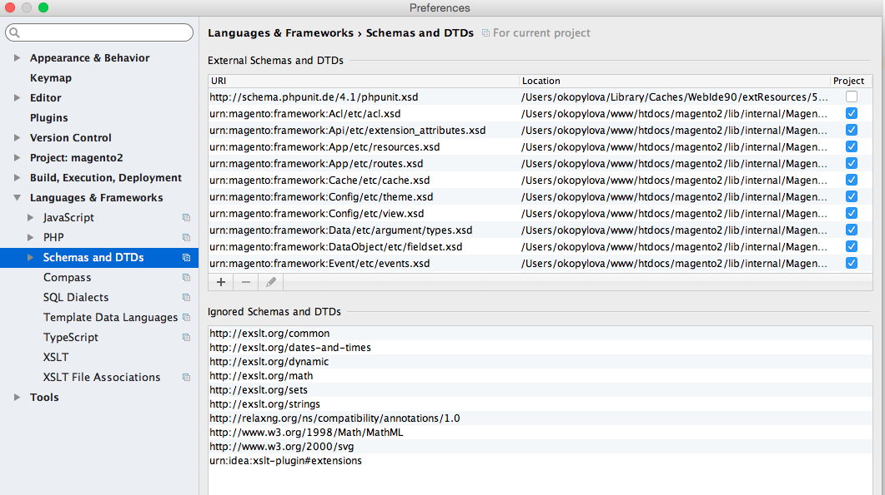

# Översikt över URN-markering

{{file-system-owner}}

Commerce-koden refererar alla XSD-scheman som [URI:er (Uniform Resource Names)](https://www.ietf.org/rfc/rfc2141.txt). Om du utvecklar kod och behöver referera till XSD:er konfigurerar det här kommandot din integrerade utvecklingsmiljö (IDE) så att URN:er känns igen och markeras. Detta underlättar utvecklingen.

Som standard är en IDE som PhpStorm inte konfigurerad för att identifiera URN:er och därför visas de i röd text enligt följande:


Med kommandot `bin/magento dev:urn-catalog:generate` kan din IDE (för närvarande bara PhpStorm och Visual Studio Code) identifiera och markera URN:er enligt följande:


Kommandot skapar i synnerhet följande PhpStorm-konfiguration:



## Konfigurera din IDE

För närvarande stöds bara PhpStorm och Visual Studio Code.

Kommandosyntax:

```bash
bin/magento dev:urn-catalog:generate <path>
```

Där `<path>` är sökvägen till din PhpStorm `misc.xml`-fil, som finns i förhållande till projektets rot. Vanligtvis är `<path>` `.idea/misc.xml`.

>[!INFO]
>
>Om du vill att dina scheman och DTD:n ska vara aktuella kör du kommandot `dev:urn-catalog:generate` varje gång du lägger till, ändrar eller tar bort Commerce 2-moduler som innehåller `*.xsd`-filer.
