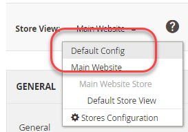

# Exempel med miljövariabler

I det här exemplet visas hur du ställer in delade, systemspecifika och känsliga värden i utvecklingssystemet och sedan anger alla värden i produktionssystemet med en kombination av den delade konfigurationen, `config.php`och PHP-miljövariabler.

Dessa konfigurationsinställningar kan delas mellan utvecklings- och produktionssystemen:

Momsnummer och butiksnamn från **Lager** > Inställningar > **Konfiguration** > Allmänt > **Allmänt**

De här konfigurationsinställningarna är antingen systemspecifika eller känsliga, vilket anges:

- Skicka e-post till (känslig) från **Lager** > Inställningar > **Konfiguration** > Allmänt > **Kontakter**
- Standarddomän för e-post (systemspecifik) från **Lager** > Inställningar > **Konfiguration** > Kunder > **Kundkonfiguration** > **Skapa nya kontoalternativ**

Du kan använda samma procedur för att konfigurera inställningar i följande referenser:

- [Referens för känsliga och systemspecifika konfigurationssökvägar](../reference/config-reference-sens.md)
- [Referens för sökvägar för betalningskonfiguration](../reference/config-reference-payment.md)
- [Allmän referens för konfigurationssökvägar](../reference/config-reference-general.md)
- [Referens för konfigurationssökvägar för Commerce Enterprise B2B-tillägg](../reference/config-reference-b2b.md)

## Innan du börjar

Innan du börjar ska du konfigurera filsystembehörigheter och ägarskap enligt [Krav för utvecklings-, bygg- och produktionssystem](../deployment/prerequisites.md).

## Antaganden

Det här avsnittet innehåller ett exempel på hur du ändrar konfigurationen av produktionssystemet. Du kan välja olika konfigurationsalternativ om du vill.

I det här exemplet förutsätts följande:

- Du använder Git-källkontrollen
- Utvecklingssystemet är tillgängligt i en Git-fjärrdatabas med namnet `mconfig`
- Din Git-arbetsgrupp heter `m2.2_deploy`

## Steg 1: Ange konfigurationen i utvecklingssystemet

Så här anger du standardinställningar för nationella inställningar och viktenheter i utvecklingssystemet:

1. Logga in på Admin.
1. Klicka **Lager** > Inställningar > **Konfiguration** > Allmänt > **Allmänt**.
1. Om du har fler än en webbplats tillgänglig använder du **Butiksvy** i det övre vänstra hörnet för att växla till en annan webbplats som bilden nedan visar.

   

1. Expandera i den högra rutan **Butiksinformation**.
1. Rensa **Använd standard** kryssrutan bredvid **Momsnummer** fält.
1. Ange en siffra i fältet (till exempel `12345`).
1. I **Butiksnamn** fält, ange ett värde (som `My Store`).
1. Klicka **Spara konfiguration**.
1. Använd **Butiksvy** listan för att välja **Standardkonfiguration** som bilden nedan visar.

   

1. Klicka på under Allmänt i den vänstra navigeringen **Kontakter**.
1. Rensa **Använd standard** kryssrutan bredvid **Skicka e-post till** fält.
1. Ange en e-postadress i fältet.
1. Klicka **Spara konfiguration**.
1. Klicka på Kunder > **Kundkonfiguration**.
1. Expandera i den högra rutan **Skapa nya kontoalternativ**.
1. Rensa **Använd systemvärde** kryssrutan bredvid **Standarddomän för e-post** fält.
1. Ange ett domännamn i fältet.
1. Klicka **Spara konfiguration**.
1. Rensa cachen om du uppmanas till det.

## Steg 2: Uppdatera konfigurationen

Nu när du har ändrat konfigurationen i Admin skriver du den delade konfigurationen till en fil enligt beskrivningen i det här avsnittet.

{{$include /help/_includes/config-save-config.md}}

Observera detta trots att `app/etc/env.php` (den systemspecifika konfigurationen) uppdaterades, checka inte in den i källkontrollen. Du kommer att skapa samma konfigurationsinställningar i produktionssystemet senare under den här proceduren.

## Steg 3: Uppdatera ditt byggsystem och generera filer

Nu när du har implementerat ändringarna i den delade konfigurationen för källkontroll kan du dra in dessa ändringar i ditt build-system, kompilera kod och generera statiska filer. Det sista steget är att föra över dessa ändringar till produktionssystemet.

{{$include /help/_includes/config-update-build-system.md}}

## Steg 4: Uppdatera produktionssystemet

Det sista steget i processen är att uppdatera produktionssystemet. Du måste göra det i två delar:

- Uppdatera känsliga och systemspecifika inställningar
- Uppdatera de delade inställningarna

### Uppdatera känsliga och systemspecifika inställningar

Om du vill ange känsliga och systemspecifika inställningar med hjälp av systemvariabler måste du känna till följande:

- Omfång för varje inställning

  Om du följde instruktionerna i steg 1 är omfattningen för Skicka e-post till global (d.v.s. standardkonfigurationsomfånget) och omfattningen för standarddomänen för e-post är webbplats.

  Du måste känna till webbplatsens kod för att kunna ställa in standardvärdet för e-postdomän. Se [Använd miljövariabler för att åsidosätta konfigurationsinställningar](../reference/override-config-settings.md#environment-variables) om du vill ha mer information om hur du hittar det.

- Konfigurationssökväg för varje inställning

  Konfigurationssökvägarna som används i det här exemplet följer:

  | Inställningsnamn | Konfigurationssökväg |
  |--------------|--------------|
  | Skicka e-post till | `contact/email/recipient_email` |
  | Standarddomän för e-post | `customer/create_account/email_domain` |

  Du hittar alla känsliga och systemspecifika konfigurationssökvägar i [Referens för känsliga och systemspecifika konfigurationssökvägar](../reference/config-reference-sens.md).

#### Konvertera konfigurationssökvägar till variabelnamn

Som beskrivs i [Använd miljövariabler för att åsidosätta konfigurationsinställningar](../reference/override-config-settings.md#environment-variables)är variabelformatet:

```text
<SCOPE>__<SYSTEM__VARIABLE__NAME>
```

Värdet för `<SCOPE>` är `CONFIG__DEFAULT__` för globalt omfång eller `CONFIG__WEBSITES__<WEBSITE CODE>` för webbplatsomfång.

För att hitta värdet för `<SYSTEM__VARIABLE__NAME>`, ersätt varje `/` i konfigurationssökvägen med två understreck.

Variabelnamnen följer:

| Namn | Konfigurationssökväg | Variabelnamn |
|--------------|--------------|--------------|
| Skicka e-post till | `contact/email/recipient_email` | `CONFIG__DEFAULT__CONTACT__EMAIL__RECIPIENT_EMAIL` |
| Standarddomän för e-post | `customer/create_account/email_domain` | `CONFIG__WEBSITES__BASE__CUSTOMER__CREATE_ACCOUNT__EMAIL_DOMAIN` |

>[!INFO]
>
>Tabellen ovan innehåller ett exempel på webbplatskod, `BASE`, för konfigurationsinställningen Standarddomän för e-post. Ersätt `BASE` med rätt webbplatskod för din butik.

#### Ange variabler med hjälp av systemvariabler

Du kan ange variabelvärden i `index.php` med följande format:

```php
$_ENV['VARIABLE'] = 'value';
```

**Ange variabelvärden**:

1. Logga in i produktionssystemet som, eller växla till, ägare av filsystemet.
1. Öppna `<Commerce root dir>/pub/index.php` i en textredigerare.
1. Anywhere `index.php`, anger värden för variablerna som liknar följande:

   ```php
   $_ENV['CONFIG__DEFAULT__CONTACT__EMAIL__RECIPIENT_EMAIL'] = 'myname@example.com';
   $_ENV['CONFIG__WEBSITES__BASE__CUSTOMER__CREATE_ACCOUNT__EMAIL_DOMAIN'] = 'magento.com';
   ```

1. Spara ändringarna i `pub/index.php` och avsluta textredigeraren.
1. Fortsätt med nästa avsnitt.

### Uppdatera de delade inställningarna

I det här avsnittet beskrivs hur du kan hämta alla ändringar du har gjort i dina utvecklings- och konstruktionssystem, vilket uppdaterar de delade konfigurationsinställningarna (Butiksnamn och Momsnummer).

{{$include /help/_includes/config-update-prod-system.md}}

### Verifiera konfigurationsinställningar i administratören

I det här avsnittet beskrivs hur du kan verifiera konfigurationsinställningarna i produktionssystemadministratören.

**Verifiera konfigurationsinställningarna**:

1. Logga in i produktionssystemets administratör.
1. Klicka **Lager** > Inställningar > **Konfiguration** > Allmänt > **Allmänt**.
1. Använd **Butiksvy** i det övre vänstra hörnet för att byta till en annan webbplats.

   De alternativ för delad konfiguration som du anger i utvecklingssystemet visas på ungefär följande sätt.

   

   >[!INFO]
   >
   >The **Butiksnamn** -fältet kan redigeras i webbplatsens omfång, men om du växlar till standardomfånget för konfiguration går det inte att redigera det. Detta är resultatet av hur du anger alternativen i utvecklingssystemet. Värdet för **Momsnummer** går inte att redigera i webbplatsens omfång.

1. Om du inte redan har gjort det växlar du till Standardkonfigurationsomfång.
1. Klicka på under Allmänt i den vänstra navigeringen **Kontakter**.

   The **Skicka e-post till** -fältet går inte att redigera, vilket visas i bilden nedan. Det här är en känslig inställning.

   

1. Klicka på Kunder > **Kundkonfiguration**.
1. Expandera i den högra rutan **Skapa nya kontoalternativ**.

   Värdet för **Standarddomän för e-post** visas enligt följande. Detta är en systemspecifik inställning.

   
