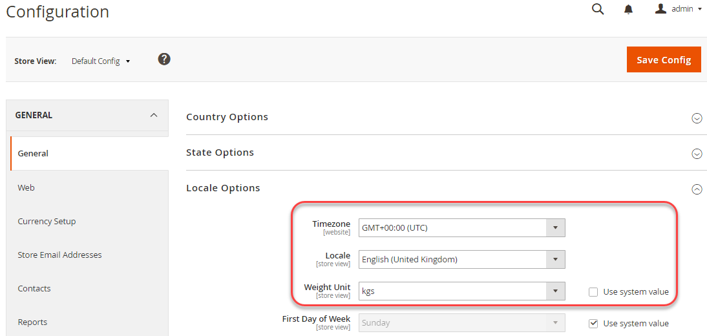

# Exempel med en delad konfiguration

I det här exemplet visas hur du ändrar följande inställningar i utvecklingssystemet, uppdaterar den delade konfigurationsfilen, `config.php`, i ditt byggsystem och implementera samma inställningar i ditt produktionssystem:

- Tidszon
- Viktenhet

De här inställningarna är tillgängliga i Admin i **Lager** > Inställningar > **Konfiguration** > Allmänt > **Allmänt**.

Du kan använda samma procedur för att konfigurera icke-känsliga, icke-systemspecifika inställningar i följande referenser:

- [Referens för andra konfigurationssökvägar](../reference/config-reference-general.md)
- [Referens för sökvägar för betalningskonfiguration](../reference/config-reference-payment.md)
- [Referens för konfigurationssökvägar för Commerce Enterprise B2B-tillägg](../reference/config-reference-b2b.md)

## Innan du börjar

Innan du börjar ska du konfigurera filsystembehörigheter och ägarskap enligt [Krav för utveckling, bygge och produktion av system](../deployment/prerequisites.md).

## Antaganden

Det här avsnittet innehåller ett exempel på hur du ändrar konfigurationen av produktionssystemet. Du kan välja olika konfigurationsalternativ om du vill.

I det här exemplet förutsätts följande:

- Du använder Git-källkontrollen
- Utvecklingssystemet är tillgängligt i en Git-fjärrdatabas med namnet `mconfig`
- Din Git-arbetsgrupp heter `m2.2_deploy`

## Steg 1: Ange konfigurationen i utvecklingssystemet

Så här anger du tidszon- och viktenheter i utvecklingssystemet:

1. Logga in på Admin.
1. Klicka **Lager** > Inställningar > **Konfiguration** > Allmänt > **Allmänt**.
1. Expandera i den högra rutan **Nationella inställningar**.

   I bilden nedan visas ett exempel.

   

1. Från **Tidszon** lista, klicka på **GMT+00.00 (UTC)**.
1. Rensa **Använd systemvärde** kryssrutan bredvid **Viktenhet** fält.
1. Från **Viktenhet** lista, klicka på **kgs**.
1. Klicka **Spara konfiguration**.
1. Rensa cachen om du uppmanas till det.

## Steg 2: Uppdatera den delade konfigurationen

Generera den delade konfigurationsfilen, `app/etc/config.php`, i ditt utvecklingssystem och överför det med hjälp av källkontroll till ditt byggsystem, vilket beskrivs i det här avsnittet.

{{$include /help/_includes/config-save-config.md}}

## Steg 3: Uppdatera ditt byggsystem och generera filer

Nu när du har implementerat ändringarna i den delade konfigurationen för källkontroll kan du dra in dessa ändringar i ditt build-system, kompilera kod och generera statiska filer. Det sista steget är att föra över dessa ändringar till produktionssystemet. Resultatet blir att produktionssystemets konfiguration matchar utvecklingssystemet.

{{$include /help/_includes/config-update-build-system.md}}

## Steg 4: Uppdatera produktionssystemet

Det sista steget i processen är att uppdatera produktionssystemet från källkontroll. Då uppdateras alla ändringar du har gjort i dina utvecklings- och konstruktionssystem, vilket innebär att ditt produktionssystem är helt uppdaterat.

{{$include /help/_includes/config-update-prod-system.md}}

### Verifiera ändringarna i administratören

**Verifiera att dessa inställningar inte kan redigeras i Admin**:

1. Logga in på Admin.
1. Klicka **Lager** > Inställningar > **Konfiguration** > Allmänt > **Allmänt**.
1. Expandera i den högra rutan **Nationella inställningar**.

   De alternativ du just anger visas enligt följande:

   

>[!INFO]
>
>Använd knappen [`magento config:set --lock` kommando](../cli/set-configuration-values.md).
