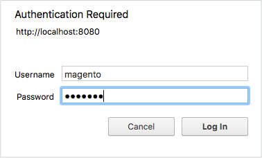

# Secure cron PHP

Det här avsnittet handlar om att skydda `pub/cron.php` för att förhindra att den används i ett fientligt utnyttjande. Om du inte skyddar kron kan alla användare köra cron för att attackera ditt Commerce-program.

Kronijobbet kör flera schemalagda aktiviteter och är en viktig del av din Commerce-konfiguration. Schemalagda aktiviteter omfattar, men är inte begränsade till:

- Omindexering
- Generera e-postmeddelanden
- Generera nyhetsbrev
- Genererar platskartor

>[!INFO]
>
>Se [Konfigurera och kör cron](../cli/configure-cron-jobs.md#run-cron-from-the-command-line) om du vill ha mer information om cron-grupper.

Du kan köra ett cron-jobb på följande sätt:

- Använda [`magento cron:run`](../cli/configure-cron-jobs.md#run-cron-from-the-command-line) kommandot antingen från kommandoraden eller på en crontab
- Åtkomst `pub/cron.php?[group=<name>]` i en webbläsare

>[!INFO]
>
>Du behöver inte göra något om du använder [`magento cron:run`](../cli/configure-cron-jobs.md#run-cron-from-the-command-line) för att köra cron eftersom en annan process som redan är säker används.

## Säker kron med Apache

I det här avsnittet beskrivs hur du skyddar kron med grundläggande HTTP-autentisering med Apache. Dessa instruktioner är baserade på Apache 2.2 med CentOS 6. Mer information finns i följande resurser:

- [Självstudiekurs om autentisering och autentisering av Apache 2.2](https://httpd.apache.org/docs/2.2/howto/auth.html)
- [Självstudiekurs om autentisering och behörighet i Apache 2.4](https://httpd.apache.org/docs/2.4/howto/auth.html)

### Skapa en lösenordsfil

Av säkerhetsskäl kan du hitta lösenordsfilen var som helst, förutom webbserverns dokumentmapp. I det här exemplet lagras lösenordsfilen i en ny katalog.

Ange följande kommandon som en användare med `root` behörighet:

```bash
mkdir -p /usr/local/apache/password
```

```bash
htpasswd -c /usr/local/apache/password/passwords <username>
```

Plats `<username>` kan vara webbserveranvändare eller en annan användare. I det här exemplet använder vi webbserveranvändaren, men det är upp till dig att välja användare.

Följ instruktionerna på skärmen för att skapa ett lösenord för användaren.

Om du vill lägga till en annan användare i lösenordsfilen anger du följande kommando som en användare med `root` behörighet:

```bash
htpasswd /usr/local/apache/password/passwords <username>
```

### Lägga till användare för att skapa en auktoriserad cron-grupp (valfritt)

Du kan göra det möjligt för flera användare att köra cron genom att lägga till dessa användare i lösenordsfilen, inklusive en gruppfil.

Så här lägger du till en annan användare i lösenordsfilen:

```bash
htpasswd /usr/local/apache/password/passwords <username>
```

Om du vill skapa en auktoriserad grupp skapar du en gruppfil var som helst utanför webbserverns dokumentmapp. Gruppfilen anger namnet på gruppen och användarna i gruppen. I det här exemplet är gruppnamnet `MagentoCronGroup`.

```bash
vim /usr/local/apache/password/group
```

Innehåll i filen:

```text
MagentoCronGroup: <username1> ... <usernameN>
```

### Säker cron in `.htaccess`

För att skydda cron in `.htaccess` fil:

1. Logga in på Commerce-servern som ägare av filsystemet eller växla till den.
1. Öppna `<magento_root>/pub/.htaccess` i en textredigerare.

   (Därför `cron.php` finns i `pub` katalog, redigera detta `.htaccess` endast.)

1. _Åtkomst till kron för en eller flera användare._ Ersätt befintlig `<Files cron.php>` -direktiv med följande:

   ```conf
   <Files cron.php>
      AuthType Basic
      AuthName "Cron Authentication"
      AuthUserFile /usr/local/apache/password/passwords
      Require valid-user
   </Files>
   ```

1. _Kronåtkomst för en grupp._ Ersätt befintlig `<Files cron.php>` -direktiv med följande:

   ```conf
   <Files cron.php>
      AuthType Basic
      AuthName "Cron Authentication"
      AuthUserFile /usr/local/apache/password/passwords
      AuthGroupFile <path to optional group file>
      Require group <name>
   </Files>
   ```

1. Spara ändringarna i `.htaccess` och avsluta textredigeraren.
1. Fortsätt med [Verifiera att kron är säker](#verify-cron-is-secure).

## Säker cron med Nginx

I det här avsnittet beskrivs hur du skyddar kron med Nginx-webbservern. Du måste utföra följande uppgifter:

1. Konfigurera en krypterad lösenordsfil för Nginx
1. Ändra din ursprungliga konfiguration så att den refererar till lösenordsfilen vid åtkomst `pub/cron.php`

### Skapa en lösenordsfil

Kontakta någon av följande resurser för att skapa en lösenordsfil innan du fortsätter:

- [Ställa in lösenordsautentisering med Nginx i Ubuntu 14.04 (DigitalOcean)](https://www.digitalocean.com/community/tutorials/how-to-set-up-password-authentication-with-nginx-on-ubuntu-14-04)
- [Grundläggande HTTP-autentisering med Nginx (howtoforge)](https://www.howtoforge.com/basic-http-authentication-with-nginx)

### Säker cron in `nginx.conf.sample`

I Commerce finns en optimerad exempelkonfigurationsfil för indexering. Vi rekommenderar att du ändrar den för att skydda kron.

1. Lägg till följande i [`nginx.conf.sample`](https://github.com/magento/magento2/blob/2.4/nginx.conf.sample) fil:

   ```conf
   #Securing cron
   location ~ cron\.php$ {
      auth_basic "Cron Authentication";
      auth_basic_user_file /etc/nginx/.htpasswd;
   
      try_files $uri =404;
      fastcgi_pass   fastcgi_backend;
      fastcgi_buffers 1024 4k;
   
      fastcgi_read_timeout 600s;
      fastcgi_connect_timeout 600s;
   
      fastcgi_index  index.php;
      fastcgi_param  SCRIPT_FILENAME  $document_root$fastcgi_script_name;
      include        fastcgi_params;
   }
   ```

1. Starta om nginx:

```bash
systemctl restart nginx
```

1. Fortsätt med [Verifiera att kron är säker](#verify-cron-is-secure).

## Verifiera att kron är säker

Det enklaste sättet att verifiera att `pub/cron.php` är säkert att verifiera att den skapar rader i `cron_schedule` databastabell när du har konfigurerat lösenordsautentisering. I det här exemplet används SQL-kommandon för att kontrollera databasen, men du kan använda vilket verktyg du vill.

>[!INFO]
>
>The `default` cron som du kör i det här exemplet körs enligt schemat i `crontab.xml`. Vissa kronijobb körs bara en gång om dagen. Första gången du kör cron från webbläsaren visas `cron_schedule` tabellen uppdateras, men därefter `pub/cron.php` begäranden som körs enligt det konfigurerade schemat.

**För att verifiera att kron är säker**:

1. Logga in i databasen som Commerce-databasanvändare eller som `root`.

   Till exempel:

   ```bash
   mysql -u magento -p
   ```

1. Använd Commerce-databasen:

   ```shell
   use <database-name>;
   ```

   Till exempel:

   ```shell
   use magento;
   ```

1. Ta bort alla rader från `cron_schedule` databastabell:

   ```shell
   TRUNCATE TABLE cron_schedule;
   ```

1. Kör cron från en webbläsare:

   ```shell
   http[s]://<Commerce hostname or ip>/cron.php?group=default
   ```

   Till exempel:

   ```shell
   http://magento.example.com/cron.php?group=default
   ```

1. Ange en behörig användares namn och lösenord när du uppmanas till detta. I bilden nedan visas ett exempel.

   

1. Kontrollera att rader har lagts till i tabellen:

   ```shell
   SELECT * from cron_schedule;
   
   mysql> SELECT * from cron_schedule;
   +-------------+-----------------------------------------------+---------+----------+---------------------+---------------------+-------------+-------------+
   | schedule_id | job_code                             | status  | messages | created_at        | scheduled_at      | executed_at | finished_at |
   +-------------+-----------------------------------------------+---------+----------+---------------------+---------------------+-------------+-------------+
   |         1 | catalog_product_outdated_price_values_cleanup | pending | NULL    | 2017-09-27 14:24:17 | 2017-09-27 14:24:00 | NULL      | NULL      |
   |         2 | sales_grid_order_async_insert             | pending | NULL    | 2017-09-27 14:24:17 | 2017-09-27 14:24:00 | NULL      | NULL      |
   |         3 | sales_grid_order_invoice_async_insert       | pending | NULL    | 2017-09-27 14:24:17 | 2017-09-27 14:24:00 | NULL      | NULL      |
   |         4 | sales_grid_order_shipment_async_insert      | pending | NULL    | 2017-09-27 14:24:17 | 2017-09-27 14:24:00 | NULL      | NULL      |
   |         5 | sales_grid_order_creditmemo_async_insert     | pending | NULL    | 2017-09-27 14:24:17 | 2017-09-27 14:24:00 | NULL      | NULL      |
   |         6 | sales_send_order_emails                  | pending | NULL    | 2017-09-27 14:24:17 | 2017-09-27 14:24:00 | NULL      | NULL      |
   |         7 | sales_send_order_invoice_emails            | pending | NULL    | 2017-09-27 14:24:17 | 2017-09-27 14:24:00 | NULL      | NULL      |
   |         8 | sales_send_order_shipment_emails           | pending | NULL    | 2017-09-27 14:24:17 | 2017-09-27 14:24:00 | NULL      | NULL      |
   |         9 | sales_send_order_creditmemo_emails         | pending | NULL    | 2017-09-27 14:24:17 | 2017-09-27 14:24:00 | NULL      | NULL      |
   |        10 | newsletter_send_all                     | pending | NULL    | 2017-09-27 14:24:17 | 2017-09-27 14:25:00 | NULL      | NULL      |
   |        11 | captcha_delete_old_attempts               | pending | NULL    | 2017-09-27 14:24:17 | 2017-09-27 14:30:00 | NULL      | NULL      |
   |        12 | captcha_delete_expired_images             | pending | NULL    | 2017-09-27 14:24:17 | 2017-09-27 14:30:00 | NULL      | NULL      |
   |        13 | outdated_authentication_failures_cleanup     | pending | NULL    | 2017-09-27 14:24:17 | 2017-09-27 14:24:00 | NULL      | NULL      |
   |        14 | magento_newrelicreporting_cron            | pending | NULL    | 2017-09-27 14:24:17 | 2017-09-27 14:24:00 | NULL      | NULL      |
   +-------------+-----------------------------------------------+---------+----------+---------------------+---------------------+-------------+-------------+
   14 rows in set (0.00 sec)
   ```

## Köra cron från en webbläsare

Du kan köra cron när som helst, t.ex. under utvecklingen, med en webbläsare.

>[!WARNING]
>
>Gör _not_ kör cron i en webbläsare utan att skydda den först.

Om du använder en Apache-webbserver måste du ta bort begränsningen från `.htaccess` innan du kan köra cron i en webbläsare:

1. Logga in på Commerce-servern som en användare med behörighet att skriva till Commerce-filsystemet.
1. Öppna något av följande i en textredigerare (beroende på vad du skriver på Magento):

   ```text
   <magento_root>/pub/.htaccess
   <magento_root>/.htaccess
   ```

1. Ta bort eller kommentera följande:

   ```conf
   ## Deny access to cron.php
     <Files cron.php>
        order allow,deny
        deny from all
     </Files>
   ```

   Till exempel:

   ```conf
   ## Deny access to cron.php
      #<Files cron.php>
         # order allow,deny
         # deny from all
      #</Files>
   ```

1. Spara ändringarna och avsluta textredigeraren.

   Du kan sedan köra cron i en webbläsare på följande sätt:

   ```text
   <your hostname or IP>/<Commerce root>/pub/cron.php[?group=<group name>]
   ```

Var:

- `<your hostname or IP>` är värdnamnet eller IP-adressen för din Commerce-installation.
- `<Commerce root>` är webbserverns dokumentrelativa katalog som du installerade Commerce-programmet på.

   Den exakta URL som du använder för att köra Commerce-programmet beror på hur du konfigurerade webbservern och det virtuella värdsystemet.

- `<group name>` är ett giltigt cron group-namn (valfritt)

Till exempel:

```http
https://magento.example.com/magento2/pub/cron.php?group=index
```

>[!INFO]
>
>Du måste köra cron två gånger: först med att identifiera uppgifter som ska köras och sedan köra själva uppgifterna igen. Se [Konfigurera och kör cron](../cli/configure-cron-jobs.md) om du vill ha mer information om cron-grupper.
