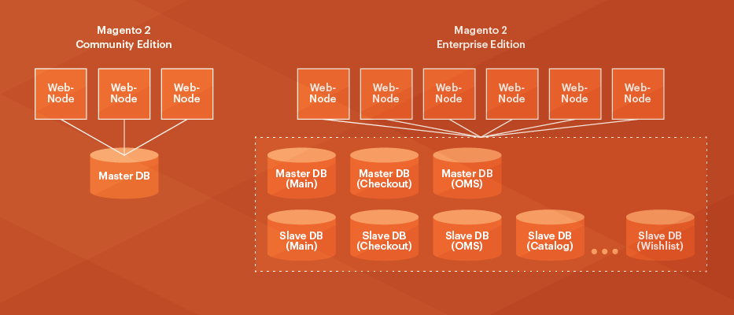

# Översikt över den delade databaslösningen

{{ee-only}}

{{deprecate-split-db}}

Adobe Commerce erbjuder flera skalbarhetsfördelar, bland annat möjligheten att använda tre separata master-databaser för olika funktionsområden i Commerce-programmet.

Utcheckning, beställningar och produktdata kan var och en använda en separat huvuddatabas som du kan replikera. Separationen är oberoende av storlek och skala in den från utcheckning av webbplatser, orderhanteringsaktiviteter, surfning av webbplatser och försäljningsaktiviteter, beroende på dina behov. Dessa ändringar ger stor flexibilitet i hur databasnivån kan skalas.

>[!INFO]
>
>Adobe Commerce i molninfrastrukturen stöder _inte_ den här funktionen.

Klassen `ResourceConnections` tillhandahåller den enhetliga MySQL-databasanslutningen till Commerce-programmet. För frågor till huvuddatabaserna implementerar vi databasmönstret CQRS (Command Query Responsibility Segregation). Det här mönstret hanterar logiken för att dirigera läs- och skrivfrågor till lämpliga databaser. Utvecklare behöver inte veta vilken konfiguration som används och det finns inga separata läs- och skrivdatabasanslutningar.

Om du konfigurerar valfri databasreplikering får du följande fördelar:

- Säkerhetskopiering av data
- Dataanalys utan att masterdatabasen påverkas
- Skalbarhet

MySQL-databaser replikeras asynkront, vilket innebär att slavar inte behöver anslutas permanent för att kunna ta emot uppdateringar från huvudservern.

Följande bild visar hur den här funktionen fungerar.

I Magento Open Source används bara en malldatabas.

Adobe Commerce använder tre huvuddatabaser och ett konfigurerbart antal slavdatabaser för replikering. Adobe Commerce har ett enda gränssnitt för databasanslutningar, vilket ger bättre prestanda och skalbarhet.

## Konfigurationsalternativ

På grund av hur prestandalösningen för den delade databasen är utformad kan din anpassade kod och installerade komponenter _inte_ göra något av följande:

- Skriv direkt till databasen (i stället måste du använda Adobe Commerce databasgränssnitt)
- Använd JOIN som påverkar försäljnings- eller offertdatabaserna
- Använd sekundärnycklar för tabeller i kassan, försäljning eller huvuddatabaser

>[!WARNING]
>
>Kontakta komponentutvecklare för att kontrollera om deras komponenter gör något av det föregående. I så fall får du bara välja något av följande:
>
>- Be komponentutvecklarna att uppdatera sina komponenter.
>- Använd komponenterna som _utan_ den delade databaslösningen.
>- Ta bort komponenterna så att du kan använda den delade databaslösningen.

Det innebär även att du kan:

- Konfigurera den delade databaslösningen _innan_ sätter Commerce i produktion.

  Adobe rekommenderar att du konfigurerar delade databaser så snart som möjligt efter att du har installerat Commerce.

- [Konfigurera ](multi-master-manual.md) den delade databaslösningen manuellt.

  Du måste utföra den här uppgiften om du redan har installerade komponenter eller om Commerce redan är i produktion. (_Uppdatera inte_ ett produktionssystem, uppdatera uppdateringarna i ett utvecklingssystem och synkronisera ändringarna när du har testat dem.)

  >[!WARNING]
  >
  >Du måste säkerhetskopiera de två ytterligare databasinstanserna manuellt. Commerce säkerhetskopierar bara huvuddatabasinstansen. Kommandot [`magento setup:backup --db`](../../installation/tutorials/backup.md) och administratörsalternativen säkerhetskopierar inte de ytterligare tabellerna.

## Förutsättningar

Den delade databasen kräver att du konfigurerar tre MySQL-huvuddatabaser på valfri värd (alla tre på Commerce-servern, varje databas på en separat server och så vidare). Detta är _master_-databaserna och de används enligt följande:

- En huvuddatabas för utcheckningstabeller
- En huvuddatabas för försäljningstabeller (kallas även _Order Management System_ eller _OMS_, tabeller)
- En huvuddatabas för resten av Commerce 2-programtabellerna

Du kan också konfigurera valfritt antal _slav_-databaser som fungerar som belastningsutjämnare och säkerhetskopior.

I den här guiden beskrivs endast hur du konfigurerar masterdatabaser. Vi tillhandahåller exempelkonfigurationer och referenser så att du kan konfigurera slavdatabaser om du vill.

I den här guiden får de tre malldatabaserna följande namn:

- `magento_quote`
- `magento_sales`
- `magento`

(Du kan namnge dina databaser vad du vill.)
