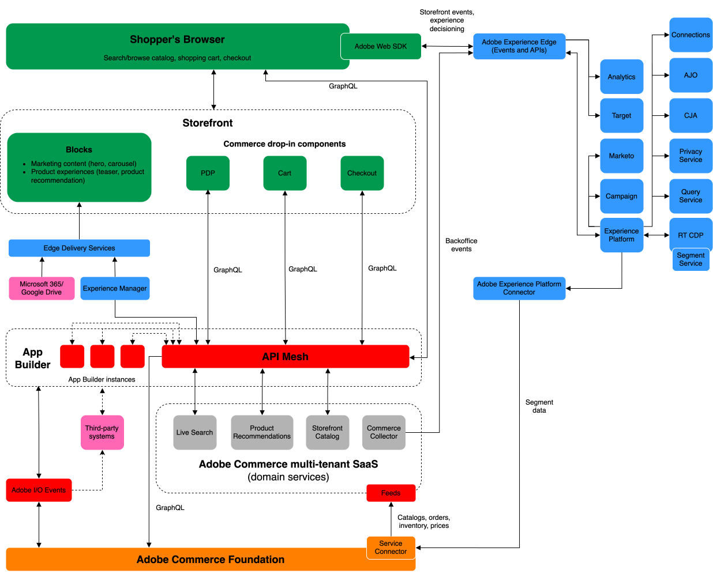

# Adobe Commerce referensarkitektur

Adobe Commerce är den upplevelsestyrda plattformen som unikt förenar teknisk flexibilitet med användarvänlighet, och som helt och hållet används för att skapa exceptionella upplevelser som ger affärsresultat.

Handeln har utvecklats för att uppfylla företagets krav på prestanda, skalbarhet och säkerhet. Att implementera en modern implementeringsstrategi som använder de senaste kompositbara e-handelslösningarna från Adobe är avgörande för företagets framgång. Den här sidan beskriver den moderna implementeringsmetoden för Commerce i detalj.

Följande arkitekturdiagram visar dataflödet mellan Adobe Commerce och alla Adobe Experience Cloud lösningar.

{zoomable=&quot;yes&quot;}

>[!NOTE]
>
>De högnivådataflöden som visas i diagrammet är konsekventa för de flesta företagsimplementationer. Den viktigaste komponenten som kan göra implementeringar unika är hur du skapar katalogen (särskilt för B2B). Mappa katalogarkitekturen noggrant till [Webb-API:er för Commerce](https://developer.adobe.com/commerce/webapi/get-started/).

## Molngrund

[Adobe Commerce i molninfrastruktur](https://experienceleague.adobe.com/en/docs/commerce-cloud-service/user-guide/overview) är grunden för er Commerce-implementering. Den ger en [säker](../../security-and-compliance/shared-responsibility.md) en automatiserad värdplattform med en självbetjäningsstrategi för att bygga, driftsätta, övervaka och hantera din Commerce-applikation i en molnbaserad miljö.

Se följande tekniska information om molnbasen:

- [**Skalbar arkitektur**](https://experienceleague.adobe.com/en/docs/commerce-cloud-service/user-guide/architecture/scaled-architecture)—Automatiskt justerad kapacitet för att upprätthålla stabila, förutsägbara prestanda
- [**Flera miljöer**](https://experienceleague.adobe.com/en/docs/commerce-cloud-service/user-guide/architecture/pro-architecture)- Företablerat med PHP, MySQL (MariaDB), Redis, RabbitMQ och de sökmotortekniker som stöds för att utveckla, testa och driftsätta din webbplats
- [**Konfigurationshantering**](https://experienceleague.adobe.com/en/docs/commerce-cloud-service/user-guide/configure/overview)- Anpassningsbara konfigurationsfiler för miljön och kommandoradsgränssnitt (CLI) för att hantera programinställningar, vägar, skapa och distribuera åtgärder samt meddelanden.
- [**Git-baserat arbetsflöde**](https://experienceleague.adobe.com/en/docs/commerce-cloud-service/user-guide/architecture/pro-develop-deploy-workflow)—Bygg och driftsätt automatiskt efter stora kodändringar för snabb utveckling och kontinuerlig driftsättning
- [**Inbyggd observerbarhet**](https://experienceleague.adobe.com/en/docs/commerce-cloud-service/user-guide/monitor/performance)—Verktyg som kombinerar loggdata från olika källor för att hjälpa dig att hantera webbplatsens prestanda och diagnostisera problem
- [**Omfattande API-täckning**](https://developer.adobe.com/commerce/webapi/get-started/)—[GraphQL](https://developer.adobe.com/commerce/webapi/graphql/) och [REST](https://developer.adobe.com/commerce/webapi/rest) API:er för integrering av centrala Commerce-applikationer med tredjepartssystem och utökade Commerce-funktioner

## Integration med Experience Cloud

Adobe Commerce kan integreras med alla lösningar från Experience Cloud för att leverera [personaliserade e-handelsupplevelser i stor skala](https://experienceleague.adobe.com/en/docs/commerce-admin/customers/customers-menu/personalize-scale#customers-menu).

[Dataanslutning](https://experienceleague.adobe.com/en/docs/commerce-merchant-services/data-connection/overview) ger er insikter om era kunders köpbeteende så att ni kan skapa personaliserade shoppingupplevelser i alla kanaler med andra Adobe-produkter för digitala upplevelser.

>[!NOTE]
>
>Se [Digital Experience-modeller](https://experienceleague.adobe.com/en/docs/blueprints-learn/architecture/overview) för mer teknisk information.

## Integrering med tredjepartssystem

Adobe förser utvecklarna med omfattande tilläggspunkter och verktyg för att bygga applikationer som utökar affärsmöjligheterna och integrerar handeln med tredjepartssystem (som CRM, ERPS och PIMS). Med dessa verktyg minskar du den totala ägandekostnaden för plattformen på följande sätt:

- **Skalbarhet**—Applikationerna kan skalas separat från de centrala programmen, vilket ger ökad effektivitet och förenklar uppgraderingar.
- **Isolering**-En isolerad miljö innebär att utvecklare kan uppgradera eller ändra sina tillägg efter eget gottfinnande utan att förlita sig på en kärnrelease.
- **Tekniskt oberoende**-Utvecklare kan välja vilket teknikläge som passar deras behov.

Adobe tillhandahåller följande utvecklingsverktyg för att bygga integreringar och anpassningar:

- [**API-nät för Adobe Developer App Builder**](https://developer.adobe.com/graphql-mesh-gateway/)—Koordinera och kombinera flera API:er, GraphQL, REST och andra källor till en enda frågningsbar slutpunkt i GraphQL.
- [**App Builder**](https://developer.adobe.com/app-builder/docs/overview/)- Bygg och driftsätt säkra och skalbara webbapplikationer som utökar Commerce-funktionaliteten och integreras med tredjepartslösningar.
- [**Händelser**](https://developer.adobe.com/commerce/extensibility/events/)- Använd anpassade händelseutlösare för att interagera med andra utökningsbara utvecklingsverktyg.
- [**Webhooks**](https://developer.adobe.com/commerce/extensibility/webhooks/)- Använd webhooks för att automatiskt starta interaktion mellan Commerce och tredjepartssystem.
- [**Administratörsgränssnitt SDK**](https://developer.adobe.com/commerce/extensibility/admin-ui-sdk/)—Anpassa och förbättra Commerce Admin med nya sidor och funktioner för era handlare.

## Tjänster för butikstjänster

Adobe erbjuder en mängd intelligenta, sammanställningsbara tjänster för att hjälpa er att uppnå era affärsmål. Dessa tjänster tillhandahåller även API:er som är viktiga för att optimera prestanda i stor skala.

- [Live Search](https://experienceleague.adobe.com/en/docs/commerce-merchant-services/live-search/overview)—Få smartare, snabbare och relevanta resultat för kunderna med detta AI-baserade sökverktyg.
- [Recommendations](https://experienceleague.adobe.com/en/docs/commerce-merchant-services/product-recommendations/overview)—Lägg till AI-anpassade rekommendationer baserade på kundbeteende, populära trender, produktlikhet med mera.
- [Katalogtjänst](https://experienceleague.adobe.com/en/docs/commerce-merchant-services/catalog-service/guide-overview)- Ge kunderna en optimerad produktupplevelse och samtidigt få bättre prestanda, bättre skalbarhet och ökad konverteringsgrad.
- [Betalningstjänster](https://experienceleague.adobe.com/en/docs/commerce-merchant-services/payment-services/guide-overview)- Öka kundnöjdheten genom att erbjuda olika betalningsmetoder, inklusive räntefria betalningar, och en enda vy över betalningshantering, order och fakturor.

## Headless storefront

Headless commerce is API-first commerce. Adobe Commerce är helt headless med en frikopplad arkitektur som ger alla e-handelstjänster och data via ett GraphQL API-lager. Med den här arkitekturen kan teamen utveckla sina gränser oberoende av huvudapplikationen, vilket gör det enkelt att snabbt skapa och testa nya kontaktytor med ny teknik.

Adobe har en modern, headless storefront-teknik som innehåller samma fördelar och funktioner som [Edge Delivery Services](https://www.aem.live/home) med dokumentbaserad framtagning, en arkitektur som sätter prestanda först och färdiga inbyggda experiment. Programmet utnyttjar Adobe Commerce skalbarhet och prestanda [butikstjänster](#storefront-services) och flexibiliteten och bekvämligheten i [komponenter för insticksprogram](https://experienceleague.adobe.com/developer/commerce/storefront/) för att leverera e-handelsfunktioner.
