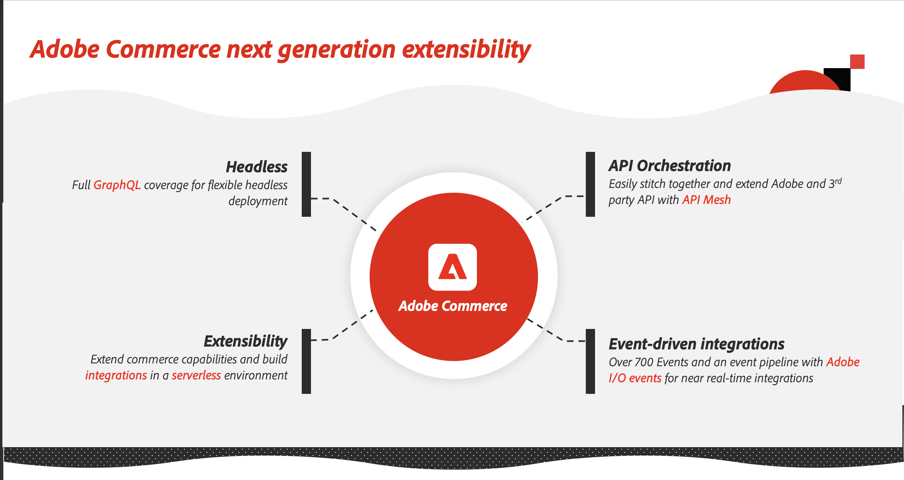

# Utbyggbarhetsstrategi

Med Adobe Commerce utbyggbarhetsplattform kan varumärken effektivt anpassa processer, integrera system och driftsätta nya funktioner samtidigt som uppgraderingsmöjligheterna bibehålls.

## Översikt över strategier för Commerce-tillägg

Utbyggnaden av kapaciteten hos handelsplattformen omfattar följande metoder på hög nivå:

* Utvidga de inbyggda funktionerna i Commerce Platform. Handlare kan till exempel installera Marketplace-applikationer (som ofta byggts av tredje part) som utökar och förfinar plattformens interna funktioner, till exempel ett tillägg som kan validera leveransadresserna under utcheckningen och som underlättar snabb integrering med UPS-API:er för företagsadresser.

* Integrera appar/tillägg från tredje part med handelsplattformen. Utvecklare kan använda Commerce befintliga, omfattande REST- och GraphQL-API:er för att direkt integrera Commerce med tredjepartslösningar.

Plattformsarkitekturen avgör dock de bästa strategierna för att bygga ut en plattform. Commerce erbjuder omfattande GQL- och REST API-täckning för headless-distribution. Kodbasen för den centrala handeln fortsätter att utvecklas mot en mer modulär arkitektur och ett enda integreringslager, som innehåller nya, förbättrade anpassningsverktyg:

* [App Builder för Adobe Commerce](https://experienceleague.adobe.com/docs/commerce-learn/tutorials/adobe-developer-app-builder/introduction-to-app-builder.html) är ett utvecklingsramverk och en verktygslåda som bygger på Adobe infrastruktur. Utvecklare kan använda den för att skapa Commerce-tillägg som sträcker sig från användarupplevelser/butiksanpassningar till mellanvara och affärslogiktillägg.

* [API-nät för Adobe Developer App Builder](https://developer.adobe.com/graphql-mesh-gateway/) låter utvecklare kombinera flera datakällor till en enda API-slutpunkt. Detta har stöd för API-samordning, eller integrering, av privata API:er och tredjeparts API:er och andra programgränssnitt med Adobe Commerce API:er och andra Adobe-produkter som använder Adobe I/O.

* [Adobe I/O Events for Adobe Commerce](https://developer.adobe.com/commerce/events/get-started/) gör transaktionsdata tillgängliga för program som har utvecklats med App Builder och webbhooks från tredje part som stöder skapandet av händelsestyrda program.

De här verktygen ger åtkomst till Adobe Developer Console och utvecklingsverktygen i Adobe för att skapa API:er och integrera anpassade plugin-program och integreringar.

I följande diagram visas huvudkomponenterna i strategin för Commerce exentisibility.

