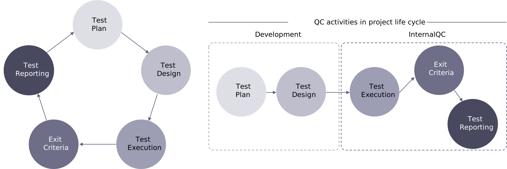

# Processer och verktyg för kvalitetskontroll

Kvalitetskontrollprocessen i det föregående diagrammet kan kortfattat beskrivas på följande sätt:

<table>
<thead>
  <tr>
    <th>Programvaruutvecklingsprocess</th>
    <th>QC-arbetsflöde</th>
    <th>QC</th>
    <th>QC-ledare</th>
  </tr>
</thead>
<tbody>
  <tr>
    <td>Utveckling</td>
    <td>Planering</td>
    <td></td>
    <td>Granska och bidra till testplaner</td>
  </tr>
  <tr>
    <td></td>
    <td></td>
    <td></td>
    <td>Skapa testspecifikationer (testfall/testscenarier)</td>
  </tr>
  <tr>
    <td></td>
    <td></td>
    <td></td>
    <td>Förbered och hämta testdata</td>
  </tr>
  <tr>
    <td></td>
    <td>Testa analys och design</td>
    <td>Granska och bidra till testplaner</td>
    <td>inleda preparatet, specifikationer</td>
  </tr>
  <tr>
    <td></td>
    <td></td>
    <td>Skapa testspecifikationer (testfall/testscenarier)</td>
    <td>Skriv eller granska en teststrategi för projektet</td>
  </tr>
  <tr>
    <td></td>
    <td></td>
    <td>Förbered och hämta testdata</td>
    <td> Ledande, styrande och övervakande av analys, design</td>
  </tr>
  <tr>
    <td>Intern testning</td>
    <td>Testimplementering och körning</td>
    <td>Implementerar tester, kör och loggar testerna</td>
    <td>Övervaka genomförandet och genomförandet av testerna</td>
  </tr>
  <tr>
    <td></td>
    <td></td>
    <td>Kontrollera prestanda och skannersäkerhet - Utvärdera resultat och avvikelser från förväntade resultat</td>
    <td>Sörja för att testerna kan spåras till testgrunden och spåra buggar i systemet för spårning av fel</td>
  </tr>
  <tr>
    <td></td>
    <td></td>
    <td>Skicka buggar till felspårningssystem (Jira/Redmine/Trello)</td>
    <td>Prioritera/schemalägg tester för anpassning till den projektplanering som definieras av PM</td>
  </tr>
  <tr>
    <td></td>
    <td></td>
    <td>Testa igen (bekräftelsetestning) efter felkorrigering</td>
    <td></td>
  </tr>
  <tr>
    <td></td>
    <td>Utvärdera och rapportera</td>
    <td>Rapportera testförlopp till QC-lead och PM</td>
    <td>Utvärdera testresultat och förlopp</td>
  </tr>
  <tr>
    <td></td>
    <td></td>
    <td></td>
    <td>Skriv testsammanfattningsrapporter baserade på den information som samlats in under testet</td>
  </tr>
  <tr>
    <td>UAT</td>
    <td>UAT</td>
    <td>Verifiera kundernas feedback eller ändringsförfrågningar</td>
    <td>Uppföljning</td>
  </tr>
  <tr>
    <td></td>
    <td></td>
    <td>Utför omtestning och regressionstestning efter ändring av källkoden</td>
    <td>Kontrollerar</td>
  </tr>
  <tr>
    <td></td>
    <td></td>
    <td>Uppdatera testspecifikationer</td>
    <td></td>
  </tr>
  <tr>
    <td>Underhåll</td>
    <td>Underhåll</td>
    <td>Granska och bidra till uppgifter</td>
    <td>Granska och beräkna tiden för uppgifter</td>
  </tr>
  <tr>
    <td></td>
    <td></td>
    <td>Skapa/uppdatera testspecifikationer</td>
    <td>Uppföljningstestets förlopp</td>
  </tr>
  <tr>
    <td></td>
    <td></td>
    <td>Utför tester för dessa uppgifter</td>
    <td></td>
  </tr>
  <tr>
    <td></td>
    <td></td>
    <td>Utför regressionstestning</td>
    <td></td>
  </tr>
</tbody>
</table>

Liknar [verktyg](project-management-tools.md) som vi har identifierat för utvecklingsprocessen har vi valt en handfull vallösningar och plattformar som vi ofta använder för kvalitetskontrolltester.

| Syfte | Verktyg |
|---------------------------|---------------------------------------------------|
| Webbplatsens prestandaindex | Google PageSpeed, Webpagetest, JMeter |
| Säkerhet | Adobe Commerce Security Scan Tool, SonarQube, ZAP |
| Ärendehanteringssystem | JIRA |
| UI-testning | Perfekt pixel, BrowserStack |
| API-testning | Postman, SoapUI |
| Automatiseringstest | Selen |

## Webbplatsens prestandaindex

GooglePageSpeed rapporterar om en sidas prestanda både på mobila och stationära enheter och ger förslag på hur sidan kan förbättras.

WebPageTest är ett webbprestandaverktyg som använder riktiga webbläsare för att få tillgång till webbsidor och samla in timingstatistik.

JMeter är ett Apache-projekt som kan användas som ett lasttestningsverktyg för att analysera och mäta prestanda för en mängd olika tjänster, med fokus på webbprogram.

## Säkerhet

SonarQube och ZAP introducerades i utvecklingsprocessen, men vi tar även med den här med mer information om hur den är involverad i QC-processen.

SonarQube används också för kontinuerlig kontroll av kodkvaliteten för att utföra automatiska granskningar med statisk analys av koden för att upptäcka buggar, kodoftor och säkerhetsluckor.

OWASPZAP (Zed Attack Proxy) är avsedd att användas både av dem som inte har använt programsäkerhet och av professionella penetrationstestare. Några av de inbyggda funktionerna är t.ex. proxyserver, traditionella och AJAX webbcrawler, automatiserad skanner, passiv skanner, forcerad bläddring, Fuzzier, WebSocket-stöd, skriptspråk samt stöd för Plug-n-Hack.

## UI-testning

Med Perfekt Pixel kan utvecklare och designers lägga en halvgenomskinlig bildövertäckning ovanpå HTML och göra en perfekt jämförelse mellan dem.

BrowserStack är en webb- och mobiltestningsplattform i molnet som gör att utvecklare kan testa sina webbplatser och mobilappar i olika webbläsare, operativsystem och riktiga mobilenheter.

## API-testning

Postman är samarbetsplattformen för API-utveckling. Postman förenklar varje steg i skapandet av ett API och effektiviserar samarbetet så att man kan skapa bättre API:er.

SoapUI är ett testprogram för webbtjänster med öppen källkod för SOAP (Simple Object Access Protocol) och REST (Representational State Transfer). Dess funktion omfattar inspektion via webben. Anrop, utveckling, simulering och gungning. funktionstestning, belastnings- och kompatibilitetstestning.

## Automatiseringstestning

Selenium består av flera komponenter (Selenium client API, Selenium WebDriver) som var och en har en specifik roll när det gäller att utveckla automatisering av testning av webbapplikationer.
