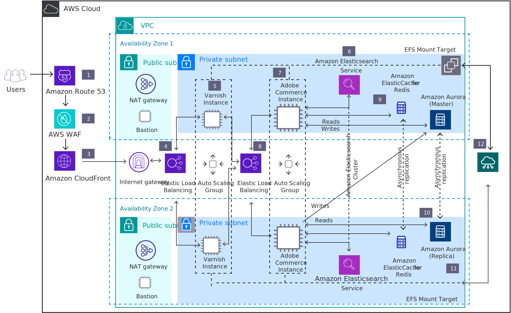

# Lokal infrastruktur för Adobe Commerce

The motivations for starting a new Adobe Commerce implementation or moving an existing on-premises Adobe Commerce implementation to the cloud are numerous, but the most common strategic drivers are reducing capital expenditure, decreasing ongoing cost, improving scalability and elasticity, improving time-to-market, and attaining improvements in security and compliance.

I följande diagram visas referensarkitekturen för distribution av Adobe Commerce lokalt i AWS-infrastrukturen. Andra molnleverantörer som Azure, Google Cloud och Alibaba Cloud delar en liknande infrastrukturdesign och homologa tjänster.

Låt oss fördjupa oss i rollerna och funktionerna i varje aspekt av den infrastruktur som visas ovan:

1. Amazon Route 53 tillhandahåller DNS-konfiguration.

1. AWS WAF is a web application firewall that protects Adobe Commerce against common web exploits.

1. Amazon CloudFront är ett snabbt leveransnätverk (CDN) som snabbar upp distributionen av statiskt och dynamiskt webbinnehåll.

1. The first Elastic Load Balancing application load balancer distributes traffic across Varnish instances in an AWS Auto Scaling group in multiple Availability Zones.

1. Finska cacheminnet är en webbprogramsaccelerator som cachelagrar HTTP-omvänd proxy. Enterprise-versionen, som är tillgänglig via AWS Marketplace, rekommenderas eftersom den har bättre funktioner för molnbaserade backends och cache-rensning över dynamiska värdar.

1. Den andra belastningsutjämnaren i programmet Elastic Load Balancing distribuerar trafik från Varnish Cache i gruppen för automatisk skalning i Adobe Commerce-instanser i flera tillgänglighetszoner.

1. Installera den senaste versionen av Magento Open Source eller Adobe Commerce på Amazon EC2-instanser. Installation consists of the Adobe Commerce application, Nginx webserver, and PHP. Build the Amazon Machine Image (AMI) to launch new instances in an Auto Scaling group.

1. Amazon Elasticsearch Service is a managed Elasticsearch service for Adobe Commerce catalog search.

1. Amazon ElastiCache for Redis innehåller ett cachelagringslager för databasen.

1. Använd Amazon Aurora eller AmazonRDS för att förenkla databasadministrationen (inklusive hög tillgänglighet och konfiguration på flera överordnad).

1. EFSMount Target underlättar mappningen av Amazon elastic File System (AmazonEFS) till handelsinstanser i Varnish och Adobe.

1. Använd Amazon EFS för att få åtkomst till delad konfiguration i lack och delade medieresurser i Adobe Commerce-instanser.

## Molntjänster

Förutom att tillhandahålla en stödplattform för teknikplattformen för att aktivera DevOps-processer på AWS i hela er Commerce-miljö i Adobe tillhandahåller AWS en samling tjänster som kan tillhandahålla (i avsaknad av) eller förstärka era befintliga lösningar för programkonfigurationshantering (SCM). This includes AWSCodeCommit, AWSCodeBuild, AWSCodePipeline, and AWSCodeDeploy, which allows for a managed source control, build, continuous integration/continuous deployment (CI/CD), and deployment services.

## Molnmigrering

Prisförslaget för migrering av Adobe Commerce till AWS har förbättrats ytterligare genom att det finns flera tjänster som ger operativ insikt och flexibilitet. Vad vi menar är operativ insikt i plattformen inte bara ur ett tekniskt perspektiv (till exempel förfrågningar per timme) utan även ur ett affärsmässigt perspektiv (till exempel order per timme), särskilt när de två uppsättningarna data kan gifta sig. Detta ger en inramning i realtid av kampanjresultat, kostnader för plattformsdrift och ett nästan oändligt antal andra indikatorer.

Inställning av Adobe Commerce till AWS kan ersätta specifika programberoenden med fullt hanterade alternativ som finns i molnet. I stället för att ha en relationsdatabas direkt på EC2-instanser kan databasen för många program enkelt ersättas med Amazon Relational Database Service (AmazonRDS). Fördelen med den här strategin är att driftansvaret för de icke-differentierade komponenterna kan överföras till AWS utan att det krävs några större förändringar i kärnapplikationen.

There are several deployment options available for running Adobe Commerce (both Magento Open Source and Adobe Commerce versions) on AWS. Det lämpligaste valet beror på era krav på kostnad, storlek, tillgänglighet och flexibilitet, liksom på er organisations kunskaper inom AWS och Adobe Commerce.
