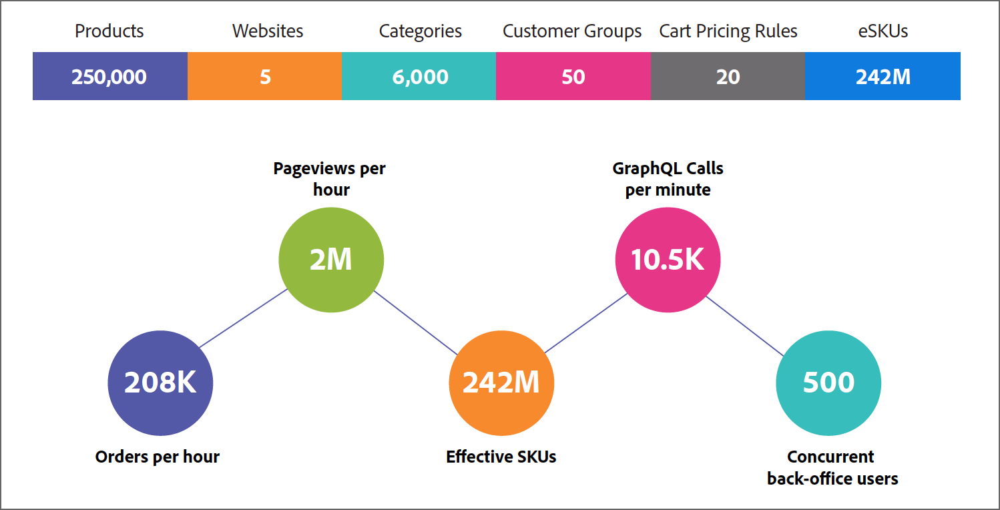

# Sammanfattning av prestandatecken

Resultat från prestandatestet i Adobe Commerce 2.4.5 återspeglar prestandatestet mätt på en Adobe Commerce-instans som distribuerats med följande infrastruktur och ytterligare komponenter.
- [Pro cloud environment](https://experienceleague.adobe.com/docs/commerce-cloud-service/user-guide/architecture/pro-architecture.html) med [skalad arkitektur](https://experienceleague.adobe.com/docs/commerce-cloud-service/user-guide/architecture/scaled-architecture.html)
- [B2B för Adobe Commerce](https://experienceleague.adobe.com/docs/commerce-admin/b2b/introduction.html)
- [Adobe Commerce Inventory management](https://experienceleague.adobe.com/docs/commerce-admin/inventory/introduction.html)
- [Adobe Stock](https://experienceleague.adobe.com/docs/commerce-admin/content-design/media/adobe-stock/adobe-stock.html)

Det finns inga ytterligare anpassningar.

I följande information sammanfattas resultaten av jämförelsen och information ges om miljön och de data som används under testningen.

## Viktiga prestandamått

Följande bild visar Commerce Store-konfigurationen för prestandatestet och nyckeltal från testresultaten.

{width="700" zoomable="yes"}

Baserat på testkriterier som härmar en företagsorganisation B2C kan systemet hantera begärd trafik och ordernummer under högtider, vid ett standardlastflöde.

### Prestandaförbättringar

- **Beställningar** - 3 481 order per minut har bearbetats och svarstiderna är mindre än 2 sekunder för den 99:e percentilen (99 % av förfrågningarna behandlades med en svarstid på mindre än 2 sekunder).
- **Sidvyer** - Hantera över 2 miljoner sidvyer per timme med en svarstid på mindre än 2 sekunder för den 99:e percentilen.
- **Effektiva SKU:er** - Kundprofilen innehöll 242 miljoner olika prisvariationer (<a href="https://experienceleague.adobe.com/docs/commerce-operations/implementation-playbook/best-practices/planning/product-sku-limits.html">eSKU</a>) för 250 000 produkter.
- **GraphQL-begäranden** - Systemet skalades till 10 500 GraphQL-begäranden per minut utan cache-lagring och bibehåller svarstiderna på mindre än 2 sekunder för den 99:e percentilen.
- **Samtidiga admin-användare** - Systemet har skalats för att stödja 500 samtidiga admin-användare samtidigt som svarstiderna för den 99:e percentilen behålls på mindre än 2 sekunder.

## Testmiljö

Prestandatestresultat erhölls genom testning mot en Adobe Commerce 2.4.5-instans som driftsatts i en Pro-molnmiljö med skalad arkitektur. Instansen hade även Adobe Commerce B2B-, Inventory management- och Adobe Stock Integration-modulerna installerade, konfigurerade och aktiverade.

Prestandatestdata för testprofilen genererades med <a href="https://experienceleague.adobe.com/docs/commerce-operations/configuration-guide/cli/generate-data.html">Performance Toolkit</a>.

Prestandamätningarna baseras på simulerade dagliga butiksaktiviteter för kunder och företagsanvändare. Värdena avspeglar en genomströmning som ligger nära det maximala värdet för varje enskilt fall, men avspeglar inte unika affärsmodeller, till exempel privat försäljning eller blixtförsäljning.

- **LUMA Storefront**
   - 3 000 samtidiga användare i butiken
   - Ange till 30 % CDN-cache-träfffrekvens

     Om du använder cache-lagret effektivt ökas antalet sidvisningar per timme.

- **GraphQL API**
   - 250 samtidiga trådar
   - Ange 0 % CDN-cache-träfffrekvens

     Svarstiderna förbättras avsevärt med ett cache-lager framför GraphQL.

- **Admin Web**
   - 500 samtidiga användare
   - Ange 0 % CDN-cache-träfffrekvens

## Testmiljöspecifikationer

Inläsningstestningen slutfördes med JMeter-inläsningsprofiler som körs mot Adobe Commerce-instansen. Tre webbnoder och tre tjänstnoder användes under testet. Följande bild visar ingångspunkten för JMeter och produktionsinfrastrukturen.

{width="700" zoomable="yes"}

### Program

<a href="https://experienceleague.adobe.com/docs/commerce-operations/release/notes/adobe-commerce/2-4-5.html">Adobe Commerce 2.4.5</a> distribueras på molninfrastruktur med Pro-arkitektur.

### Infrastruktur

För prestandatestet distribuerades Adobe Commerce 2.4.5 på en [skalbar infrastruktur](https://experienceleague.adobe.com/docs/commerce-cloud-service/user-guide/architecture/scaled-architecture.html) med följande kapacitet.

- **Webbnodsspecifikationer**
   - vCPU 216 (72 x 3 noder)
   - Minne 432 GiB (144 x 3 noder)
   - Nätverksbandbredd 768 Gbit/s (256 x 3 noder)
   - EBS-bandbredd 57000 Mbit/s (19000 x 3 noder)
   - Provisionerad lagring 100 GB

- **Specifikationer för servicenod**
   - vCPU 192 (64 x 3 noder)
   - Minne 768 GiB (256 x 3 noder)
   - Nätverksbandbredd 60 Gbit/s (20 x 3 noder)
   - EBS-bandbredd 40800 Mbit/s (13600 x 3 noder)
   - Provisionerad lagring på 1 100 GB
