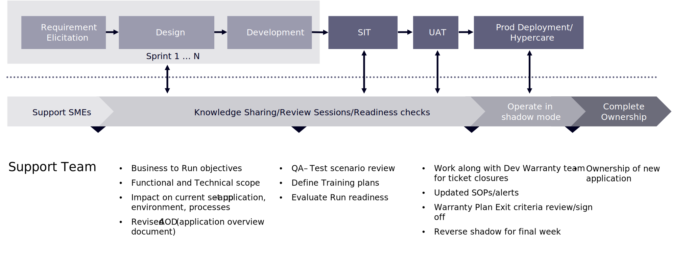

# Översikt över underhåll och support

Konsumenterna har redan fler alternativ än någonsin. Utan brist på varumärken som behöver uppmärksammas kan ni inte ge konsumenterna någon anledning att titta på era konkurrenter. Som vi har sett är lojaliteten och tålamodet med konsumenterna tunn. Det tar inte mycket för dem att ge upp för ert varumärke och att ha en dålig e-handelsupplevelse är ett enkelt sätt för dem att ge upp.

Detta leder till två kompletterande punkter. Det första är att lanseringen av en ny e-handelsplats inte innebär att du sedan kan gå vidare. Den snabba förändringen i marknadsföringen och konsumenternas behov är alltför stor för att varumärkena ständigt måste utvecklas för att hänga med. Vilket för oss till punkt två. Om ert stöd för e-handel bara finns till för att åtgärda något när det upphör, kommer det att vara omöjligt att tillgodose konsumenternas ökande förväntningar. Kort och gott: e-handelssupporten bör inte bara hålla er webbplats i drift, den bör föra ert varumärke framåt. Det här avsnittet kommer att hjälpa er att börja utveckla ert varumärke efter lanseringen av er webbplats.

## Övergångsfas

Att få produktionsstöd under ett projekts övergångsfas är en av de viktigaste framgångarna för ett e-handelsföretag. När implementeringen är klar och sajten publiceras måste supportteamet vara redo och utrustat för att ta över supportaktiviteter. Det vanligaste är att ge utvecklingsteamet en skjuts framåt under övergångsfasen och bygga upp ett mindre team på plats för support.

Kunskapsöverföring sker under hela projektet, och en lyckad övergång sker parallellt med leverans. Dessutom är användarhandböcker och en teknikwiki viktiga verktyg som gör det möjligt för teamet att gå igenom workshops under hela projektfasen.

I följande diagram visas de faser och aktiviteter som skulle ingå i ett lyckat övergångsresultat:

>[!NOTE]
>
> Det är viktigt att skapa en checklista för övergångar som hjälper projektledarna att slutföra de uppgifter som krävs för att de ska lyckas med sin postproduktion. Denna övergång bör ingå i den övergripande projektplanen och uppgifterna måste ingå i tidsplanen.

Att hitta rätt supportmodell för ert företag för att fortsätta förbättra och optimera er plattform - och handelspraxis som helhet - är ett viktigt steg när det gäller att behålla allt det hårda arbete som utfördes under implementeringsprocessen. Med en omfattande och kontinuerlig supportplan på plats kan e-handelsplatsen hålla jämna steg med kundernas förväntningar och ni kan fortsätta att nå era mål.
