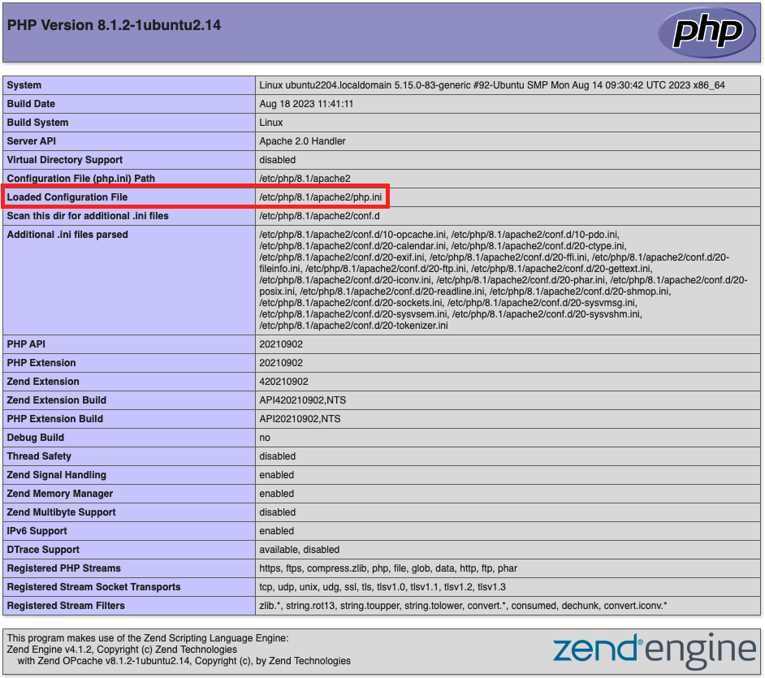

# PHP-inställningar

I det här avsnittet beskrivs hur du ställer in obligatoriska PHP-alternativ.

>[!NOTE]
>
>För den senaste versionen av Adobe Commerce och Magento Open Source krävs minst PHP 8.1. Se [systemkrav](../system-requirements.md) för alla PHP-versioner som stöds.

Mer information om konfigurering av molnet finns i [PHP-inställningar](https://experienceleague.adobe.com/docs/commerce-cloud-service/user-guide/configure/app/php-settings.html) i _Commerce on Cloud Infrastructure_ guide.

## Kontrollera att PHP är installerat

PHP installeras som standard på de flesta Linux-distributioner. Det här avsnittet förutsätter att du redan har installerat PHP. Kontrollera om PHP är installerat genom att skriva följande på kommandoraden:

```bash
php -v
```

Om PHP är installerat visas ett meddelande som liknar följande:

```terminal
PHP 8.1.2-1ubuntu2.14 (cli) (built: Aug 18 2023 11:41:11) (NTS)
Copyright (c) The PHP Group
Zend Engine v4.1.2, Copyright (c) Zend Technologies
    with Zend OPcache v8.1.2-1ubuntu2.14, Copyright (c), by Zend Technologies
```

Om PHP inte är installerat (eller kräver en uppgradering) installerar du det genom att följa instruktionerna för din Linux-distribution.

## Verifiera installerade tillägg

Adobe Commerce och Magento Open Source kräver vissa PHP-tillägg. I följande listor anges vilka tillägg som krävs för varje utgåva av Commerce. Listorna genereras automatiskt från en distribution som kör den senaste versionen av varje utgåva.

{{$include /help/_includes/templated/php-extensions.md}}

Så här verifierar du installerade tillägg:

1. Lista installerade moduler.

   ```bash
   php -m
   ```

1. Kontrollera att alla nödvändiga tillägg är installerade.
1. Lägg till saknade moduler med samma arbetsflöde som används för att installera PHP.

## Kontrollera PHP-inställningar

>[!WARNING]
>
>Om du använder PHP 7.4.20 anger du `pcre.jit=0` i `php.ini` -fil. Det här kommer runt en PHP [bug](https://bugs.php.net/bug.php?id=81101) som förhindrar att CSS läses in.

- Ställ in systemtidszonen för PHP, annars kanske fel som följande visas under installationen och tidsrelaterade åtgärder som kron inte fungerar:

```terminal
PHP Warning:  date(): It is not safe to rely on the system's timezone settings. [more messages follow]
```

- Ange PHP-minnesgränsen.

  Adobe rekommenderar följande:

   - Kompilera kod eller distribuera statiska resurser, `1G`
   - Felsökning, `2G`
   - Testning, `~3-4G`

- Öka värdena för PHP `realpath_cache_size` och `realpath_cache_ttl` till rekommenderade inställningar:

  ```conf
  realpath_cache_size=10M
  realpath_cache_ttl=7200
  ```

  Med de här inställningarna kan PHP-processer cachelagra sökvägar till filer i stället för att leta upp dem vid sidinläsning. Se [Prestandajustering](https://www.php.net/manual/en/ini.core.php) i PHP-dokumentationen.

- Aktivera [`opcache.save_comments`](https://www.php.net/manual/en/opcache.configuration.php#ini.opcache.save-comments), vilket krävs för Adobe Commerce och Magento Open Source 2.1 och senare.

  Adobe rekommenderar att du aktiverar [PHP OPcache](https://www.php.net/manual/en/book.opcache.php) av prestandaskäl. OPcache är aktiverat i många PHP-distributioner.

  Adobe Commerce och Magento Open Source 2.1 och senare använder PHP-kodkommentarer för kodgenerering.

>[!NOTE]
>
>För att undvika problem under installation och uppgradering rekommenderar Adobe starkt att du använder samma PHP-inställningar för både PHP-kommandoradskonfigurationen och PHP-webbserverns plugin-konfiguration. Mer information finns i nästa avsnitt.

## Sök efter PHP-konfigurationsfiler

I det här avsnittet beskrivs hur du hittar de konfigurationsfiler som behövs för att uppdatera de nödvändiga inställningarna.

### Sök `php.ini` konfigurationsfil

Om du vill hitta webbserverkonfigurationen kör du en [`phpinfo.php` fil](optional-software.md#create-phpinfophp) i webbläsaren och leta efter `Loaded Configuration File` enligt följande:



Om du vill hitta PHP-kommandoradskonfigurationen anger du

```bash
php --ini | grep "Loaded Configuration File"
```

>[!NOTE]
>
>Om du bara har en `php.ini` ändrar du den filen. Om du har två `php.ini` filer, ändra *båda* filer. Om du inte gör det kan prestandan bli oförutsägbar.

### Sök efter inställningar för OPcache-konfiguration

Inställningarna för PHP OPcache finns vanligtvis antingen i `php.ini` eller `opcache.ini`. Platsen kan vara beroende av operativsystemet och PHP-versionen. Konfigurationsfilen för OPCache kan ha en `opcache` -avsnitt eller inställningar som `opcache.enable`.

Använd följande riktlinjer för att hitta den:

- Apache-webbserver:

  För Ubuntu med Apache finns inställningarna för OPcache vanligtvis i `php.ini` -fil.

  För CentOS med Apache eller nginx finns inställningarna för OPcache vanligtvis i `/etc/php.d/opcache.ini`

  Om inte, använder du följande kommando för att hitta den:

  ```bash
  sudo find / -name 'opcache.ini'
  ```

- nginx-webbserver med PHP-FPM: `/etc/php/8.1/fpm/php.ini`

Om du har fler än en `opcache.ini`, ändra alla.

## Ange PHP-alternativ

Så här anger du PHP-alternativ:

1. Öppna en `php.ini` i en textredigerare.
1. Leta reda på serverns tidszon i den tillgängliga [tidszonsinställningar](https://www.php.net/manual/en/timezones.php)
1. Leta reda på följande inställning och avkommentera den om det behövs:

   ```conf
   date.timezone =
   ```

1. Lägg till tidszonsinställningen som du hittade i steg 2.

1. Ändra värdet för `memory_limit` till ett av de värden som rekommenderas i början av det här avsnittet.

   Exempel:

   ```conf
   memory_limit=2G
   ```

1. Lägg till eller uppdatera `realpath_cache` som matchar följande värden:

   ```conf
   ;
   ; Increase realpath cache size
   ;
   realpath_cache_size = 10M
   
   ;
   ; Increase realpath cache ttl
   ;
   realpath_cache_ttl = 7200
   ```

1. Spara ändringarna och avsluta textredigeraren.

1. Öppna den andra `php.ini` (om de är olika) och gör samma ändringar i den.

## Ange alternativ för OPCache

Till `opcache.ini` alternativ:

1. Öppna din OPCache-konfigurationsfil i en textredigerare:

   - `opcache.ini` (CentOS)
   - `php.ini` (Ubuntu)
   - `/etc/php/8.1/fpm/php.ini` (nginx-webbserver (CentOS eller Ubuntu))

1. Sök `opcache.save_comments` och avkommentera vid behov.
1. Se till att dess värde är inställt på `1`.
1. Spara ändringarna och avsluta textredigeraren.
1. Starta om webbservern:

   - Apache, Ubuntu: `service apache2 restart`
   - Apache, CentOS: `service httpd restart`
   - nginx, Ubuntu och CentOS: `service nginx restart`

## Felsökning

Se följande Adobe Commerce supportartiklar för hjälp med felsökning av PHP-problem:

- [PHP-versionsfel eller 404-fel vid åtkomst till Adobe Commerce i en webbläsare](https://support.magento.com/hc/en-us/articles/360033117152-PHP-version-error-or-404-error-when-accessing-Magento-in-browser)
- [Fel i PHP-inställningar](https://support.magento.com/hc/en-us/articles/360034599631-PHP-settings-errors)
- [PHP-krypteringstillägget har inte installerats korrekt](https://support.magento.com/hc/en-us/articles/360034280132-PHP-mcrypt-extension-not-installed-properly-)
- [Problem med beredskapskontroll av PHP-version](https://support.magento.com/hc/en-us/articles/360033546411)
- [Vanliga PHP-allvarliga fel och lösningar](https://support.magento.com/hc/en-us/articles/360030568432)
