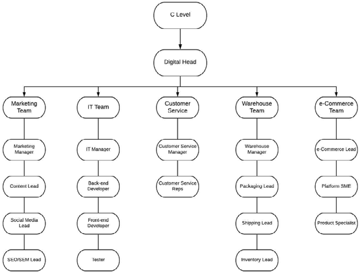
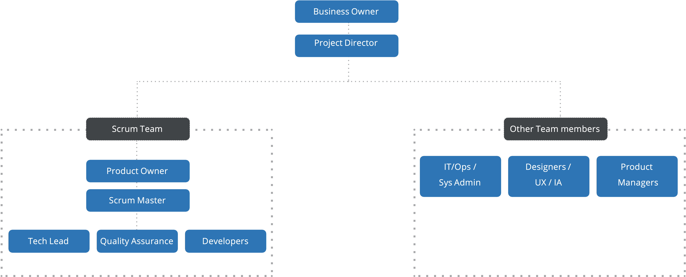

# Organisationsstruktur

För digitala implementeringsprojekt finns det vanligtvis en central teamstruktur som implementeras. Det finns enskilda team som har en ledargrupp som sedan rapporterar till den digitala chefen, e-handelsledaren eller produktägaren.

I följande diagram visas ett exempel på hur organisationsstrukturen skulle se ut:

Fördelarna med denna form av centraliserad modell i ett digitalt implementeringsprojekt är bland annat:

- Ger kontroll och enhetlighet
- Enhetlig budget och strategi
- Hjälper till skalbarhet
- Stöd för större företag

## Projektbaserad struktur

I följande diagram visas ett exempel på en rekommenderad projektbaserad organisationsstruktur:

