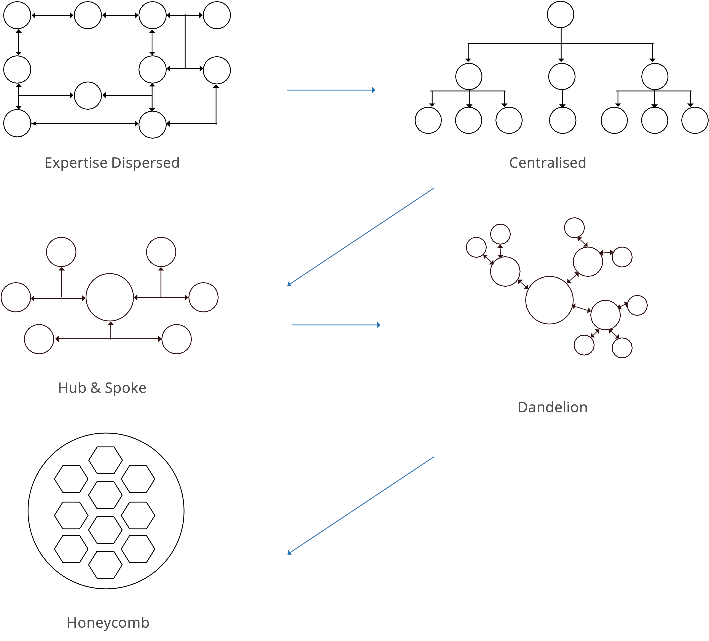

# Teamstruktur

Teamstrukturen avser en kombination av antingen en enskild team eller en struktur med flera team. Teamstrukturer är en grundläggande del i alla teamprocesser. Ett korrekt aktiverat team ökar effektivt samarbete, kommunikation, support, ledarskap, problemlösning och beslutsfattande.

Teamstrukturen gör det möjligt för individer att arbeta tillsammans mot ett gemensamt mål. Det finns olika typer av teamstrukturer, från hierarkiska till flexibla, som fungerar på olika sätt för olika branscher.

I följande diagram sammanfattas de olika teamstrukturerna i olika organisationer:

>[!NOTE]
>
>Som en del av ett typiskt e-handelsarbetsflöde är ett centralt team den vanligaste av de fem typer som visas nedan. Bikakestrukturen passar bäst med Agile-arbetsflöden.

