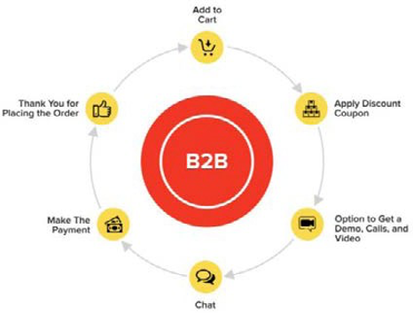

# Utcheckningsflöden och -process

Utcheckning är en viktig del av onlineshoppingen. Det är här som de reella pengarna görs. Återförsäljarna tenderar att fokusera mer på webbplatsens utseende och känsla och ser över utcheckningsflödet, men båda delarna är lika viktiga.

Utcheckningsflödet är som slutresultatet, där kunderna blir kunder som gör transaktioner. Men även en liten skillnad i kassan kan ha en stor negativ inverkan på konverteringsgraden och avkastningen, vilket innebär att en förbättring av konverteringsgraden till och med kan bidra till att öka avkastningen avsevärt. Att förbättra utcheckningsflöden och -processer börjar redan före utcheckningssidan.

## Produktsidor

Försök att behålla all information innan sidan viks, som produktinformation, priser, produktbilder, recensioner och omdömen. Alla faktorer som kunden behöver för att fatta ett beslut om att köpa produkten.

Lägg till avsnitt som&quot;Du kanske gillar&quot;, som visar produkter som är relaterade till den produkt som en kund tittar på just nu. Detta är en strategi som används för att göra kundköpet mer.

## Effektivisera utcheckningsprocessen

Försök att ha begränsade steg och färre klick på utcheckningssidan för att snabbt spåra processen. Utcheckningen måste till exempel innehålla:

- Leverans
- Fakturering
- Betalning

Genom att införa en enkel och bekväm utcheckning elimineras risken för att kunden överger kundvagnen.

## Visual checkout flow

Visa ett utcheckningsflöde där kunderna kan se en förhandsgranskning av hur många steg köpet ska ta.

## Ta bort extramaterial

Ta bort extra information, t.ex. minibag, search och/eller navigation bar. Detta hjälper kunden att fokusera på utcheckningsprocessen i stället för att navigera till en annan sida.

Ha rena och feta CTA-knappar med enkel siddesign.

## Förtroende

Kunder som handlar online är alltid intresserade av säkerheten. Om du vill försäkra kunderna ska du visa följande på webbplatsen:

- Kreativitetsackrediteringar som Norton, säkert, MacAfee och Google Trusted Store
- SSL-certifikat
- Logotyper för betalningsmetoder
- Omdömen och recensioner
- Profiler
- Villkor

## Utcheckningsalternativ

Ange olika alternativ för utcheckning, som:

- Gästanvändare
- Registrerad användare
- Skapa ett konto

Tvinga inte en typ av alternativ för användaren.

## Leveransalternativ

Återförsäljarna bör tillhandahålla olika leveransmetoder för att tillgodose behoven hos olika kunder.

Förutom betalningsalternativ kan återförsäljarna även tillhandahålla alternativ som [klicka och samla in](click-collect.md).

## Betalningsinformation

Betalningsinformation ska placeras i slutet, direkt innan du bekräftar att du har gjort en beställning.

Ange en enkel metod för att ange betalningsinformation, som namnet på kortet och kortnumret.

Ange ett alternativ för användaren att spara sin kreditinformation för nästa inköp.

## Ordersammanfattning

Ange en detaljerad ordersammanfattning innan användaren bekräftar köpet.

## Orderbekräftelse

Visa ett tackmeddelande med orderbekräftelseinformationen så att kunden kan vara säker på att de har gjort en beställning.

En del återförsäljare tillhandahåller även kampanjmeddelanden om användaren har checkat ut som gäst för att göra registreringen till registrerad användare.

## E-post

Följ alltid upp orderbekräftelsen med ett e-postmeddelande med en orderbekräftelse som visar all orderinformation och spårningsfunktion.

Utcheckning är en faktor som ökar konverteringsgraden och i sin tur ökar avkastningen. Det är nödvändigt att effektivisera utcheckningsprocessen för att skapa en användarvänlig, snabb och bekväm utcheckning. Det är inte en storlek som passar alla när det gäller kassaflödet och processen, så det är viktigt för återförsäljarna att undersöka, analysera och testa de bästa alternativen.

## B2C vs B2B-utcheckning

Det finns en skillnad mellan arbetsflöden och processer för B2B- och B2C-utcheckning.

### B2C

- Det går att ändra kvantitet
- Det går att ta bort produkten från varukorgen
- Enkel utcheckning
- Olika betalningsalternativ, som kreditkort och e-plånbok
- Kan lägga till kupongkod i kassan

### B2B

- Det går att ändra kvantitet
- Det går att ta bort produkten från varukorgen
- Enkel utcheckning
- Olika betalningsalternativ som inköpsorder, banköverföring eller check
- Enkel process att ordna om

