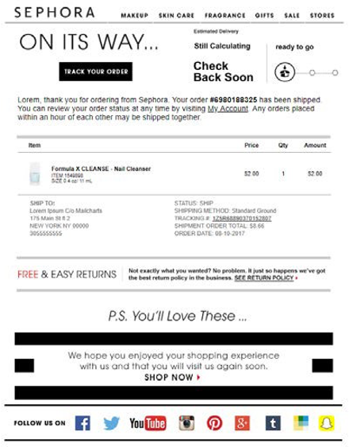
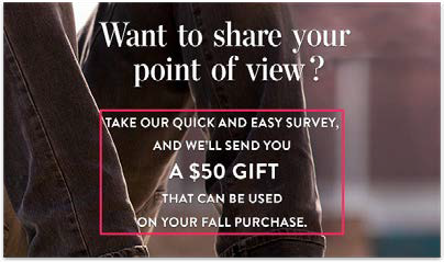

# E-postmarknadsföring

E-postmarknadsföring (i enkla termer) skickar marknadsföringsmeddelanden till leads och befintliga kunder via e-post för att marknadsföra, attrahera och sälja produkter till kunder. Marknadsföringsteamen har full kontroll över att hämta kundinformation och skicka personaliserat innehåll via direktkampanjer. E-post fungerar som ett verktyg som hjälper er att bygga en relation mellan era kunder och ert varumärke.

Därför bör ni överväga e-postmarknadsföring:

- Gör att du kan skapa en relation med befintliga och framtida kunder

- Hjälper till att öka försäljningen och konverteringsgraden

- Ökar tillväxten

- Kräver ingen tredje part, som Instagram eller Facebook

## Välkomstmeddelande

Att få det första intrycket att stanna är avgörande i e-handelsverksamheten. Om det första e-postmeddelandet du skickar till nya kunder är effektivt kommer det att ge kunderna ett bestående intryck i minnet. Försök att hålla designen enkel och originaltrogen. Vissa varumärken ger till exempel rabatter i e-postmeddelandet när kunden registrerar sig.

## Kuraterad e-post

Samlad e-post är en av de bästa formerna av e-post eftersom den gör det möjligt för prenumeranter att lära sig mer om produkten. Du kan också skicka e-postmeddelanden med kuraterade utskick baserat på kundsegmentering.

## E-post om engagemang

Kunderna kan enkelt glömma bort e-postmeddelanden, men om e-postmeddelanden skickas som e-postmeddelanden om engagemang är sannolikheten att en kund tar bort det utan att titta på det lägre. E-postmeddelanden om engagemang kan vara i form av en kampanj som ger användarna en befordran, till exempel fri frakt.

## E-post för hänskjutande

Munord är en av de bästa marknadsföringsstrategierna. Du kan t.ex. skicka hänvisningsmeddelanden till en befintlig kund via e-post. Exempel:&quot;Referera en vän och få $10!&quot; E-post med hänskjutande motiverar kunderna att sprida ordet organiskt, vilket hjälper er att få fler kunder.

## E-post med rabatt

Att erbjuda rabatter via e-post är en effektiv marknadsföringsstrategi. Du bör erbjuda rabatter till prenumeranter för att behålla deras lojalitet.

## Övergiven e-post

Kunderna överger sina varukorgar av olika skäl, bland annat höga fraktkostnader eller otillfredsställande returpolicy. Du kan försöka konvertera dessa kunder till framgångsrika kunder genom att skicka en påminnelse via e-post om produkten de lämnade i kundvagnen. Dessutom kan du erbjuda incitament att slutföra utcheckningen, inklusive fri frakt, rabatt eller en kupong för nästa inköp. Detta bidrar till att öka konverteringsgraden.

## E-postmeddelande med orderbekräftelse

E-postmeddelanden med orderbekräftelse hjälper inte bara till att öka försäljningen, utan ger även kunderna förtroende för att de har gjort sin beställning, vilket ökar kundupplevelsen och kundlojaliteten.

## E-postenkät

När kunderna har fått sina beställningar bör du skicka ett uppföljningsmeddelande via e-post för att fråga om deras erfarenheter och förslag på förbättringar. Vissa återförsäljare tillhandahåller också en presentkupong om kunderna slutför enkäten eftersom kunderna oftast inte slutför enkäter eftersom de inte har någon anledning att göra det.

