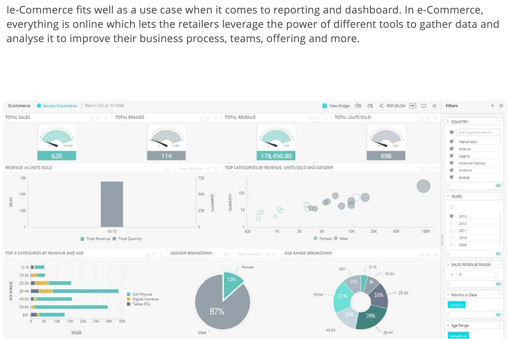

# Rapportering och kontrollpaneler

E-handeln passar in i ett bra exempel när det gäller rapportering och instrumentpaneler. Inom e-handeln är allt online, vilket gör att återförsäljarna kan utnyttja de kraftfulla verktygen för att samla in data och analysera dem för att förbättra sina affärsprocesser, team, produkterbjudanden med mera.

Alla företag har olika rapporteringskrav. Om du till exempel vill spåra en viss kampanj kan du skapa en specifik kontrollpanel för att se hur långt kampanjen har kommit, till exempel hur många som har använt kampanjen, vilka produkter som sålt bäst och så vidare. Du kan också använda en kontrollpanel för att spåra dagliga aktiviteter på webbplatsen, trafik, konverteringsgrad, bästsäljande produkt, pessimistisk produkt och returer.

## Funktioner

Andra funktioner i rapporter och kontrollpaneler:

- Spåra ROI, som hjälper återförsäljare att fatta beslut och övervaka utvecklingen

- Spåra försäljningen för att förstå vad som genererar mest försäljning

- Spåra webbplatstrafiken i realtid och visualisera informationen

- Mät hur bra webbplatsfunktionerna är och förbättra dem för att förbättra kundservicen

- Övervaka nyckeltal för varje team

Det är så mycket som pågår inom e-handeln att det kan vara svårt att hålla reda på det. Det är där rapporter och kontrollpaneler kan hjälpa. De sammanställer alla data på ett och samma ställe för att ge alla en översikt över verksamheten. De hjälper även återförsäljarna att sätta upp nya mål, identifiera nya möjligheter och få konkurrensfördelar.

## B2B-alternativ

De fyra viktigaste rapporterna och kontrollpanelerna som B2B-företag använder är:

- **Företagsprofil** - B2B-företag måste spåra sina kundföretagsprofiler för att förstå inköpshistorik, betalningsinformation och vilken kanal de använde för att köpa. Kontrollpanelen kan hjälpa till att identifiera potentiella risker och problem.

- **Katalog** - En katalograpport och kontrollpanel hjälper B2B-företag att se resultatet för varje produkt i katalogen, kampanjerna och lagernivåerna, vilket hjälper dem att identifiera vilken typ av kampanj som fungerar bäst och vilka produkter som efterfrågas. Detta hjälper företag att inventera och få konkurrensfördelar.

- **Offerter** - B2B-affärsmodellen bygger på offerter och priser. B2B-företag måste gå igenom en process där de analyserar en offert så att de antingen kan godkänna den eller försöka förhandla. En offertrapport och en kontrollpanel hjälper er att förbättra konverteringsgraden för offerter genom att spåra kundens framgångsgrad, konkurrensnivåer, resultat och totala kundlojalitet.

- **Försäljning** - Även om B2B-företag kan arbeta online är en säljare fortfarande nödvändig för att komma igång med att identifiera offerter som behöver förhandlas, spåra offerter som snart går ut, spåra kontrakt som ska förnyas, spåra teamets prestanda och hjälpa till att effektivisera den dagliga verksamheten.

## Bättre tillsammans

Handlare som vill ha ett sätt att korrelera beteendedata med transaktionsdata kan använda Adobe Commerce Reporting och Adobe Analytics för att få en mer korrekt förståelse för hur marknadsföringsaktiviteter påverkar viktiga affärsdata.

