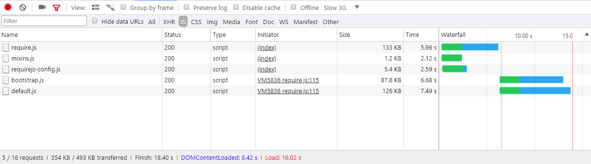

# Avancerad paketering för [!DNL JavaScript]

Att paketera [!DNL JavaScript] moduler för bättre prestanda handlar om att minska två saker:

1. Antalet serverförfrågningar.
1. Storleken på dessa serverförfrågningar.

I ett modulärt program kan antalet serverförfrågningar nå ut till hundratals. Följande skärmbild visar till exempel bara början av listan med [!DNL JavaScript] moduler som är inlästa på startsidan för en ren installation.


## Sammanfogning och paketering

[!DNL Commerce] har två sätt att minska antalet serverförfrågningar: sammanfogning och paketering. De här inställningarna är inaktiverade som standard. Du kan aktivera dem i administratörsgränssnittet i **[!UICONTROL Stores]** > **Inställningar** > **[!UICONTROL Configuration]** > **[!UICONTROL Advanced]** > **[!UICONTROL Developer]** > **[!UICONTROL [!DNL JavaScript] Settings]** eller från kommandoraden.


### Grundläggande paketering

Så här aktiverar du det inbyggda paketet från kommandoraden:

```bash
php -f bin/magento config:set dev/js/enable_js_bundling 1
```

Detta är en inbyggd [!DNL Commerce]-mekanism som kombinerar alla resurser som finns i systemet och distribuerar dem till paket av samma storlek (bundle_0.js, bundle_1.js ... bundle_x.js):

![[!DNL Commerce] paketerar](../assets/performance/images/magentoBundling.png)

Bättre, men webbläsaren läser fortfarande in ALLA [!DNL JavaScript]-paket, inte bara de som behövs.

[!DNL Commerce]-paketering minskar antalet anslutningar per sida, men för varje sidbegäran läses alla paket in, även när den begärda sidan bara är beroende av filer i ett eller två av paketen. Prestandan förbättras när webbläsaren har cachelagrat paketen. Men eftersom webbläsaren läser in dessa paket synkront, kan det ta ett tag för användaren att besöka en [!DNL Commerce]-butik för att återge och skada användarupplevelsen.

### Grundläggande sammanslagning

Så här aktiverar du inbyggd sammanslagning från kommandoraden:

```bash
php -f bin/magento config:set dev/js/merge_files 1
```

Det här kommandot sammanfogar alla synkrona [!DNL JavaScript]-filer till en fil. Det är inte användbart att aktivera sammanfogning utan att aktivera paketering eftersom [!DNL Commerce] använder RequireJS. Om du inte aktiverar paketering sammanfogar [!DNL Commerce] bara RequireJS och dess konfiguration. När du aktiverar både paketering och sammanslagning skapar [!DNL Commerce] en enda [!DNL JavaScript]-fil:


## Återgivningstider i verkligheten

De tidigare paketerade och sammanfogade laddningstiderna ser bra ut i en utvecklingsmiljö. Men i verkligheten kan många saker göra återgivningen långsammare: långsamma anslutningar, höga anslutningströsklar, begränsade nätverk. Dessutom återges inte mobilenheter lika snabbt som stationära datorer.

Vi rekommenderar att du testar och förbereder din storskalig driftsättning för den verkliga världen med Chrome inbyggda strypningsprofil&quot;Långsam 3G&quot;. Med Slow 3G återspeglar våra tidigare paketerade utdatatider nu många användares anslutningsrealiteter:


Vid en långsam 3G-anslutning tar det ca 44 sekunder att läsa in alla paket för hemsidan av en ren [!DNL Commerce]-installation.

Detsamma gäller när du sammanfogar paketen i en enda fil. Användarna kan fortfarande vänta i cirka 42 sekunder på att den första sidan laddas, vilket visas här:


Med ett mer avancerat tillvägagångssätt för [!DNL JavaScript]-paketering kan vi förbättra de här inläsningstiderna.

## Avancerad paketering

Målet med [!DNL JavaScript]-paketeringen är att minska antalet och storleken på begärda resurser för varje sida som läses in i webbläsaren. För att göra det vill vi bygga våra paket så att varje sida i vår butik bara behöver ladda ned ett gemensamt paket och ett sidspecifikt paket för varje sida som öppnas.

Ett sätt att uppnå detta är att definiera era paket efter sidtyp. Du kan kategorisera sidorna för [!DNL Commerce] i flera sidtyper, bland annat Kategori, Produkt, CMS, Kund, Kund och Kassa. Varje sida som kategoriseras i någon av dessa sidtyper har olika beroenden för RequireJS-modulen. När du paketerar dina RequireJS-moduler per sidtyp får du bara ett handtag som täcker alla sidors beroenden i din butik.

Du kan till exempel få ett paket med de beroenden som är gemensamma för alla sidor, ett paket som bara innehåller CMS, ett paket som endast innehåller katalogsidor, ett annat paket som bara innehåller söksidor och ett paket som innehåller utcheckningssidor.

Du kan också skapa paket utifrån syfte: för gemensamma funktioner, produktrelaterade funktioner, leveransfunktioner, utcheckningsfunktioner, skatter och formulärvalideringar. Det är upp till dig och butikens struktur att definiera era paket. Ni kanske märker att vissa paketeringsstrategier kommer att fungera bättre än andra.

En ren [!DNL Commerce]-installation gör att du kan uppnå tillräckligt goda prestanda genom att dela paket efter sidtyp, men vissa anpassningar kan kräva djupare analyser och andra resursdistributioner.

### Nödvändiga verktyg

Följande steg kräver att du installerar och känner till följande verktyg:

- [nodatums](https://nodejs.org/en/download/)
- [r.js](http://requirejs.org/docs/optimization.html#download)
- [[!DNL PhantomJS]](https://phantomjs.org/) (valfritt)

### Exempelkod

Fullständiga versioner av exempelkoden som används i den här artikeln finns här:

- [build.js](../assets/performance/code-samples/build.js)
- [deps.js](../assets/performance/code-samples/deps.js)
- [deps-map.sh](../assets/performance/code-samples/deps-map.sh.txt)

### Del 1: Skapa en paketkonfiguration

#### 1\. Lägg till en build.js-fil

Skapa en `build.js`-fil i rotkatalogen [!DNL Commerce]. Den här filen innehåller hela byggkonfigurationen för dina paket.

```javascript
({
    optimize: 'none',
    inlineText: true
})
```

Senare kommer vi att ändra inställningen `optimize:` från `none` till `uglify2` för att minimera paketutdata. Men under utvecklingen kan du för närvarande låta den vara inställd på `none` för att säkerställa snabbare byggen.

#### 2\. Lägg till RequireJS-beroenden, shims, paths och map

Lägg till följande RequireJS build-konfigurationsnoder, `deps`, `shim`, `paths` och `map`, i din build-fil:

```javascript
({
    optimize: 'none',
    inlineText: true,

    deps: [],
    shim: {},
    paths: {},
    map: { "*": {} },
})
```

#### 3\. Aggregera kravjs-config.js-instansvärden

I det här steget måste du samla alla flera `deps`-, `shim`-, `paths`- och `map`-konfigurationsnoder från butikens `requirejs-config.js`-fil i motsvarande noder i `build.js`-filen. Det gör du genom att öppna fliken **[!UICONTROL Network]** i webbläsarens Developer Tools-panel och navigera till en sida i din butik, till exempel hemsidan. På fliken Nätverk ser du butikens instans av filen `requirejs-config.js` i närheten av den övre, markerade här:


I den här filen hittar du flera poster för varje konfigurationsnod (`deps`, `shim`, `paths`, `map`). Du måste samla dessa värden för flera noder i build.js-filens enda konfigurationsnod. Om butikens `requirejs-config.js`-instans till exempel har poster för 15 separata `map`-noder måste du sammanfoga posterna för alla 15 noder i den enda `map`-noden i `build.js`-filen. Detsamma gäller noderna `deps`, `shim` och `paths`. Utan ett skript som automatiserar den här processen kan det ta tid.

Du måste ändra sökvägen `mage/requirejs/text` till `requirejs/text` i konfigurationsnoden `paths` enligt följande:

```javascript
({
    //...
    paths: {
        //...
        "text": "requirejs/text"
    },
})
```

#### 4\. Lägg till en modulnod

I slutet av filen `build.js` lägger du till arrayen modules[] som en platshållare för de paket som du definierar för din storefront senare.

```javascript
({
    optimize: 'none',
    inlineText: true,

    deps: [],
    shim: {},
    paths: {},
    map: { "*": {} },

    modules: [],
})
```

#### 5\. Hämta RequireJS-beroenden

Du kan hämta alla [!DNL RequireJS]-modulberoenden från din butiks sidtyper genom att använda:

1. [!DNL PhantomJS] från kommandoraden (förutsatt att du har [!DNL PhantomJS] installerat).
1. RequireJS-kommandot i webbläsarens konsol.

#### Så här använder du [!DNL PhantomJS]:

Skapa en ny fil med namnet [!DNL Commerce] i rotkatalogen `deps.js` och kopiera den i koden nedan. Den här koden använder [!DNL [!DNL PhantomJS]] för att öppna en sida och vänta på att webbläsaren ska läsa in alla sidresurser. Därefter genereras alla [!DNL RequireJS]-beroenden för en viss sida.

```javascript
"use strict";
var page = require('webpage').create(),
    system = require('system'),
    address;

if (system.args.length === 1) {
    console.log('Usage: $phantomjs deps.js url');
    phantom.exit(1);
} else {
    address = system.args[1];
    page.open(address, function (status) {
        if (status !== 'success') {
            console.log('FAIL to load the address');
        } else {
            setTimeout(function () {
                console.log(page.evaluate(function () {
                    return Object.keys(window.require.s.contexts._.defined);
                }));
                phantom.exit();
            }, 5000);
        }
    });
}
```

Öppna en terminal i rotkatalogen [!DNL Commerce] och kör skriptet mot varje sida i din butik som representerar en viss sidtyp:

<pre>
phantomjs deps.js <i>url-to-specific-page</i> &gt; <i>text-file-representing-pagetype-Berodencies</i>
</pre>

Här är till exempel fyra sidor från Lumas exempelbutik som representerar de fyra sidtyperna som vi kommer att använda för att skapa våra fyra paket (hemsida, kategori, produkt, vagn):

```
phantomjs deps.js http://m2.loc/ > bundle/homepage.txt
phantomjs deps.js http://m2.loc/women/tops-women/jackets-women.html > bundle/category.txt
phantomjs deps.js http://m2.loc/beaumont-summit-kit.html > bundle/product.txt
phantomjs deps.js http://m2.loc/checkout/cart/?SID=m2tjdt7ipvep9g0h8pmsgie975 > bundle/cart.txt (prepare a shopping cart)
..............
```

#### Använda webbläsarkonsolen:

Om du inte vill använda [!DNL PhantomJS] kan du köra följande kommando från webbläsarens konsol när du visar varje sidtyp i din butik:

```shell
Object.keys(window.require.s.contexts._.defined)
```

Det här kommandot (används i skriptet [!DNL PhantomJS]) skapar samma lista med [!DNL RequireJS]-beroenden och visar dem i webbläsarens konsol. Nackdelen med det här är att du måste skapa egna textfiler av text av text på sidan/i paket.

#### 6\. Formatera och filtrera utdata

När du har sammanfogat [!DNL RequireJS]-beroenden till sidtypstextfiler kan du använda följande kommando för varje sidtypsberoende fil för att ersätta kommatecknen i dina filer med nya rader:

```bash
sed -i -e $'s/,/\\\n/g' bundle/category.txt
sed -i -e $'s/,/\\\n/g' bundle/homepage.txt
sed -i -e $'s/,/\\\n/g' bundle/product.txt
....
```

Du bör också ta bort alla blandningar för varje fil eftersom blandar dubblettberoenden. Använd följande kommando för varje beroendefil:

```bash
sed -i -e 's/mixins\!.*$//g' bundle/homepage.txt
sed -i -e 's/mixins\!.*$//g' bundle/category.txt
sed -i -e 's/mixins\!.*$//g' bundle/product.txt
...
```

#### 7\. Identifiera unika och gemensamma paket

Målet är att skapa ett gemensamt paket med [!DNL JavaScript] filer som behövs för alla sidor. På så sätt behöver webbläsaren bara läsa in det gemensamma paketet tillsammans med en eller flera specifika sidtyper.

Öppna en terminal i rotkatalogen [!DNL Commerce] och använd följande kommando för att verifiera att du har beroenden som du kan dela upp i separata paket:

```bash
sort bundle/*.txt |uniq -c |sort -n
```

Det här kommandot sammanfogar och sorterar beroenden som finns i `bundle/*.txt`-filerna.  Utdata visar också antalet filer som innehåller varje beroende:

```
1 buildTools,
1 jquery/jquery.parsequery,
1 jsbuild,
2 jquery/jquery.metadata,
2 jquery/validate,
2 mage/bootstrap,
3 jquery
3 jquery/ui
3 knockoutjs/knockout
...
```

Utdata visar att `buildTools` bara är beroende av en av paketfilerna/*.txt. `jquery/jquery.metadata`-beroendet finns i två (2) filer och `es6-collections` finns i tre (3) filer.

Våra utdata visar endast tre sidtyper (hemsida, kategori och produkt), som talar om för oss:

- Tre beroenden är unika för endast en sidtyp (visas med talet 1).
- Tre ytterligare beroenden inträffar för två sidtyper (visas med siffran 2).
- De tre sista beroendena är gemensamma för alla tre av våra sidtyper (visas med siffran 3).

Detta visar att vi sannolikt kan förbättra butikens sidladdningshastighet genom att dela upp våra beroenden i olika paket, när vi vet vilka sidtyper som behöver vilka beroenden.

#### 8\. Skapa en beroendedistributionsfil

Om du vill ta reda på vilka sidtyper som behöver vilka beroenden skapar du en ny fil i rotkatalogen [!DNL Commerce] med namnet `deps-map.sh` och kopierar i koden nedan:

```shell
awk 'END {
 for (R in rec) {
   n = split(rec[R], t, "/")
   if (n > 1)
     dup[n] = dup[n] ? dup[n] RS sprintf("\t%-20s -->\t%s", rec[R], R) : \
       sprintf("\t%-20s -->\t%s", rec[R], R)
   }
 for (D in dup) {
   printf "records found in %d files:\n\n", D
   printf "%s\n\n", dup[D]
   }
 }
{
 rec[$0] = rec[$0] ? rec[$0] "/" FILENAME : FILENAME
}' bundle/*.txt
```

Du kan också hitta skriptet på [https://www.unix.com/shell-programming-and-scripting/140390-get-common-lines-multiple-files.html](https://www.unix.com/shell-programming-and-scripting/140390-get-common-lines-multiple-files.html)

Öppna en terminal i rotkatalogen [!DNL Commerce] och kör filen:

```bash
bash deps-map.sh
```

Utdata från det här skriptet, som tillämpas på våra tre exempelsidtyper, ska se ut ungefär så här (men mycket längre):

```
bundle/product.txt   -->   buildTools,
bundle/category.txt  -->   jquery/jquery.parsequery,
bundle/product.txt   -->   jsbuild,

bundle/category.txt/bundle/homepage.txt -->    jquery/jquery.metadata,
bundle/category.txt/bundle/homepage.txt -->    jquery/validate,
bundle/category.txt/bundle/homepage.txt -->    mage/bootstrap,

bundle/category.txt/bundle/homepage.txt/bundle/product.txt --> jquery,
bundle/category.txt/bundle/homepage.txt/bundle/product.txt --> jquery/ui,
bundle/category.txt/bundle/homepage.txt/bundle/product.txt --> knockoutjs/knockout,
```

Det här är tillräckligt med information för att skapa en paketkonfiguration.

#### 9\. Skapa paket i filen build.js

Öppna konfigurationsfilen `build.js` och lägg till dina paket i noden `modules`. Varje paket ska definiera följande egenskaper:

- `name` - paketets namn. Namnet `bundles/cart` genererar till exempel ett `cart.js`-paket i en `bundles`-underkatalog.

- `create` - en boolesk flagga som skapar paketet (värden: `true` eller `false`).

- `include` - en matris med resurser (strängar) inkluderad som beroenden för sidan. RequireJS spårar alla beroenden och inkluderar dem i paketet om de inte utesluts.

- `exclude` - en matris med paket eller resurser som ska exkluderas från paketet.

```javascript
{
    name: 'bundles/catalog',
    create: true,
    include: [
        'addToWishlist',
        'priceBundle',
        'priceUtils',
        'priceOptions',
        'sticky',
        'productSummary',
        'slide'
    ],
    exclude: [
        'requirejs/require',
        'bundles/default',
        'mage/bootstrap'
    ],
}
```

I det här exemplet återanvänds `mage/bootstrap`- och `requirejs/require`-resurser, vilket ger högre prioritet åt deras viktigaste komponenter och komponenter som måste läsas in synkront. De paket som finns är:

- `requirejs/require` - det enda synkront inlästa paketet
- `mage/bootstrap` - bootstrap-paketet med UI-komponenter
- `bundles/default` - standardpaket krävs för alla sidor
- `bundles/cart` - ett paket krävs för kundvagnssidan
- `bundles/shipping` - vanligt paket för kundvagn- och utcheckningssida (förutsatt att utcheckningen aldrig öppnas direkt laddas utcheckningssidan ännu snabbare om kundvagnssidan öppnades tidigare och leveranspaketet redan lästes in)
- `bundles/checkout` - allt för utcheckning
- `bundles/catalog` - allt för produkt- och kategorisidor

### Del 2: Generera paket

Stegen nedan beskriver den grundläggande processen för att generera mer effektiva [!DNL Commerce]-paket. Du kan automatisera den här processen hur du vill, men du måste fortfarande använda `nodejs` och `r.js` för att generera dina paket. Och om dina teman har [!DNL JavaScript]-relaterade anpassningar och inte kan återanvända samma `build.js`-fil kan du behöva skapa flera `build.js` konfigurationer per tema.

#### &#x200B;1. Generera statiska butiksplatser

Kör det statiska distributionskommandot innan du genererar paket:

```bash
php -f bin/magento setup:static-content:deploy -f -a frontend
```

Det här kommandot genererar statiska butiksdistributioner för varje tema och språk som du har konfigurerat. Om du till exempel använder Luma-temat och ett anpassat tema med språkområden på engelska och franska genererar du fyra statiska distributioner:

- ...luma/en_US
- ...luma/fr_FR
- ...custom/en_US
- ...custom/fr_FR

Om du vill generera paket för alla butiksteman och språkområden upprepar du stegen nedan för varje butikstema och språkområde.

#### &#x200B;2. Flytta det statiska innehållet till en tillfällig katalog

Först måste du flytta det statiska innehållet från målkatalogen till en tillfällig katalog eftersom RequireJS ersätter allt innehåll i målkatalogen.

```bash
mv pub/static/frontend/Magento/{theme}/{locale} pub/static/frontend/Magento/{theme}/{locale}_tmp
```

Exempel:

```bash
mv pub/static/frontend/Magento/luma/en_US pub/static/frontend/Magento/luma/en_US_tmp
```

#### &#x200B;3. Kör optimeraren för r.js

Kör sedan r.js-optimeraren på filen `build.js` från rotkatalogen för [!DNL Commerce]. Sökvägar till alla kataloger och filer är relativa till arbetskatalogen.

```bash
r.js -o build.js baseUrl=pub/static/frontend/Magento/luma/en_US_tmp dir=pub/static/frontend/Magento/luma/en_US
```

Det här kommandot genererar paket i en `bundles`-underkatalog till målkatalogen, vilket i det här fallet resulterar i `pub/static/frontend/Magento/luma/en_US/bundles`.

Innehållet i den nya paketkatalogen kan se ut så här:

```bash
ll pub/static/frontend/Magento/luma/en_US/bundles
```

```
total 1900
drwxr-xr-x  2 root root    4096 Mar 28 11:24 ./
drwxr-xr-x 70 root root    4096 Mar 28 11:24 ../
-rw-r--r--  1 root root  116417 Mar 28 11:24 cart.js
-rw-r--r--  1 root root  187090 Mar 28 11:24 catalog.js
-rw-r--r--  1 root root  307619 Mar 28 11:24 checkout.js
-rw-r--r--  1 root root 1240608 Mar 28 11:24 default.js
-rw-r--r--  1 root root   74233 Mar 28 11:24 shipping.js
```

#### &#x200B;4. Konfigurera RequireJS att använda paket.

Om du vill få RequireJS att använda dina paket lägger du till ett `onModuleBundleComplete`-återanrop efter `modules`-noden i filen `build.js`:

```javascript
[
    {
       //...
       exclude: [
           'requirejs/require',
           'bundles/default',
           'bundles/checkout',
           'bundles/cart',
           'bundles/shipping',
           'mage/bootstrap'
       ],
   },
],
bundlesConfigOutFile: `${config.dir}/requirejs-config.js`,
onModuleBundleComplete: function(data) {
    if (this.bundleConfigAppended) {
        return;
    }
    this.bundleConfigAppended = true;

    // bundlesConfigOutFile requires a simple require.config call in order to modify the configuration
    const bundleConfigPlaceholder = `
(function (require) {
require.config({});
})(require);
    `;

    fs.appendFileSync(this.bundlesConfigOutFile, bundleConfigPlaceholder);
}
```

#### &#x200B;5. Kör kommandot för distribution igen

Kör följande kommando för att distribuera:

```bash
r.js -o app/design/frontend/Magento/luma/build.js baseUrl=pub/static/frontend/Magento/luma/en_US_tmp dir=pub/static/frontend/Magento/luma/en_US
```

Öppna `requirejs-config.js` i katalogen `pub/static/frontend/Magento/luma/en_US` för att verifiera att RequireJS har lagt till filen med konfigurationsanrop:

```javascript
require.config({
    bundles: {
        "bundles/default": ["mage/template", "mage/apply/scripts", "mage/apply/main", "mage/mage", "mage/translate", "mage/loader"],
        "bundles/cart": ["Magento_Ui/js/lib/validation/utils", "Magento_Ui/js/lib/validation/rules", "Magento_Ui/js/lib/validation/validation"]
    }
}
```

>[!NOTE]
>
>När du konfigurerar paket ska du se till att du placerar `requirejs.config()`-anropen i den ordning som du vill att de ska köras, eftersom anropen körs i den ordning som de visas.

#### &#x200B;6. Testa resultaten

Lägg märke till att webbläsaren läser in olika beroenden och paket när sidan har lästs in. Här är till exempel resultatet för profilen Långsam 3G:


Sidinläsningstiden för en tom hemsida är nu dubbelt så snabb som om det ursprungliga [!DNL Commerce]-paketet används. Men vi kan göra ännu bättre.

#### &#x200B;7. Optimera paketen

Även om de gzippas är [!DNL JavaScript]-filerna fortfarande stora. Minimera dem med RequireJS, som använder en förstärkare för att minimera [!DNL JavaScript] till bra resultat.

Om du vill aktivera optimeraren i `build.js`-filen lägger du till `uglify2` som värde för optimeringsegenskapen högst upp i `build.js`-filen:

```javascript
({
    optimize: 'uglify2',
    inlineText: true
})
```

Resultaten kan vara viktiga:


Inläsningstiderna är nu tre gånger snabbare än med det inbyggda [!DNL Commerce]-paketet.
