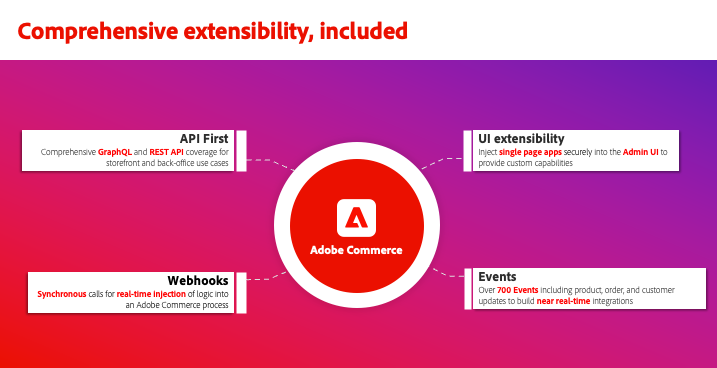
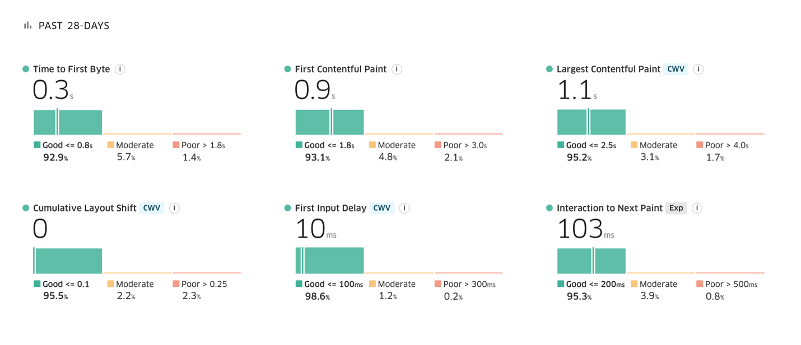

# Adobe Commerce produktinformation från februari

Adobe Commerce har samarbetat nära med kunderna för att utveckla nya upplevelsestyrda e-handelsfunktioner som gör det möjligt för dem att snabbare och öka försäljningen. Kunder som Hanesbrands drar redan nytta av snabbare webbplatser, högre konverteringsgrader och bättre kampanjer med dessa nya funktioner. Och Nestle Purina förenklar sammansättningsbar utveckling med vår enhetliga utvecklarupplevelse. Läs mer om de nya funktionerna och hur du kommer igång i den här produktannonsöversikten för februari.

{zoomable=&quot;yes&quot;}

## Lär dig av andra ledande företag inom e-handeln

Delta i dessa personliga och virtuella event för att lära oss mer om Adobe Commerce från ledande och yrkesverksamma inom e-handel:

- **15 mars 2024**: Adobe Commerce: Building the Experience-led Commerce Platform, 10.00 PDT / 6.00 GMT. [Registrera dig för live-webbinariet](https://engage.adobe.com/BdgxpComWBR-register.html).

- **26-28 mars 2024**: Träffa tusentals ledare och yrkesverksamma på e-handelsområdet i Adobe Summit i Las Vegas. Läs mer om [Adobe Summit](https://business.adobe.com/summit/adobe-summit.html) och [Commerce Track](https://reg.adobe.com/flow/adobe/as24/sessions/page/catalog?tab.allsessions=1643149273691001NFtR&amp;search.track=1601680652403006TXuG) med högtalare från [Hanesbrands](https://reg.adobe.com/flow/adobe/as24/sessions/page/catalog?tab.allsessions=1643149273691001NFtR&amp;search=S435), [Coca-Cola](https://reg.adobe.com/flow/adobe/as24/sessions/page/catalog?tab.allsessions=1643149273691001NFtR&amp;search=S434), [Unilever](https://reg.adobe.com/flow/adobe/as24/sessions/page/catalog?tab.allsessions=1643149273691001NFtR&amp;search=s430)och [Nestle Purina](https://reg.adobe.com/flow/adobe/as24/sessions/page/catalog?tab.allsessions=1643149273691001NFtR&amp;search=S437).

Inspelningar från tidigare händelser:

- [Effektivare e-handel](https://experienceleague.adobe.com/docs/events/learn-from-your-peers-recordings/commerce/feb2024/agile-sdlc.html?lang=en): En fokuserad strategi för kommunikation, krav och testning i Agile SDLC. 22 februari 2023.

- [Hanesbrands: Sätt data i rörelse för exceptionella handelsupplevelser](https://engage.adobe.com/Q1PersWBR-register1.html). 28 februari 2023.

- [Adobe Commerce produktuppdateringar](https://experienceleague.adobe.com/docs/events/adobe-commerce-product-update-recordings/overview.html?lang=en) från tredje och fjärde kvartalet 2023.

## Förenklad sammansättningsbar utveckling med App Builder

Adobe Commerce är en sammansättningsbar e-handelsplattform som utformats för att lansera e-handelsfunktioner snabbare, enkelt dela data mellan tredjepartssystem och sänka ägandekostnaden för integreringar och anpassningar.

Traditionella sammansättningsbara applikationer byggs med hjälp av punktintegreringar mellan flera tjänster. Den här metoden leder till ett spritt integrationsskikt med ökad teknisk skuld. Adobe Commerce förser utvecklarna med omfattande tilläggspunkter samt en utbyggbar plattform för att samordna API:er, händelser och data, vilket ger en flexibel sammansättningsbar arkitektur. Adobe Commerce-plattformen innehåller följande:

- Omfattande [API](https://developer.adobe.com/commerce/webapi/) täckning
- [Webhooks](https://developer.adobe.com/commerce/extensibility/webhooks/) för att anpassa interna affärsprocesser
- [Administratörsgränssnitt](https://developer.adobe.com/commerce/extensibility/admin-ui-sdk/) utbyggbarhet
- Över 700 [händelser](https://experienceleague.adobe.com/docs/commerce-learn/tutorials/adobe-developer-app-builder/io-events/getting-started-io-events.html)

{align="center" zoomable="yes"}

[Adobe Developer App Builder](https://experienceleague.adobe.com/docs/commerce-learn/tutorials/adobe-developer-app-builder/introduction-to-app-builder.html) för Adobe Commerce är en utbyggbar plattform som bygger på molnfunktioner och som kan integreras med tredjepartslösningar. Den innehåller API-samordning med [API-nät](https://experienceleague.adobe.com/docs/commerce-learn/tutorials/adobe-developer-app-builder/api-mesh/getting-started-api-mesh.html), skalbar händelsebaserad dataroutning med [Adobe I/O Events](https://developer.adobe.com/events/docs/)och en [serverlös körning](https://developer.adobe.com/runtime/docs/guides/overview/howitworks/).

Det här sättet förenklar hur utvecklare lägger till nya tjänster eller ersätter befintliga tjänster i sin sammansatta hög. Med App Builder kan utvecklare enkelt bygga appar och integreringar medan Adobe hanterar provisionering, skalning och säkerhet för App Builder-infrastrukturen. Enhetliga webbkonsoler, utvecklingsverktyg, loggning och övervakning ger en överlägsen utvecklarupplevelse och gör det enklare att skapa, köra och hantera program och integreringar. Viktigast av allt är att du kan koppla in tredjepartstjänster i App Builder för att göra befintliga investeringar ännu kraftfulla.

>[!TIP]
>
>Om du vill lära dig hur du kommer igång med App Builder kan du läsa [inlärningsväg](https://developer.adobe.com/commerce/extensibility/app-development/learning-path/).

## Förbättringar i webhooks och AdminUI SDK

[!BADGE Ute nu]{type=Informative tooltip="Ute nu"}

I och med den senaste versionen fortsätter Adobe att vara ledande när det gäller att förenkla den disponibla utvecklingen för e-handelsföretag. Nu kan du [konfigurera webhooks via administratörsgränssnittet](https://developer.adobe.com/commerce/extensibility/webhooks/admin-configuration/) vilket gör det ännu enklare att utöka interna affärsprocesser som utcheckning, tillägg i kundvagnen med mera. Webbhooks kan nu också aktiveras villkorligt. Du kan t.ex. utlösa en webkrok för beräkning av frakt för utcheckningsprocessen endast för specifika postnummer.

Utvecklare har nu mer detaljkontroll för att utöka administratörsgränssnittet, till exempel genom att lägga till ytterligare [kolumner](https://developer.adobe.com/commerce/extensibility/admin-ui-sdk/extension-points/product/grid-columns/), [knappar](https://developer.adobe.com/commerce/extensibility/admin-ui-sdk/extension-points/order/view-button/)och [massåtgärder](https://developer.adobe.com/commerce/extensibility/admin-ui-sdk/extension-points/order/mass-action/) till befintliga administrationspaneler.

Senare i år kommer Adobe att öka tillgängligheten för API-nät till över 200 globala platser, vilket minskar nätverksfördröjningen och ger bättre beräkningstid och ger en bättre övergripande upplevelse för kunderna.

>[!TIP]
>
>Läs våra [dokumentation](https://developer.adobe.com/commerce/extensibility/webhooks/).

## Integrationsstartpaket och färdigbyggda ERP-integreringar

[!BADGE Tillgänglig juni 2024]{type=Informative tooltip="Tillgänglig juni 2024"}

Att integrera en e-handelsplattform med ERP, OMS eller CRM är ett verksamhetskritiskt krav. Företagen kan spendera tiotusentals dollar på att bygga upp dessa integreringar. För att minska kostnaderna för integrering med back-office-system och för att förbättra tillförlitligheten i realtidsanslutningar introducerar Adobe ett startpaket för integrering.

Paketet innehåller referensintegrationer för vanliga affärsdata, inklusive order, produkter och kunder. Det innehåller även introduktionsskript och en standardiserad arkitektur för utvecklare som bygger vidare på bästa praxis. Startsatsen (som för närvarande finns i betaversionen) förväntas minska integreringsarbetet med upp till 50 %.

Senare i år kommer Adobe också att släppa färdigbyggda integreringar för två vanliga ERP-program med startpaketet för integrering:

- [Microsoft Dynamics Finance &amp; Operations](https://www.microsoft.com/en-us/dynamics-365/products/finance)
- [SAP S/4HANA](https://www.sap.com/products/erp/s4hana.html)

Dessa referensintegreringar kan enkelt anpassas av utvecklare för att tillgodose verksamhetens behov, vilket minskar time to market och kostnaden för integreringar.

>[!TIP]
>
>Dokumentation kommer snart.

## EDGE DELIVERY SERVICES i ADOBE COMMERCE

[!BADGE Tillgänglig nu]{type=Informative tooltip="Ute nu"}

Forskning har visat att [64 % av kunderna](https://techreport.com/statistics/website-load-time-statistics-data) kommer att gå till en konkurrents webbplats för att köpa en liknande artikel om deras webbupplevelse är dålig. Omvänt kan företag förvänta sig en förbättring av webbplatshastigheten med 0,1 sekunder [9,2 % ökning av genomsnittligt ordervärde](https://techreport.com/statistics/website-load-time-statistics-data).

2023 [Edge Delivery Services](https://business.adobe.com/products/experience-manager/sites/aem-sites.html) i Adobe Experience Manager introducerades för att hantera dessa marknadstrender genom att leverera snabbare och mer engagerande webbplatser. Adobe tar nu med sig denna robusta teknik till Adobe Commerce med en ny högpresterande butik.

För att erbjuda en verkligt kraftfull och komplett handelsupplevelse innehåller den nya butiken inte bara samma fördelar och funktioner som [Edge Delivery Services](https://business.adobe.com/products/experience-manager/sites/aem-sites.html) med dokumentbaserad framtagning, en arkitektur som sätter prestanda först och färdiga inbyggda experiment, men som också utnyttjar skalan och prestandan hos [Adobe Commerce SaaS](https://experienceleague.adobe.com/docs/commerce-merchant-services/user-guides/home.html) -produkter, samt flexibiliteten och smidigheten hos instickskomponenter som ger de affärsmöjligheter som behövs för att kunna agera online.

Den här nya högpresterande butiken har redan lotsats av flera Adobe Commerce-handlare, som [Maidenform](https://business.adobe.com/blog/perspectives/how-hanesbrands-and-adobe-built-one-of-the-fastest-ecommerce-websites-in-the-world), en egenskap för HanesBrands. Resultaten talar för sig själva. Macdenform-sidor ger konsekvent Google Lighthuse-poäng på 100 och [Core Web Vitals results](https://www.rumvision.com/tools/core-web-vitals-history/www.maidenform.com/?path=/) långt över genomsnittet i branschen.

{width=&quot;50%&quot; align=center}

{zoomable=&quot;yes&quot;}

Källa: [https://treo.sh/sitespeed/www.maidenform.com](https://treo.sh/sitespeed/www.maidenform.com)

_&quot;Det är en dröm som börjar kännas sann som att vara lika lyhörd mot verksamheten som vi har varit. Vi säger: &#39;Hallå, du ville ha något snabbare? Vi kanske har världens snabbaste e-handelsplats.&quot;_ - Leo Griffin, Vice President och Global Head of Consumer Technology, HanesBrands, Inc

Du kan läsa mer om Edge Delivery Services i Adobe Commerce på [Adobe Summit](https://reg.adobe.com/flow/adobe/as24/sessions/page/catalog?tab.format=1643049381306001SAYb&amp;search=masterclass&amp;search.track=1601680652403006TXuG), inklusive våra färdiga butikskomponenter som stöder snabbare implementering av den här prestandaförsta arkitekturen.

Dessutom är vi också värd för en [labbsession](https://reg.adobe.com/flow/adobe/as24/sessions/page/catalog?tab.format=1643049381306001SAYb&amp;search=%5BL445%5D&amp;search.track=1601680652403006TXuG&amp;search.track=option_1636755664165) för att fördjupa dig i de inre arbetena och konfigurationen av detta nya butikserbjudande.

## Adobe Commerce HIPAA-förberedda lösning

[!BADGE Ute nu]{type=Informative tooltip="Ute nu"}

Adobe har stor erfarenhet av att driftsätta HIPAA-Ready Services med vårdkunder av alla storlekar. Från betalare till leverantörer till läkemedelsföretag och mellanleverantörer - Adobe sätter standarden för ansvarsfull hantering av konsumentdata. Denna expertis sträcker sig nu till den snabbt växande marknaden för digital e-handel inom hälso- och sjukvården med en HIPPA-klar version av Adobe Commerce molnplattform.

HIPAA-Ready-erbjudandet är tillgängligt för Adobe Commerce Managed Services-kunder. Det omfattar ytterligare säkerhets- och integritetskontroller för att säkerställa skyddet av elektronisk personlig hälsoinformation (ePHI) så att hälso- och sjukvårdsorganisationer enklare kan uppfylla sina skyldigheter. Lösningen stöder en rad olika användningsfall, inklusive snabb och smidig onlineförsäljning av sjukvårdstjänster, recept, förskrivna medicintekniska produkter och medicinska förråd. Adobe Commerce går nu med i [Adobe Experience Cloud for Healthcare](https://business.adobe.com/solutions/industries/healthcare.html) en uppsättning lösningar som gör det möjligt för kunderna att leverera säkra och enastående patientupplevelser samtidigt som de uppfyller kundernas önskemål.

>[!TIP]
>
>Läs mer om HIPAA-beredskap för Adobe Commerce i vår [dokumentation](https://experienceleague.adobe.com/docs/commerce-admin/start/compliance/hipaa-ready-service.html).

## B2B-handel

[!BADGE Tillgänglig april 2024]{type=Informative tooltip="Tillgänglig april 2024"}

Adobe Commerce har levererat verksamhetskritiska B2B-e-handelsfunktioner i åratal, inklusive företagskonton, regler för godkännande av inköp, offerthantering och kundprislistor. Det är därför B2B-ledande företag som [Watsco](https://business.adobe.com/content/dam/dx/us/en/resources/ebooks/building-better-experiences/building-better-experiences-and-bigger-profits.pdf), [SealedAir](https://business.adobe.com/customer-success-stories/sealed-air-case-study.html), [Solbältesuthyrning](https://business.adobe.com/customer-success-stories/sunbelt-rentals-case-study.html), [Transcat](https://business.adobe.com/customer-success-stories/transcat-case-study.html), [FoodServiceDirect.com](https://business.adobe.com/customer-success-stories/foodservicedirect-case-study.html)och [Univar Solutions](https://business.adobe.com/summit/2023/sessions/debunking-top-b2b-commerce-myths-s517.html) driva sina globala B2B-kommunikationskanaler på Adobe Commerce.

Adobe vill gärna berätta att nya funktioner för offerter och företagshantering kommer att finnas tillgängliga i april.

Med funktioner för företagshantering kan företag konfigurera vilken struktur som helst av köparföretagen som de behöver för att stödja B2B2X, konglomerat eller globala företag med hjälp av Adobe nya överordnade/underordnade kontostrukturer. Köpare kan också växla mellan flera barnkonton för smidiga inköp.

B2B-säljarna bygger på vårt kraftfulla offertverktyg och kan snabbare få in mer intäkter med nya offertverktyg som offertutkast, dubbla citattecken, delade citattecken, offertmallar och åtkomst till offerter för flera administratörer.

Båda funktionerna är kompatibla med Adobe Commerce inbyggda butiksarkitektur och headless commerce-driftsättningar via GraphQL API:er.

>[!TIP]
>
>Mer information om B2B Commerce-funktioner finns i vår dokumentation:
>
>- [Användarhandbok för B2B för Adobe Commerce](https://experienceleague.adobe.com/docs/commerce-admin/b2b/guide-overview.html)
>- [B2B for Adobe Commerce Developer Guide](https://developer.adobe.com/commerce/webapi/rest/b2b/)

## Bättre integrering mellan Adobe Commerce och Adobe Experience Platform

[!BADGE Tillgänglig juni 2024]{type=Informative tooltip="Tillgänglig juni 2024"}

Förra året släpptes Adobe Commerce [Dataanslutning](https://experienceleague.adobe.com/docs/commerce-merchant-services/data-connection/overview.html), som automatiskt samlar in, mappar och delar en rad Commerce-data, inklusive butiksklickningar, orderstatus och orderhistorik. Idag använder ledande företag inom digital handel Data Connection för att bryta ned datastrukturen, skapa enhetliga kundprofiler och målgrupper, personalisera kundresor och för att ge avancerade analyser.

Under det första halvåret i år kommer Adobe att dela ännu fler data, bland annat [Handelskundprofiler](https://experienceleague.adobe.com/docs/commerce-admin/customers/customer-accounts/manage/update-account.html), mobilappsbeteende och anpassade attribut för back-office-event för att personalisera kampanjer och upplevelser i stor skala.

Kunder kommer till exempel att kunna använda kundregistreringar från Commerce i realtid för att utlösa välkomstkampanjer i [Adobe Journey Optimizer](https://experienceleague.adobe.com/docs/journey-optimizer/using/get-started/get-started.html).

{align="center" zoomable="yes"}

Inledda av hundratals implementeringar av Adobe Commerce tillsammans med andra Adobe Experience Cloud-lösningar lanserar Adobe [Använd fallspelningsböcker](https://experienceleague.adobe.com/docs/journey-optimizer/using/get-started/playbooks.html), som är färdiga implementeringsresurser som gör det möjligt för kunderna att omedelbart få tid till värde.

Med Adobe Commerce första spelbok kan kunderna enkelt starta övergivna kundvagnskampanjer genom att vägleda dem genom datakonfigurationsprocessen. När kunderna är anslutna kan de snabbt lansera kampanjer, spara tid och hjälpa dem att öka försäljningen. En global återförsäljare lyckades konvertera 1,9 gånger per klick, fler än 1 000 personer återengagerade per vecka och en tvåsiffrig intäktsökning på grund av lanseringen av kampanjer i Adobe Commerce och Adobe Journey Optimizer.

Adobe lägger också till handelspecifika kontrollpaneler i Adobe Experience Platform för att hjälpa marknadsförarna att analysera sina Commerce-data och identifiera möjligheter till personalisering.

{zoomable=&quot;yes&quot;}

Förra året lanserades Adobe Commerce [Audience Activation](https://experienceleague.adobe.com/docs/commerce-admin/customers/audience-activation.html), som utnyttjar enhetliga kundprofiler och målgrupper från Real-Time CDP för att personalisera kundresor. I synnerhet [Adobe Real-Time CDP](https://experienceleague.adobe.com/docs/experience-platform/rtcdp/intro/rtcdp-intro/get-started.html) sammanfogar affärsdata med data från andra källor för att skapa detaljerade kundprofiler och målgruppssegment för innehåll och marknadsföringserbjudanden i Adobe Commerce.

Under det första halvåret utökar Adobe dessa [Audience Activation](https://experienceleague.adobe.com/docs/commerce-admin/customers/audience-activation.html) möjlighet att låta marknadsförare och handlare använda de målgrupper som definieras i Adobe Real-Time CDP för att personalisera fler aspekter av Adobe Commerce shoppingupplevelse, inklusive [relaterade produkter](https://experienceleague.adobe.com/docs/commerce-admin/marketing/promotions/product-relationships/product-related-rules.html), [kampanjer](https://experienceleague.adobe.com/docs/commerce-admin/marketing/promotions/cart-rules/price-rules-cart.html)och [innehållsblock](https://experienceleague.adobe.com/docs/commerce-admin/content-design/elements/dynamic-blocks/dynamic-blocks.html). Adobe kommer även att släppa stöd för att spåra användarbeteende för Adobe Commerce inbyggda mobilappsinstallationer, förutom webbkanaler.

>[!TIP]
>
>Läs mer om hur du kommer igång med Adobe Commerce Data Connection i [dokumentation](https://experienceleague.adobe.com/docs/commerce-merchant-services/data-connection/overview.html):

## Betalningstjänster för Adobe Commerce

[!BADGE Ute nu]{type=Informative tooltip="Ute nu"}

[Betalningstjänster för Adobe Commerce](https://business.adobe.com/products/magento/payment-services.html) är en SaaS-tjänst som förenklar betalningar och ökar konverteringar och försäljningsintäkter. Den används av företag som Toyota North America och har stöd för en rad betalningsmetoder och valfria funktioner för bedrägeri och missbruk på flera marknader. Det gör det möjligt för handlarna att på ett säkert sätt hantera betalningar och beställa data i en enda administratörsupplevelse för effektivitetsvinster.

Den senaste releasen bygger på en rad uppdateringar från 2023 som lade till Apple Pay, en integrering med Signifyd, internationellt stöd för Storbritannien, Frankrike och Australien, infrastrukturskalning för företagsvolym och transaktionsrapportering. Nya funktioner ger fler betalningsalternativ och gör det enklare att komma igång, oavsett vilken butiksteknik som används.

>[!TIP]
>
>Läs mer om hur du kommer igång med betaltjänster i [dokumentation](https://experienceleague.adobe.com/docs/commerce-merchant-services/payment-services/guide-overview.html).

### Headless support for Payment Services

[!BADGE Ute nu]{type=Informative tooltip="Ute nu"}

I den senaste versionen innehåller Betalningstjänster nu stöd från GraphQL så att handlarna kan acceptera och bearbeta betalningar för headless Store-implementeringar, som Adobe Experience Manager och andra anpassade front end-system.

Betalningstjänster ger dig även rätt prissättning, inklusive Interchange++ för mer konkurrenskraftig betalningshantering och [självbetjäningsintroduktion](https://experienceleague.adobe.com/docs/commerce-merchant-services/payment-services/get-started/production.html#standard-onboarding) till Payment Services Basic som ger betalningshantering i nästan 200 regioner världen över.

>[!TIP]
>
>Om du vill veta hur du kommer igång med betaltjänstAPI:er kan du läsa våra [dokumentation](https://developer.adobe.com/commerce/webapi/graphql/payment-services/).

### Google Pay for Payment Services

[!BADGE Tillgängligt 1H 2024]{type=Informative tooltip="Tillgängligt 1H 2024"}

Under första halvåret 2008 räknar Adobe Commerce med att lansera stöd för Google Pay, en ledande digital plånbok. Enligt Insider Intelligence förväntas Google Pay nå [36 miljoner konsumenter](https://forecasts-na1.emarketer.com/591373e4aeb8830e3829e400/5efc402eac4d4d07841472f9?_gl=1*qmtm8x*_ga*OTEwMjg4NjExLjE3MDY2MzQ2MTk.*_ga_XXYLHB9SXG*MTcwNjk3NjkzNS44LjAuMTcwNjk3NjkzNS42MC4wLjA.*_gcl_au*MTkwNzgzOTY5OS4xNzA2NjM0NjE5LjQ3MzE4MjY5LjE3MDY3MTcyMjUuMTcwNjcxNzIyNQ.) 2024. Google Pay ger stöd för de populära digitala plånböckerna som Apple Pay och PayPal.

Dessa digitala plånböcker ger kunderna rätt betalningsmetod för dem, vilket ökar förtroendet för inköp och slutförande av köp.

>[!TIP]
>
>Dokumentation kommer snart.

## AI-driven personalisering med Live Search

[!BADGE Ute nu]{type=Informative tooltip="Ute nu"}

Företagen försöker personalisera alla delar av köpresan, från att hjälpa kunderna att hitta rätt produkter till att leverera personaliserade kampanjer, erbjudanden och kommunikation i alla kanaler.

[Live Search från Adobe Sensei](https://business.adobe.com/products/magento/live-search.html)hjälper er att personalisera hur kunderna hittar exakt det de behöver så att ni kan öka konverteringsgraden. Faktum är att Live Search-kunder ökar konverteringsgraden med i genomsnitt 7 % efter att de har startat Live Search, och 15 % av kunderna upplever en konverteringsökning på över 40 %.

Adobe senaste version av Live Search fokuserar på att göra dessa funktioner enkla att använda och ger dig möjlighet att anpassa sökgränssnittet efter just dina behov. Nu kan du använda specifika [Regler för AI-omordning](https://experienceleague.adobe.com/docs/commerce-merchant-services/live-search/live-search-admin/rules/rules-add.html) om du vill söka efter den största volymen ska du komplettera dessa regler med en standardåtergångsregel som täcker den långa änden av _alla andra frågor_.

En handlare kan t.ex. ange en regel om att sökfrågor som innehåller frasen &quot;dress&quot; ska sorteras efter _trendobjekt_ algoritm. Samma handlare kan sedan använda _mest köpta_ för alla andra sökfrågor. Med den här uppdateringen kan varumärken visa upp sina bästa produkter för varje sökning, vilket förenklar personaliserad varuexponering.

{align="center" zoomable="yes"}

Adobe har också introducerat nya anpassningsalternativ för Live Search. Använda Live Search [PLP-widget](https://experienceleague.adobe.com/docs/commerce-merchant-services/live-search/live-search-storefront/plp-styling.html) och [Popovisningswidget](https://experienceleague.adobe.com/docs/commerce-merchant-services/live-search/live-search-storefront/storefront-popover.html)kan du utforma gränssnittsfunktionerna för Live-sökning, inklusive färgrutor, layoutalternativ för produktinformation, lägga till i kundvagnsknappar, prisreglage med mera med hjälp av verktygen för låg kodkonfiguration. Adobe ger full flexibilitet genom [öppna kodarkiv](https://experienceleague.adobe.com/docs/commerce-merchant-services/live-search/onboard/technical-overview.html?lang=en#widget-code-repository), som fungerar som en implementering av metodtips.

>[!TIP]
>
>Läs mer om hur du kommer igång med Live Search i [dokumentation](https://experienceleague.adobe.com/docs/commerce-merchant-services/live-search/guide-overview.html):

## Prenumerationshandeln drivs av Zuora

[!BADGE Ute nu]{type=Informative tooltip="Ute nu"}

Enligt finansföretaget UBS är prenumerationsekonomin på väg att nå 1,5 biljoner dollar, vilket är en ökning från 650 miljarder dollar 2021. Både konsumenter och företag blir allt mer bekväma med att köpa prenumerationsprodukter och prenumerationstjänster på grund av deras bekvämlighet och värde.

För att företag ska kunna lägga till intäktsströmmar för prenumerationer och stödja befintliga affärsmodeller med återkommande intäkter har Adobe Commerce samarbetat med Zuora - den branschledande prenumerationshanteringsplattformen - för att lansera [Zuora-prenumerationshantering för Adobe Commerce](https://commercemarketplace.adobe.com/zuora-revenue-management-with-subcriptions.html) tillägg.

Byggt på Adobe App Builder-ramverket, [Zuora-tillägg](https://commercemarketplace.adobe.com/zuora-revenue-management-with-subcriptions.html) mottagen [Adobe Commerce App Assurance Program](https://developer.adobe.com/commerce/marketplace/guides/sellers/assurance/) erkännande av följande förenklade och genomförbara utvecklingsmetoder, inklusive en React-inbyggd front-end-arkitektur och användning av Adobe I/O-händelser och Adobe API Mesh för att begränsa anpassningar inom Adobe Commerce kärnplattform.

>[!TIP]
>
>Läs mer om hur du kommer igång med Zuora-tillägget i [dokumentation](https://commercemarketplace.adobe.com/media/catalog/product/zuora-revenue-management-with-subcriptions-1-0-0-ece/installation_guides.pdf?1708112475).

## Adobe Experience Manager Assets Integration

[!BADGE Beta tillgänglig senast i juni 2024]{type=Informative tooltip="Beta tillgänglig senast i juni 2024"}

Att vara ledande när det gäller upplevelser innebär att presentera bilder och videor av hög kvalitet som tvingar kunderna att köpa. Adobe Commerce gör det enklare att skapa och hantera dessa viktiga resurser genom att integrera med [Adobe Experience Manager Assets](https://business.adobe.com/products/experience-manager/assets/aem-assets.html). Istället för att behöva mappa och uppdatera mediefiler manuellt mellan produkterna kan kunderna använda en ny regelmotortjänst som automatiskt matchar och bifogar bilder och videor i Adobe Experience Manager Assets till motsvarande produkter i Adobe Commerce. Nya eller uppdaterade bilder som läggs till i Adobe Experience Manager Assets matchas automatiskt och delas, och man kan utnyttja möjligheten till massmatchning för att effektivt hantera säsongsuppdateringar eller nya produktlinjeintroduktioner.

Adobe Experience Management Manager Assets är också en nyckelkomponent i [Adobe GenStudio](https://business.adobe.com/solutions/adobe-genstudio.html), en totallösning för att snabba upp och förenkla hanteringen av innehållsleveranser med generativ AI och intelligent automatisering. Adobe Commerce-kunder kan dra nytta av denna breda lösning för att skapa nytt och varierande innehåll med [Adobe Firefly](https://www.adobe.com/products/firefly.html) generativ AI och Adobe Express för nytt och personaliserat material som ökar försäljningen.

En betaversion av tjänsten New Rules Engine förväntas släppas i juni i år. Du kan läsa mer om integrationen med Adobe Experience Manager Assets i våra [Adobe Commerce 2024 Roadmap Review](https://reg.adobe.com/flow/adobe/as24/sessions/page/catalog?tab.allsessions=1643149273691001NFtR&amp;search=s432) gruppsession i Adobe Summit.

>[!TIP]
>
>Dokumentation kommer snart.

## Adobe Commerce 2.4.7, allmän tillgänglighet

[!BADGE Tillgänglig april 2024]{type=Informative tooltip="Tillgänglig april 2024"}

Adobe åtagande att prestera fortsätter med den kommande releasen av Adobe Commerce 2.4.7 i april. Den här nya versionen har stöd för flera viktiga prestandaförbättringar, bland annat stöd för 100 000 aktiva kampanjer, 10 miljoner aktiva kuponger, möjlighet att betala tillbaka flera kampanjer mot en enda order, 30 % snabbare svarstider från GraphQL, förbättrad GraphQL-cachning och möjlighet att importera upp till 100 000 produkter per minut till Adobe Commerce i JSON-format. Adobe Commerce har släppt en [betaversion](beta.md) för utvecklare att bygga och testa mot.

>[!TIP]
>
>Läs mer om version 2.4.7 i [dokumentation](https://experienceleague.adobe.com/docs/commerce-operations/release/notes/adobe-commerce/2-4-7.html).

## Framåt

I takt med att vi går vidare till 2024 är det viktigt för företagsledare att leverera upplevelsestyrd e-handel genom att förbättra butiksprestanda och använda AI-baserade personaliseringsfunktioner. Teknikproffsen måste också gå snabbt med hjälp av förenklade, disponibla utvecklingsramverk. Hela teamet på Adobe Commerce är entusiastiska över att se hur e-handeln kan utvecklas på vår plattform, och vår senaste release visar hur omfattande vår plattform är.

Andra sätt att interagera med Adobe Commerce:

- [Läs mer om Adobe Commerce](https://business.adobe.com/products/magento/magento-commerce.html) eller delta oss live på [Adobe Summit](https://business.adobe.com/summit/adobe-summit.html) i Las Vegas 25-28 mars 2024
- Läs Adobe Commerce februari 2024 [publicera blogginlägg](https://business.adobe.com/blog/the-latest/adobe-commerce-continues-investment-in-composable-development-tools-and-ai-powered-personalization)
