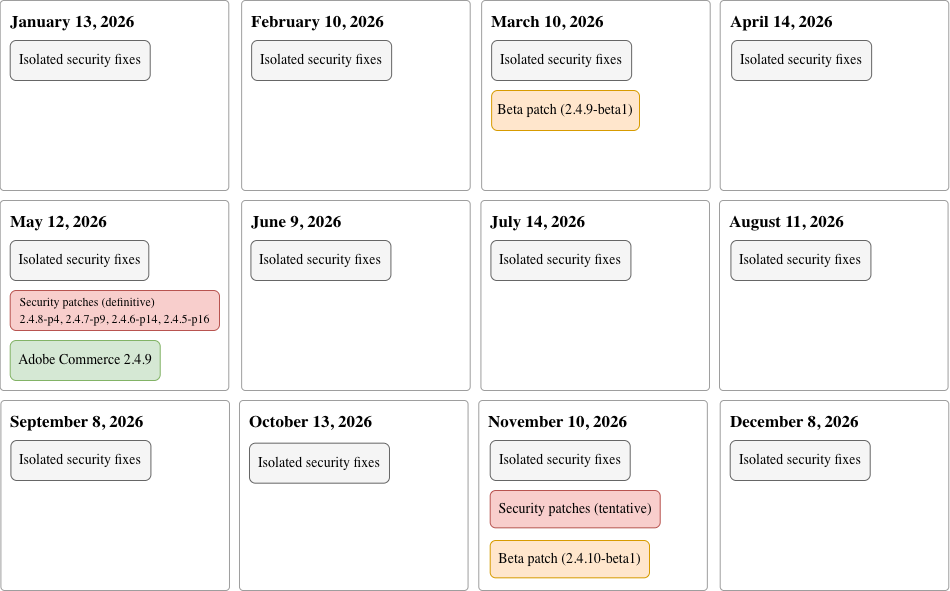

# Schema för patchrelease

Adobe strävar hela tiden efter att hitta rätt balans mellan att göra produktuppgraderingar enkla och förutsägbara samtidigt som man levererar förbättringar till tidiga användare snabbare (se [versionspolicy](versioning-policy.md)).

Syftet med schemat är att ange datum när Adobe planerar att meddela att [korrigeringar](versioning-policy.md#patch-release) har släppts för varje rad i Adobe Commerce PHP-huvudprogrammet som stöds. Patch-versioner är möjligheter att uppgradera kärnkodbasen för att hålla plattformen säker, tillförlitlig och effektiv.

>[!NOTE]
>
>Mer information om nya funktioner, molninfrastruktur och utökningsmöjligheter finns i [versionsdokumentationen för Adobe Commerce Services](https://experienceleague.adobe.com/sv/docs/commerce/user-guides/release-information/release-notes-all).

Förutom de schemalagda kvalitets-, säkerhets- och betatestarna på den här sidan ger Adobe tillgång till [enskilda korrigeringsfiler](versioning-policy.md#individual-patch) via [kvalitetskorrigeringsverktyget](../tools/quality-patches-tool/usage.md). Med verktyget kan du tillämpa, återställa och visa allmän information om alla enskilda korrigeringsfiler som är tillgängliga för den installerade versionen av Adobe Commerce.

Från och med januari 2026 kommer Adobe Commerce att övergå till ett månadsschema för publicering av korrigeringar med följande strategi:

- **Isolerade säkerhetskorrigeringar** - Individuella, icke-kumulativa [säkerhetskorrigeringar](versioning-policy.md#isolated-patch) kan släppas månadsvis och innehålla säkerhetskorrigeringar för alla [supportade](lifecycle-policy.md) versionsrader (inklusive reguljär och utökad support).

- **Säkerhetsuppdateringar** - [Säkerhetsuppdateringar](versioning-policy.md#security-patch-release) släpps årligen (maj) för alla [supportade](lifecycle-policy.md) versionsrader. Dessa korrigeringar innehåller alla tidigare släppta isolerade säkerhetskorrigeringar. Adobe kan släppa ytterligare säkerhetsuppdateringar i november om det behövs, men det är inte säkert.

- **Lappa** - En fullständig [patch](versioning-policy.md#patch-release) för Adobe Commerce 2.4.x LTS-versionsrad (3-årig supportperiod) släpps årligen (maj).

- **Beta-korrigeringar** - Två [betatchar](versioning-policy.md#beta-patch-release) för Adobe Commerce 2.4.x LTS-versionsrad släpps två gånger per år (mars och november).

Mer information finns i följande bild:

<!-- The SVG source for the following image is located here: /help/assets/release/release-calendar.drawio.svg -->

