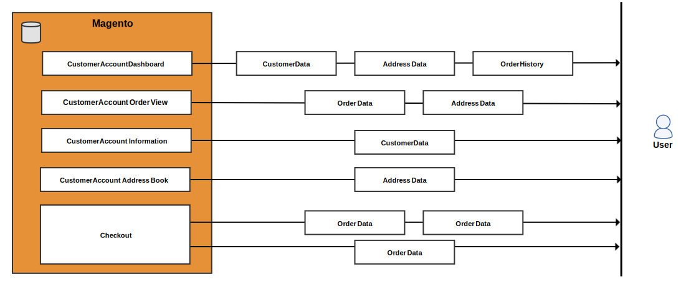

# Kundens personuppgifter (version 1.x)

>[!NOTE]
>
>Detta är ett av ett antal ämnen som hjälper Adobe Commerce och Magento Open Source handlare och utvecklare att förbereda sig för att följa sekretessbestämmelser. Kontakta ditt juridiska ombud för att avgöra om och hur ditt företag ska uppfylla juridiska skyldigheter.

Använd följande dataflödesdiagram och databastentitetsmappningar som referens när du utvecklar kompatibilitetsprogram för sekretessregler som:

- [GDPR](gdpr.md)
- [CCPA](ccpa.md)

## Dataflödesdiagram

Dataflödesdiagrammen visar vilka typer av data som kunder och administratörer kan ange och hämta på butiken och i Admin.

### Frontend-datainmatningspunkter

Användaren kan ange kund-, adress- och betalningsinformation när han eller hon registrerar sig för ett konto, under utcheckning och liknande händelser.

### Åtkomstpunkter för klientdata

Commerce läser in kundinformation när kunden loggar in och visar flera olika sidor eller checkar ut.

### Datainmatningspunkter för backend

En handlare kan ange kund-, adress- och betalningsinformation från administratören för att skapa en kund eller order.

### Åtkomstpunkter för backend-data

Commerce läser in kundinformation när en handlare tittar på flera typer av rutnät, klickar på ett rutnät för att visa detaljerad information och utför olika andra uppgifter.

## Databasenheter

Magento 1 lagrar kundinformation i kundregister, säljregister och andra databastabeller.

### Kunddata

Magento 1 lagrar kundinformation i `customer_entity` och `customer_address_entity` tabeller. Båda tabellerna har flera referenstabeller som kan innehålla anpassade kundattribut.

#### `customer_entity` och referenstabeller

Följande kolumner i `customer_entity`tabellen innehåller kundinformation:

| Kolumn | Datatyp |
| --- | --- |
| `email` | varchar(255) |

Tabellreferenser `customer_entity` och kan innehålla anpassade kundattribut:

| Tabell | Kolumn | Datatyp |
| --- | --- | --- |
| `customer_entity_datetime` | `value` | datetime |
| `customer_entity_decimal` | `value` | decimal(12,4) |
| `customer_entity_int` | `value` | int(11) |
| `customer_entity_text` | `value` | text |
| `customer_entity_varchar` | `value` | varchar(255) |

#### `customer_address_entity` och referenstabeller

Följande tabellreferens `customer_address_entity` och kan innehålla anpassade kundattribut:

| Tabell | Kolumn | Datatyp |
| --- | --- | --- |
| `customer_address_entity_datetime` | `value` | datetime |
| `customer_address_entity_decimal` | `value` | decimal(12,4) |
| `customer_address_entity_int` | `value` | int(11) |
| `customer_address_entity_text` | `value` | text |
| `customer_address_entity_varchar` | `value` | varchar(255) |

### Beställningsdata

The `sales_flat_order` och tillhörande tabeller innehåller kundens namn, fakturerings- och leveransadress samt relaterad information.

#### `sales_flat_order` table

Följande kolumner i `sales_order` tabellen innehåller kundinformation:

| Kolumn | Datatyp |
| --- | --- |
| `customer_id` | int(10) |
| `customer_email` | varchar(128) |
| `customer_firstname` | varchar(128) |
| `customer_gender` | int(11) |
| `customer_lastname` | varchar(128) |
| `customer_middlename` | varchar(128) |
| `customer_prefix` | varchar(32) |
| `customer_suffix` | varchar(32) |
| `customer_taxvat` | varchar(32) |
| `remote_ip` | varchar(32) |

#### `sales_flat_order_address` table

The `sales_flat_order_address` tabellen innehåller kundens adress.

| Kolumn | Datatyp |
| --- | --- |
| `customer_id` | int(10) |
| `fax` | varchar(255) |
| `region` | varchar(255) |
| `postcode` | varchar(255) |
| `lastname` | varchar(255) |
| `street` | varchar(255) |
| `city` | varchar(255) |
| `email` | varchar(255) |
| `telephone` | varchar(255) |
| `firstname` | varchar(255) |
| `prefix` | varchar(255) |
| `suffix` | varchar(255) |
| `middlename` | varchar(255) |
| `company` | varchar(255) |
| `vat_id` | text |

#### `sales_flat_order_grid` table

Följande kolumner i `sales_flat_order_grid` tabellen innehåller kundinformation:

| Kolumn | Datatyp |
| --- | --- |
| `customer_id` | int(10) |
| `shipping_name` | varchar(255) |
| `billing_name` | varchar(255) |

#### `sales_flat_order_payment` table

Följande kolumner i `sales_flat_order_payment` tabellen innehåller kundinformation:

| Kolumn | Datatyp |
| --- | --- |
| `cc_exp_month` | varchar(255) |
| `cc_ss_start_year` | varchar(255) |
| `echeck_bank_name` | varchar(128) |
| `echeck_type` | varchar(255) |
| `cc_ss_start_month` | varchar(255) |
| `cc_owner` | varchar(255) |
| `cc_exp_year` | varchar(255) |
| `echeck_routing_number` | varchar(255) |
| `echeck_account_name` | varchar(255) |

### Offertdata

Offerterna innehåller en kunds namn, e-postadress, adress och relaterad information.

#### `sales_flat_quote` table

Följande kolumner i `sales_flat_quote` tabellen innehåller kundinformation:

| Kolumn | Datatyp |
| --- | --- |
| `customer_id` | int(10) |
| `customer_tax_class_id` | int(10) |
| `customer_group_id` | int(10) |
| `customer_email` | varchar(255) |
| `customer_prefix` | varchar(40) |
| `customer_firstname` | varchar(255) |
| `customer_middlename` | varchar(40) |
| `customer_lastname` | varchar(255) |
| `customer_suffix` | varchar(40) |
| `customer_dob` | datetime |
| `customer_note` | varchar(255) |
| `remote_ip` | varchar(255) |
| `customer_gender` | varchar(255) |

#### `sales_flat_quote_address` table

Följande kolumner i `sales_flat_quote_address` tabellen innehåller kundinformation:

| Kolumn | Datatyp |
| --- | --- |
| `email` | varchar(255) |
| `prefix` | varchar(40) |
| `firstname` | varchar(255) |
| `middlename` | varchar(40) |
| `lastname` | varchar(255) |
| `suffix` | varchar(40) |
| `company` | varchar(255) |
| `street` | varchar(255) |
| `city` | varchar(255) |
| `region` | varchar(255) |
| `postcode` | varchar(255) |
| `fax` | varchar(255) |

#### `sales_flat_quote_payment` table

The `sales_flat_quote_payment` tabellen innehåller kreditkortsinformation och annan transaktionsinformation.

| Kolumn | Datatyp |
| --- | --- |
| `cc_last_4` | varchar(255) |
| `cc_owner` | varchar(255) |
| `cc_exp_month` | smallint(5) |
| `cc_exp_year` | smallint(5) |
| `cc_ss_owner` | varchar(255) |
| `cc_ss_start_month` | smallint(5) |
| `cc_ss_start_year` | smallint(5) |

### Arkivera data

Följande tabeller och kolumner innehåller kundinformation:

| Tabell | Kolumn | Datatyp |
| --- | --- | --- |
| `enterprise_sales_creditmemo_grid_archive` | `billing_name` | varchar(255) |
| `enterprise_sales_invoice_grid_archive` | `billing_name` | varchar(255) |
| `enterprise_sales_order_grid_archive` | `billing_name` | varchar(255) |
| `enterprise_sales_order_grid_archive` | `customer_id` | int(10) |
| `enterprise_sales_order_grid_archive` | `shipping_name` | varchar(255) |
| `enterprise_sales_shipment_grid_archive` | `shipping_name` | varchar(255) |

### Försäljningsdata

Följande tabeller och kolumner innehåller kundinformation:

| Tabell | Kolumn | Datatyp |
| --- | --- | --- |
| `sales_flat_creditmemo_grid` | `billing_name` | varchar(255) |
| `sales_flat_invoice_grid` | `billing_name` | varchar(255) |

### RMA-data

Följande RMA-tabeller och -kolumner innehåller kundinformation:

| Tabell | Kolumn | Datatyp |
| --- | --- | --- |
| `enterprise_rma` | `customer_custom_email` | varchar(255) |
| `enterprise_rma_grid` | `customer_id` | int(10) |
| `enterprise_rma_grid` | `customer_name` | varchar(255) |

### Diverse data

Följande tabeller och kolumner innehåller kundinformation:

| Tabell | Kolumn | Datatyp |
| --- | --- | --- |
| `core_email_queue_recipients` | `recipient_email` | varchar(128) |
| `core_email_queue_recipients` | `recipient_name` | varchar(255) |
| `customer_flowpassword` | `email` | varchar(255) |
| `customer_flowpassword` | `ip` | varchar(50) |
| `enterprise_giftregistry_person` | `email` | varchar(150) |
| `enterprise_giftregistry_person` | `firstname` | varchar(100) |
| `enterprise_giftregistry_person` | `lastname` | varchar(100) |
| `enterprise_giftregistry_person` | `middlename` | text |
| `enterprise_invitation` | `customer_id` | int(10) |
| `enterprise_invitation` | `email` | varchar(255) |
| `enterprise_invitation` | `referral_id` | int(10) |
| `enterprise_reminder_rule_coupon` | `customer_id` | int(10) |
| `enterprise_reminder_rule_coupon` | `emails_failed` | smallint(5) |
| `enterprise_scheduled_operations` | `email_receiver` | varchar(150) |
| `enterprise_scheduled_operations` | `email_sender` | varchar(150) |
| `gift_message` | `customer_id` | int(10) |
| `gift_message` | `recipient` | varchar(255) |
| `gift_message` | `sender` | varchar(255) |
| `newsletter_subscriber` | `customer_id` | int(10) |
| `newsletter_subscriber` | `subscriber_email` | varchar(150) |
| `persistent_session` | `customer_id` | int(10) |
| `persistent_session` | `info` | text |
| `poll_vote` | `customer_id` | int(10) |
| `poll_vote` | `ip_address` | varbinary(16) |
| `rating_option_vote` | `customer_id` | int(10) |
| `rating_option_vote` | `remote_ip` | varchar(50) |
| `rating_option_vote` | `remote_ip_long` | varbinary(516) |
| `send_friend_log` | `ip` | varbinary(16) |

Andra tabeller som refererar till kunden:

- `catalog_compare_item`
- `downloadable_link_purchased`
- `enterprise_customerbalance`
- `enterprise_customersegment_customer`
- `enterprise_giftregistry_entity`
- `enterprise_reminder_rule_log`
- `enterprise_reward`
- `log_customer`
- `log_visitor_online`
- `oauth_token`
- `product_alert_price`
- `product_alert_stock`
- `report_compared_product_index`
- `report_viewed_product_index`
- `review_detail`
- `sales_billing_agreement`
- `sales_flat_shipment`
- `sales_recurring_profile`
- `salesrule_coupon_usage`
- `salesrule_customer`
- `tag`
- `tag_relation`
- `wishlist`
