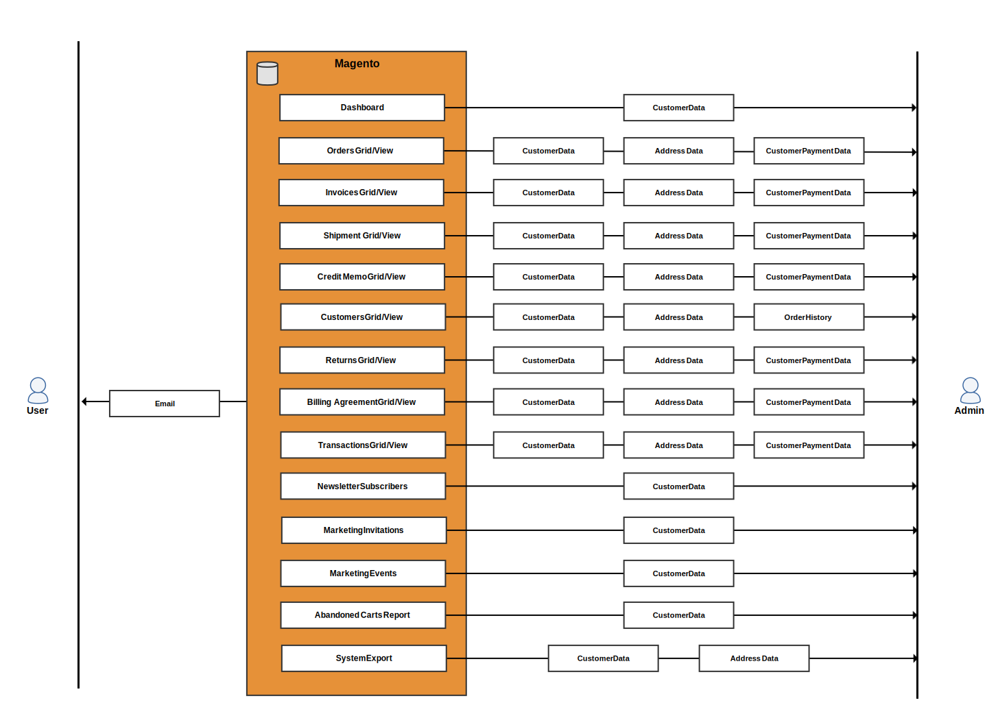

# Kundens personuppgifter (version 2.x)

>[!NOTE]
>
>Detta är ett av ett antal ämnen som hjälper Adobe Commerce och Magento Open Source handlare och utvecklare att förbereda sig för att följa sekretessbestämmelser. Kontakta ditt juridiska ombud för att få reda på om och hur ditt företag ska uppfylla juridiska skyldigheter.

Använd följande dataflödesdiagram och databastentitetsmappningar som referens när du utvecklar kompatibilitetsprogram för sekretessregler som:

- [GDPR](gdpr.md)
- [CCPA](ccpa.md)

## Dataflödesdiagram

Dataflödesdiagrammen visar vilka typer av data som kunder och administratörer kan ange och hämta från butiken och Admin.

### Frontend-datainmatningspunkter

Användaren kan ange kund-, adress- och betalningsinformation när han eller hon registrerar sig för ett konto, under utcheckning och liknande händelser.

### Åtkomstpunkter för klientdata

Adobe Commerce och Magento Open Source läser in kundinformation när kunden loggar in och visar flera olika sidor, eller checkar ut.

### Datainmatningspunkter för backend

En handlare kan ange kundinformation, adressdata och betalningsdata när han eller hon skapar en kund eller beställning från administratören.

### Åtkomstpunkter för backend-data

Adobe Commerce och Magento Open Source läser in kundinformation när en handlare tittar på flera olika typer av rutnät, klickar på ett rutnät för att se detaljerad information och utför olika andra uppgifter.

## Databasenheter

Adobe Commerce och Magento Open Source lagrar i första hand kundspecifik information i kund-, adress-, order-, offert- och betalningstabeller. Andra tabeller innehåller referenser till kund-ID:t.

### Kunddata

Adobe Commerce och Magento Open Source kan konfigureras för att lagra följande kundattribut:

- Födelsedatum
- E-post
- Förnamn
- Kön
- Efternamn
- Mellannamn/initial
- Namnprefix
- Namnsuffix

>[!NOTE]
>
>I enlighet med gällande säkerhets- och integritetspraxis bör du vara medveten om eventuella juridiska risker och säkerhetsrisker som är förknippade med lagring av kunders fullständiga födelsedatum (månad, dag, år) tillsammans med andra personliga identifierare, t.ex. fullständigt namn, innan du samlar in eller behandlar sådana data.

#### `customer_entity` och customer_entity-referenser

Följande kolumner i `customer_entity` tabellen innehåller kundinformation:

| Kolumn | Datatyp |
| ------------ | ------------ |
| `email` | varchar(255) |
| `prefix` | varchar(40) |
| `firstname` | varchar(255) |
| `middlename` | varchar(255) |
| `lastname` | varchar(255) |
| `suffix` | varchar(40) |
| `dob` | datum |
| `gender` | smallint(5) |

Tabellreferenser `customer_entity` och kan innehålla anpassade kundattribut:

| Tabell | Kolumn | Datatyp |
| -------------------------- | ------- | ------------- |
| `customer_entity_datetime` | `value` | datetime |
| `customer_entity_decimal` | `value` | decimal(12,4) |
| `customer_entity_int` | `value` | int(11) |
| `customer_entity_text` | `value` | text |
| `customer_entity_varchar` | `value` | varchar(255) |

#### `customer_grid_flat` table

Följande kolumner i `customer_grid_flat` tabellen innehåller kundinformation:

| Kolumn | Datatyp |
| -------------------- | ------------ |
| `name` | text |
| `email` | varchar(255) |
| `dob` | datum |
| `gender` | int(11) |
| `shipping_full` | text |
| `billing_full` | text |
| `billing_firstname` | varchar(255) |
| `billing_lastname` | varchar(255) |
| `billing_telephone` | varchar(255) |
| `billing_postcode` | varchar(255) |
| `billing_country_id` | varchar(255) |
| `billing_region` | varchar(255) |
| `billing_city` | varchar(255) |
| `billing_fax` | varchar(255) |
| `billing_vat_id` | varchar(255) |
| `billing_company` | varchar(255) |

### Adressdata

Adobe Commerce och Magento Open Source har följande kundattribut:

- Ort
- Företag
- Land
- Fax
- Förnamn
- Efternamn
- Mellannamn/initial
- Namnprefix
- Namnsuffix
- Telefonnummer
- Stat/provins
- Stat/provins-ID
- Gatuadress
- Momsnummer
- Postnummer

#### `customer_address_entity` och `customer_address_entity` referenser

Följande kolumner i `customer_address_entity` tabellen innehåller kundinformation:

| Kolumn | Datatyp |
| ------------ | ------------ |
| `city` | varchar(255) |
| `company` | varchar(255) |
| `country_id` | varchar(255) |
| `fax` | varchar(255) |
| `firstname` | varchar(255) |
| `lastname` | varchar(255) |
| `middlename` | varchar(255) |
| `postcode` | varchar(255) |
| `region` | varchar(255) |
| `region_id` | int(10) |
| `street` | text |
| `suffix` | varchar(40) |
| `telephone` | varchar(255) |
| `vat_id` | varchar(255) |

Tabellreferenser `customer_address_entity` och kan innehålla anpassade kundattribut:

| Tabell | Kolumn | Datatyp |
| ---------------------------------- | ------- | ------------- |
| `customer_address_entity_datetime` | `value` | datetime |
| `customer_address_entity_decimal` | `value` | decimal(12,4) |
| `customer_address_entity_int` | `value` | int(11) |
| `customer_address_entity_text` | `value` | text |
| `customer_address_entity_varchar` | `value` | varchar(255) |

### Beställningsdata

The `sales_order` och tillhörande tabeller innehåller kundens namn, fakturerings- och leveransadresser samt tillhörande data.

#### `sales_order` table

Följande kolumner i `sales_order` tabellen innehåller kundinformation:

| Kolumn | Datatyp |
| --------------------- | ------------ |
| `customer_dob` | datetime |
| `customer_email` | varchar(128) |
| `customer_firstname` | varchar(128) |
| `customer_gender` | int(11) |
| `customer_group_id` | int(11) |
| `customer_id` | int(10) |
| `customer_lastname` | varchar(128) |
| `customer_middlename` | varchar(128) |
| `customer_prefix` | varchar(32) |
| `customer_suffix` | varchar(32) |
| `customer_taxvat` | varchar(32) |
| `quote_address_id` | int(11) |
| `remote_ip` | varchar(32) |
| `x_forwarded_for` | varchar(32) |

#### `sales_order_address` table

The `sales_order_address` tabellen innehåller kundens adress.

| Kolumn | Datatyp |
| --------------------- | ------------ |
| `customer_address_id` | int(11) |
| `quote_address_id` | int(11) |
| `region_id` | int(11) |
| `customer_id` | int(11) |
| `fax` | varchar(255) |
| `region` | varchar(255) |
| `postcode` | varchar(255) |
| `lastname` | varchar(255) |
| `street` | varchar(255) |
| `city` | varchar(255) |
| `email` | varchar(255) |
| `telephone` | varchar(255) |
| `country_id` | varchar(2) |
| `firstname` | varchar(255) |
| `suffix` | varchar(255) |
| `company` | varchar(255) |

#### `sales_order_grid` table

Följande kolumner i `sales_order_grid` tabellen innehåller kundinformation:

| Kolumn | Datatyp |
| ---------------------- | ------------ |
| `customer_id` | int(10) |
| `shipping_name` | varchar(255) |
| `billing_name` | varchar(255) |
| `billing_address` | varchar(255) |
| `shipping_address` | varchar(255) |
| `shipping_information` | varchar(255) |
| `customer_email` | varchar(255) |
| `customer_name` | varchar(255) |

### Offertdata

Offerterna innehåller en kunds namn, e-postadress, adress och relaterad information.

#### `quote` table

Följande kolumner i `quote` tabellen innehåller kundinformation:

| Kolumn | Datatyp |
| --------------------- | ------------ |
| `customer_id` | int(10) |
| `customer_email` | varchar(255) |
| `customer_prefix` | varchar(40) |
| `customer_firstname` | varchar(255) |
| `customer_middlename` | varchar(40) |
| `customer_lastname` | varchar(255) |
| `customer_dob` | datetime |
| `remote_ip` | varchar(32) |
| `customer_taxvat` | varchar(255) |
| `customer_gender` | varchar(255) |

#### `quote_address` table

Följande kolumner i `quote_address` tabellen innehåller kundinformation:

| Kolumn | Datatyp |
| ------------- | ------------ |
| `customer_id` | int(10) |
| `email` | varchar(255) |
| `prefix` | varchar(40) |
| `firstname` | varchar(255) |
| `middlename` | varchar(40) |
| `lastname` | varchar(255) |
| `suffix` | varchar(40) |
| `company` | varchar(255) |
| `street` | varchar(255) |
| `city` | varchar(255) |
| `region` | varchar(255) |
| `region_id` | int(10) |
| `postcode` | varchar(20) |
| `country_id` | varchar(30) |
| `telephone` | varchar(255) |
| `fax` | varchar(255) |

### Betalningsdata

The `sales_order_payment` tabellen innehåller kreditkortsinformation och annan transaktionsinformation.

| Kolumn | Datatyp |
| ------------------------ | ------------ |
| `cc_exp_month` | varchar(12) |
| `echeck_bank_name` | varchar(128) |
| `cc_last_4` | varchar(100) |
| `cc_owner` | varchar(128) |
| `po_number` | varchar(32) |
| `cc_exp_year` | varchar(4) |
| `echeck_routing_number` | varchar(32) |
| `cc_debug_response_body` | varchar(32) |
| `echeck_account_name` | varchar(32) |
| `cc_number_enc` | varchar(128) |
| `additional_information` | text |

### Inbjudningsdata

Adobe Commerce och Magento Open Source kan konfigureras så att kunderna kan skicka inbjudningar till privat försäljning och evenemang.

#### `magento_invitation` table

The `magento_invitation` tabellen innehåller kund-ID, e-post och hänvisnings-ID.

| Kolumn | Datatyp |
| ------------- | ------------ |
| `customer_id` | int(10) |
| `email` | varchar(255) |
| `referral_id` | int(10) |

#### `magento_invitation_track` table

The `magento_invitation_track` tabellen innehåller även kundinformation.

| Kolumn | Datatyp |
| ------------- | --------- |
| `inviter_id` | int(10) |
| `referral_id` | int(10) |

### Diverse tabeller som refererar till kund

Följande tabeller innehåller en `customer_id` kolumn:

- `catalog_compare_item`
- `catalog_product_frontend_action`
- `downloadable_link_purchased`
- `magento_customerbalance`
- `magento_customersegment_customer`
- `magento_reward`
- `magento_rma`
- `oauth_token`
- `paypal_billing_agreement`
- `persistent_session`
- `product_alert_price`
- `product_stock_alert`
- `report_compared_product_index`
- `report_viewed_product_index`
- `review_detail`
- `salesrule_coupon_usage`
- `salesrule_customer`
- `wishlist`
