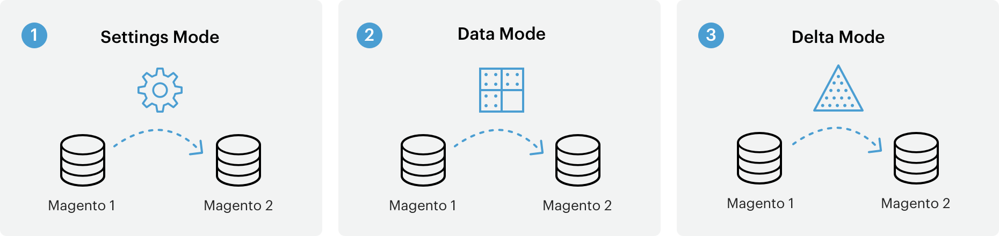

# Så fungerar datamigrering

Det här avsnittet innehåller en översikt på hög nivå över hur data migreras från Magento 1 till Magento 2 med [!DNL Data Migration Tool].

The [!DNL Data Migration Tool] är ett kommandoradsverktyg (CLI) som används för att överföra data från Magento 1 till Magento 2. Verktyget verifierar konsekvensen mellan databasstrukturerna Magento 1 och 2 (tabeller och fält), spårar dataöverföringsförloppet, skapar loggar och kör dataverifieringstester.

## Terminologi

* **Lägen** - en ordnad uppsättning åtgärder för att migrera data från Magento 1.x till Magento 2.x.
* **Steg** - åtgärderna i ett läge som definierar vilken typ av data som ska migreras.
* **Steg** - de stegvisa åtgärder som validerar, överför och verifierar data.
* **Mappa filer** - XML-filer som definierar regler och anslutningar mellan datastrukturen Magento 1.x och Magento 2.x för att slutföra stegen.

## Lägen

The [!DNL Data Migration Tool] delar upp migreringsprocessen i tre faser eller *lägen* för att överföra och anpassa data från Magento 1.x till Magento 2.x. De tre lägena visas här och måste köras i följande ordning:

1. **Inställningsläge**: migrerar systemkonfigurationen och webbplatsrelaterade inställningar.
1. **Dataläge**: migrerar flera databasresurser samtidigt.
1. **Deltaläge**: migrerar stegvisa ändringar (ändringar sedan den senaste körningen), t.ex. nya kunder och beställningar.

## Steg

The [!DNL Data Migration Tool] använder en lista med *steg* i varje läge för att migrera en viss typ av data. I inställningsläget används till exempel två steg för att migrera alla inställningsdata: Steget Lagrar och steget Inställningar. Information om specifika data som migreras i vart och ett av dessa steg (och för steg i de andra lägena) finns i [[!DNL Data Migration Tool] Teknisk specifikation](technical-specification.md).

## Steg

Inom varje steg finns tre *faser* som alltid körs i den här ordningen för att säkerställa att data migreras korrekt:

1. **Integritetskontroll**: Jämför tabellfältets namn, typer och annan information för att verifiera kompatibiliteten mellan datastrukturen Magento 1 och 2.
1. **Dataöverföring**: Överför datatabellen med tabell från Magento 1 och 2.
1. **Volymkontroll**: Jämför antalet poster mellan tabeller för att verifiera att överföringen lyckades.

## Mappa filer

På den lägsta nivån för migreringsprocesserna finns XML *kartfiler*. The [!DNL Data Migration Tool] I används kartfiler i stegen i ett steg för att omforma olika datastrukturer mellan tabellerna Magento 1.x och 2.x.

När du till exempel omformar data från en Magento Open Source 1.8.0.0-databas till Magento Open Source 2.x.x, anger kartfilen att en tabell har fått ett nytt namn och byter namn på den i måldatabasen. Om det inte finns några skillnader i datastruktur eller dataformat [!DNL Data Migration Tool] överför den i befintligt skick, inklusive data från tabeller som skapats av tillägg, till databasen Magento 2.

När skillnader inte deklareras i mappningsfiler är [!DNL Data Migration Tool] visar ett fel och startar inte.

Mappningsfiler beskrivs mer ingående i [[!DNL Data Migration Tool] Teknisk specifikation].

## Flyttningsflödesdiagram

[[!DNL Data Migration Tool] Teknisk specifikation]: technical-specification.md

Vi är glada över att du funderar på att gå över från världens främsta e-handelsplattform - Magento 1.x - till framtidens plattform, Magento 2. Vi är glada att kunna dela med oss av detaljerna om den här processen, som vi kallar migrering.

## Migreringskomponenter

Migrering från Magento 2 omfattar fyra komponenter: data, tillägg och anpassad kod, teman och anpassningar.

### Data

Vi har utvecklat **Magento 2[!DNL Data Migration Tool]** så att ni effektivt kan flytta alla era produkter, kunder och beställningsdata, butikskonfigurationer, kampanjer med mera till Magento 2. Den här handboken innehåller information om verktyget och de bästa sätten att använda det för att migrera data.

### Tillägg och anpassad kod

Vi har arbetat hårt med utvecklingscommunityn för att hjälpa dig använda dina tillägg för Magento 1 i Magento 2. Nu är vi stolta över att kunna presentera [Commerce Marketplace](https://marketplace.magento.com/), där du kan ladda ned eller köpa de senaste versionerna av dina favorittillägg.

Mer information om hur du utvecklar tillägg för Magento 2 finns i [Utvecklarhandbok för PHP](https://developer.adobe.com/commerce/php/development/).

### Teman och anpassningar

Magento 2 använder nya metoder och tekniker som ger handlarna oöverträffade möjligheter att skapa innovativa shoppingupplevelser och anpassa sig till nya nivåer. För att kunna utnyttja dessa framsteg måste utvecklarna göra ändringar i sina teman och anpassningar. Dokumentation finns online för att skapa Magento 2 [teman](https://developer.adobe.com/commerce/frontend-core/guide/themes/), [layouter](https://developer.adobe.com/commerce/frontend-core/guide/layouts/)och [anpassningar](https://developer.adobe.com/commerce/frontend-core/guide/layouts/xml-manage/).

## Migreringsarbete

Precis som en uppgradering mellan 1.x-versioner (till exempel från v1.12 till v1.14) beror migreringsnivån från Magento 1 till Magento 2 på hur du har skapat webbplatsen och hur stor den har anpassats.
Vi förbättrar dock ständigt [!DNL Data Migration Tool] (se [Changelog](https://github.com/magento/data-migration-tool/blob/2.3/CHANGELOG.md) för mer information); så att migreringsarbetet hela tiden minskar.
