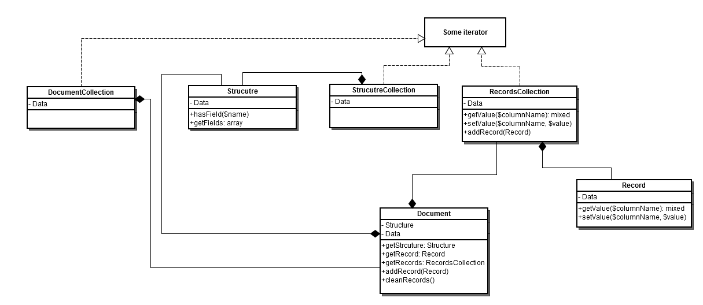

# [!DNL Data Migration Tool] teknisk specifikation

Detta avsnitt beskriver [!DNL Data Migration Tool] implementeringsinformation och hur du utökar funktionaliteten.

## Databaser

Så här öppnar du [!DNL Data Migration Tool] källkod, se GitHub [databas](https://github.com/magento/data-migration-tool).

## Systemkrav

The [systemkrav](https://devdocs.magento.com/guides/v2.4/install-gde/system-requirements.html) för [!DNL Data Migration Tool] är samma som för Magento 2.

## Intern struktur

### Katalogstruktur

I följande diagram visas katalogstrukturen för [!DNL Data Migration Tool]:

```terminal
├── etc                                    --- all configuration files
│   ├── opensource-to-opensource            --- configuration files for migration from Magento Open Source 1 to Magento Open Source 2
│   │   ├── 1.9.1.1
│   │   │   ├── config.xml.dist
│   │   │   └── map.xml.dist
│   │   ├── 1.9.2.0
│   │   │   ├── config.xml.dist
│   │   │   └── map.xml.dist
│   │   ├── ........
│   │   ├── class-map.xml.dist
│   │   ├── deltalog.xml.dist
│   │   └── settings.xml.dist
│   │   ├── ........
│   ├── opensource-to-commerce              --- configuration files for migration from Magento Open Source 1 to Adobe Commerce 2
│   ├── commerce-to-commerce                --- configuration files for migration from Adobe Commerce 1 to Adobe Commerce 2
│   ├── class-map.xsd
│   ├── config.xsd
│   ├── map.xsd
│   └── settings.xsd
├── src
│   └── Migration
│       ├── App                             --- application framework
│       ├── Console
│       ├── Handler                         --- handlers are used by map files
│       │   ├── AbstractHandler.php
│       │   ├── AddPrefix.php
│       │   ├── ConvertIp.php
│       │   ├── ........
│       ├── Logger
│       ├── Reader
│       ├── Mode
│       │   ├── AbstractMode.php
│       │   ├── Data.php
│       │   ├── Delta.php
│       │   └── Settings.php
│       ├── ResourceModel                   --- contains [adapter](https://glossary.magento.com/adapter) for connection to data storage and classes to work with structured data
│       │   ├── Adapter
│       │   │   └── Mysql.php
│       │   ├── AbstractCollection.php
│       │   ├── AbstractResource.php
│       │   ├── AdapterInterface.php
│       │   ├── Destination.php
│       │   ├── Document.php
│       │   ├── Record.php
│       │   ├── Source.php
│       │   └── Structure.php
│       ├── Config.php
│       ├── [Exception](https://glossary.magento.com/exception).php
│       └── Step                            --- functionality for migrating specific data
│           ├── Eav
│           │   ├── Data.php
│           │   ├── Helper.php
│           │   ├── InitialData.php
│           │   ├── Integrity.php
│           │   └── Volume.php
│           ├── Map
│           │   ├── Data.php
│           │   ├── Delta.php
│           │   ├── Helper.php
│           │   ├── Integrity.php
│           │   └── Volume.php
│           ├── UrlRewrite
│           │   ├── Version11300to2000.php
│           │   ├── Version11410to2000.php
│           │   └── Version191to2000.php
│           ├── ..........
└── tests
    ├── integration
    ├── static
    └── unit
```

## Startpunkt

Skriptet som kör migreringsprocessen finns på: `magento-root/bin/magento`.

## Konfiguration

Konfigurationens schema `config.xsd` filen finns i `etc/` katalog. Standardkonfigurationsfilen (`config.xml.dist`) skapas för varje version av Magento 1.x. Den finns i en separat katalog under `etc/`.

Standardkonfigurationsfilen kan ersättas med en anpassad fil (se [kommandosyntax](migrate-data/overview.md#command-syntax)).

Konfigurationsfilen har följande struktur:

```xml
<config xmlns:xs="http://www.w3.org/2001/XMLSchema-instance" xs:noNamespaceSchemaLocation="config.xsd">
    <steps mode="settings">
        <step title="Settings step">
            <integrity>Migration\Step\Settings</integrity>
            <data>Migration\Step\Settings</data>
        </step>
    </steps>
    <steps mode="data">
        <step title="Map step">
            <integrity>Migration\Step\Map\Integrity</integrity>
            <data>Migration\Step\Map\Data</data>
            <volume>Migration\Step\Map\Volume</volume>
        </step>
        ...
    </steps>
    <steps mode="delta">
        <step title="Map step">
            <delta>Migration\Step\Map\Delta</delta>
            <volume>Migration\Step\Map\Volume</volume>
        </step>
        ...
    </steps>
    <source>
        <database host="localhost" name="magento1" user="root" password=""/>
    </source>
    <destination>
        <database host="localhost" name="magento2" user="root" password=""/>
    </destination>
    <options>
        <map_file>map-file.xml</map_file>
        <settings_map_file>settings-map-file.xml</settings_map_file>
        <bulk_size>100</bulk_size>
        <custom_option>custom_option_value</custom_option>
        <source_prefix />
        <dest_prefix />
        ...
    </options>
</config>
```

* steg - beskriver alla steg som bearbetas under migreringen

* source - konfiguration för datakälla. Tillgängliga källtyper: databas

* mål - konfiguration för datamål. Tillgängliga måltyper: databas

* options - list of parameters. Innehåller både obligatoriska (map_file, settings_map_file, bulk_size) och valfria (custom_option, resource_adapter_class_name, prefix_source, prefix_dest, log_file) parametrar

Ändra prefixalternativet om Magento installerades med prefix i databastabeller. Den kan ställas in för databaserna Magento 1 och Magento 2. Använd konfigurationsalternativen &quot;source_prefix&quot; och &quot;dest_prefix&quot; i enlighet med detta.

Konfigurationsdata är tillgängliga med `\Migration\Config` klassen.

## Åtgärder som är tillgängliga

| Dokument | Fält |
|---|---|
| `step` | Nod på andra nivån inuti noden Steps. En beskrivning av det relevanta steget måste anges i `title` -attribut. |
| `integrity` | Anger den PHP-klass som ansvarar för integritetskontrollen. Jämför tabellfältets namn, typer och annan information för att verifiera kompatibiliteten mellan datastrukturen Magento 1 och 2. |
| `data` | Anger den PHP-klass som är ansvarig för datakontrollen. Överför data, tabell för tabell från Magento 1 till Magento 2. |
| `volume` | Anger den PHP-klass som ansvarar för volymkontrollen. Jämför antalet poster mellan tabeller för att verifiera att överföringen lyckades. |
| `delta` | Anger den PHP-klass som är ansvarig för deltakontrollen. Överför delta från Magento 1 till Magento 2 efter fullständig datamigrering. |

## Källdatabasens informationsattribut

| Dokument | Fält | Obligatoriskt? |
|---|---|---|
| `name` | Databasnamn för Magento 1-servern. | ja |
| `host` | Magento 1-serverns värdadress. | ja |
| `port` | Portnummer för Magento 1-servern. | no |
| `user` | Användarnamn för databasservern Magento 1. | ja |
| `password` | Lösenord för Magento 1-databasservern. | ja |
| `ssl_ca` | Sökväg till filen för SSL-certifikatutfärdare. | no |
| `ssl_cert` | Sökväg till SSL-certifikatfil. | no |
| `ssl_key` | Sökväg till SSL-nyckelfil. | no |

## Informationsattribut för måldatabas

| Dokument | Fält | Obligatoriskt? |
|---|---|---|
| `name` | Databasnamn för Magento 2-servern. | ja |
| `host` | Magento 2-serverns värdadress (IP). | ja |
| `port` | Portnummer för Magento 2-servern. | no |
| `user` | Användarnamn för databasservern Magento 2. | ja |
| `password` | Lösenord för Magento 2-databasservern. | ja |
| `ssl_ca` | Sökväg till filen för SSL-certifikatutfärdare. | no |
| `ssl_cert` | Sökväg till SSL-certifikatfil. | no |
| `ssl_key` | Sökväg till SSL-nyckelfil. | no |

## Anslut med TLS-protokollet

Du kan också ansluta till en databas med TLS-protokollet (dvs. med offentliga/privata kryptografiska nycklar). Lägg till följande valfria attribut i `database` element:

* `ssl_ca`
* `ssl_cert`
* `ssl_key`

Exempel:

```xml
<source>
    <database host="localhost" name="magento1" user="root" ssl_ca="/path/to/file" ssl_cert="/path/to/file" ssl_key="/path/to/file"/>
</source>
<destination>
    <database host="localhost" name="magento2" user="root" ssl_ca="/path/to/file" ssl_cert="/path/to/file" ssl_key="/path/to/file"/>
</destination>
```

## Stega interna

Migreringsprocessen består av steg.

Steg är en enhet som tillhandahåller de funktioner som krävs för att migrera vissa separerade data. Steget kan bestå av ett eller flera steg (integritetskontroll, data, volymkontroll och delta).

Som standard finns det flera steg ([Karta](#map-step), [EAV](#eav), [URL-omskrivning](#url-rewrite-step)och så vidare). Du kan även lägga till egna steg.

Steg relaterade klasser finns i katalogen src/Migration/Step.

Om du vill köra en Step-klass måste klassen definieras i filen config.xml.

```xml
<config xmlns:xs="http://www.w3.org/2001/XMLSchema-instance" xs:noNamespaceSchemaLocation="config.xsd">
    <steps mode="mode_name">
        <step title="Step Name">
            <integrity>Migration\Step\StepName\Integrity</integrity>  <!-- integrity check stage of the step -->
            <data>Migration\Step\StepName\Data</data>
            <volume>Migration\Step\StepName\Volume</volume>
        </step>
        ...
    </steps>
    ...
</config>
```

Alla scenklasser måste implementera StageInterface.

```php
class StageClass implements StageInterface
{
  /**
   * Perform the stage
   *
   * @return bool
   */
  public function perform()
  {
  }
}
```

Om datastadiet har stöd för återställning bör det implementera `RollbackInterface` gränssnitt.

Visualisering av det pågående steget tillhandahålls av Symfonys ProgressBar-komponent (se [Förloppsindikator](http://symfony.com/doc/current/components/console/helpers/progressbar.html)). Kom åt den här komponenten i ett steg som LogLevelProcessor.

De viktigaste användningsmetoderna är:

```xml
$this->progress->start();
$this->progress->advance();
$this->progress->finish();
```

## Steg

### Integritetskontroll

Varje steg måste kontrollera att strukturen för datakällan (Magento 1 som standard) och strukturen för datamålet (Magento 2) är kompatibel. Annars visas ett fel med enheter som inte är kompatibla. Om fälten har olika datatyper (samma fält har decimaldatatyp i Magento 1 och heltal i Magento 2) visas ett varningsmeddelande (förutom när det fanns med i kartfilen).

### Dataöverföring

Om integritetskontrollen skickas körs data. Om fel uppstår går återställningen tillbaka till det tidigare läget Magento 2. Om en stegklass implementerar `RollbackInterface` -gränssnittet körs återställningsmetoden när ett fel uppstår.

### Volymkontroll

När data har migrerats kan du med volymkontrollen kontrollera att alla data har överförts korrekt.

### Delta-leverans

Delta-funktionaliteten ansvarar för att leverera resten av data som lagts till efter huvudmigreringen.

## Körningslägen

Verktyget ska köras i tre olika lägen i särskild ordning:

1. inställningar - migrering av systeminställningar
1. data - huvudmigrering av data
1. delta - migrering av resten av data som lagts till efter huvudmigreringen

Varje läge har en egen lista över steg som ska köras. Se config.xml

### Migreringsläge för inställningar

Inställningsmigreringsläget för det här verktyget används för att överföra följande enheter:

1. Webbplatser, butiker, butiksvyer.
1. Konfiguration för butik (huvudsakligen Lager->Konfiguration i M2 eller System->Konfiguration i M1)

All butikskonfiguration sparar data i tabellen core_config_data i databasen. filen settings.xml innehåller regler för den här tabellen som tillämpas under migreringsprocessen. Den här filen beskriver inställningar som ska ignoreras, namnändras eller som ska ändra deras värden. filen settings.xml har följande struktur:

```xml
<?xml version="1.0" encoding="UTF-8"?>
<settings xmlns:xs="http://www.w3.org/2001/XMLSchema-instance" xs:noNamespaceSchemaLocation="settings.xsd">
    <key>
        <ignore>
            <path>path/to/ignore*</path>
        </ignore>
        <rename>
            <path>path/to/rename</path>
            <to>new/path/renamed</to>
        </rename>
    <key>
    <value>
        <transform>
            <path>some/key/to/change</path>
            <handler class="Some\Handler\Class"/>
        </transform>
    </value>
</settings>
```

Under noden `<key>` det finns regler som fungerar med kolumnen &#39;path&#39; i `core_config_data` tabell. `<ignore>` regler förhindrar att verktyget överför vissa inställningar. Jokertecken kan användas i den här noden. Alla andra inställningar som inte finns i listan `<ignore>` noden migreras. Om sökvägen till en inställning ändras i Magento 2 bör den läggas till i `//key/rename` nod, där den gamla sökvägen anges `//key/rename/path` nod och ny sökväg anges i `//key/rename/to` nod.

Under noden `<value>`, finns det regler som fungerar med kolumnen &#39;value&#39; i `core_config_data` tabell. Dessa regler syftar till att omforma inställningsvärden av hanterare (klasser som implementerar `Migration\Handler\HandlerInterface`) och anpassa den för Magento 2.

### Datamigreringsläge

I det här läget migreras merparten av data. Före datamigrering körs integritetskontrollens faser för varje steg. Om integritetskontrollen lyckas [!DNL Data Migration Tool] installerar delatogtabeller (med prefix `m2_cl_*`) och motsvarande utlösare för databasen Magento 1 och kör steg för datamigrering. När migreringen är klar utan fel kontrollerar volymkontrollen datakonsekvensen. Det kan visa ett varningsmeddelande om du migrerar livebutiken. Oroa dig inte. Deltamigreringen tar hand om dessa inkrementella data. De mest värdefulla migreringsstegen är Karta, URL-omskrivning och EAV.

#### Kartsteg

Kartsteget används för att överföra större delen av data från Magento 1 till Magento 2. Det här steget läser instruktioner från filen map.xml (finns i `etc/` katalog). I filen beskrivs skillnaderna mellan datastrukturerna för källan (Magento 1) och målet (Magento 2). Om Magento 1 innehåller tabeller eller fält som tillhör vissa [extension](https://glossary.magento.com/extension) som inte finns i Magento 2, kan dessa enheter placeras här för att ignorera dem via Mappa steg. Annars visas ett felmeddelande.

Kartfilen har nästa format:

```xml
<?xml version="1.0" encoding="UTF-8"?>
<map xmlns:xs="http://www.w3.org/2001/XMLSchema-instance" xs:noNamespaceSchemaLocation="map.xsd">
    <source>
        <document_rules>
            <ignore>
                <document>some_document2</document>
            </ignore>
            <rename>
                <document>some_document</document>
                <to>some_dest_document</to>
            </rename>
            <log_changes>
                <document key="primary_key">some_dest_document</document>
            </log_changes>
        </document_rules>

        <field_rules>
            <move>
                <field>some_document1.field1</field>
                <to>some_document1.field2</to>
            </move>
            <ignore>
                <field>some_document3.field8</field>
            </ignore>
            <transform>
                <field>some_document1.field1</field>
                <handler class="\Migration\Handler\Convert">
                    <param name="map" value="[value1:value2;value3:value4;value5:value6;]" />
                </handler>
            </transform>
        </field_rules>
    </source>
    <destination>
        <document_rules>
            <ignore>
                <document>some_document8</document>
            </ignore>
        </document_rules>

        <field_rules>
            <transform>
                <field>some_document5.field3</field>
                <handler class="\Migration\Handler\SetValue">
                    <param name="value" value="10" />
                </handler>
            </transform>
        </field_rules>
    </destination>
</map>
```

Områden:

* *källa* - innehåller regler för källdatabasen

* *mål* - innehåller regler för måldatabasen

Alternativ:

* *ignorera* - dokument, fält eller datatyp som är markerade med det här alternativet ignoreras

* *byt namn* - beskriver namnrelationer mellan dokument med olika namn. Om måldokumentnamnet inte är detsamma som källdokumentet kan du använda alternativet Byt namn för att ange ett källdokumentnamn som liknar måltabellens namn

* *move* - anger att regeln ska flytta det angivna fältet från källdokumentet till måldokumentet. OBS! måldokumentets namn ska vara detsamma som källdokumentets namn. Om käll- och måldokumentnamnen är olika - du måste använda alternativet Byt namn för dokument som innehåller flyttade fält

* *omforma* - är ett alternativ som gör att användaren kan migrera fält enligt det beteende som beskrivs i hanterare

* *hanterare* - beskriver omformningsbeteendet för fält. Om du vill anropa hanteraren måste du ange ett hanterarklassnamn i en `<handler>` -tagg. Använd `<param>` -tagg med parameternamn och värdedata som ska skickas till hanteraren

**Källa** tillgängliga åtgärder:

| Dokument | Fält |
|--- |--- |
| ignorera namnändring | ignorera flyttningsomformning |

**Mål** tillgängliga åtgärder:

| Dokument | Fält |
|--- |--- |
| ignorera | ignorera omformning |

#### Jokertecken

Om du vill ignorera dokument med liknande delar (`document_name_1`, `document_name_2`) kan du använda jokerteckenfunktioner. Put `*` symbol i stället för upprepande del (`document_name_*`) och masken täcker alla käll- eller måldokument som uppfyller den här masken.

#### Omskrivningssteg för URL

Det här steget är komplext eftersom det finns många olika algoritmer som utvecklats i Magento 1 som inte är kompatibla med Magento 2. För olika versioner av Magento 1 kan det finnas olika algoritmer. I mappen Step/UrlRewrite finns det därför klasser som utvecklats för vissa versioner av Magento och Migration\Step\UrlRewrite\Version191to2000 is one of them. Den kan överföra data från Magento 1.9.1 till Magento 2.

#### EAV-steg

I det här steget överförs alla attribut (product, customer, RMA) från Magento 1 till Magento 2. Den använder filen map-eav.xml som innehåller regler som liknar de i filen map.xml för specifika fall av databearbetning.

Några av tabellerna som bearbetas i steget:

* `eav_attribute`
* `eav_attribute_group`
* `eav_attribute_set`
* `eav_entity_attribute`
* `catalog_eav_attribute`
* `customer_eav_attribute`
* `eav_entity_type`

### Delta-migreringsläge

Efter huvudmigreringen kunde ytterligare data ha lagts till i Magento 1-databasen (till exempel av kunder på storefront). För att spåra dessa data anger verktyget databasutlösarna för tabeller i början av migreringsprocessen. Mer information finns i [Migrera data som skapats av tillägg från tredje part](migrate-data/delta.md#migrate-data-created-by-third-party-extensions).

## Datakällor

Det finns många klasser i resursmappen för att nå datakällorna för Magento 1 och Magento 2 och arbeta med data för dem (markera, uppdatera, infoga, ta bort). Migration\ResourceModel\Source and Migration\ResourceModel\Destination är huvudklasser. Alla migreringssteg använder den för att hantera data. Dessa data finns i klasser som Migration\ResourceModel\Document, Migration\ResourceModel\Record, Migration\ResourceModel\Structure osv.

Här följer ett klassdiagram över dessa klasser:



## Loggning

För att implementera utdata från migreringsprocessen och kontrollera alla möjliga nivåer tillämpas PSR-loggare, som används i Magento. `\Migration\Logger\Logger` klassen implementerades för att tillhandahålla loggningsfunktioner. Om du vill använda loggen bör du injicera den via konstruktorn [beroendeinjektion](https://glossary.magento.com/dependency-injection).

```php
class SomeClass
{
    ...
    protected $logger;

    public function __construct(\Migration\Logger\Logger $logger)
    {
        $this->logger = $logger;
    }
    ...
}
```

Därefter kan du använda den här klassen för att logga vissa händelser:

```php
$this->logger->info("Some information message");
$this->logger->debug("Some debug message");
$this->logger->error("Message about error operation");
$this->logger->warning("Some warning message");
```

Det finns en möjlighet att anpassa var logginformation ska skrivas. Du kan göra det genom att lägga till hanterare i loggaren med hjälp av metoden pushHandler() i loggningsfunktionen. Varje hanterare ska implementera `\Monolog\Handler\HandlerInterface` gränssnitt. För närvarande finns det två hanterare:

* ConsoleHandler: skriver meddelanden till konsolen

* FileHandler: skriver meddelanden till loggfilen som har angetts i config-alternativet &quot;log_file&quot;

Det går även att implementera ytterligare hanterare. Det finns en uppsättning hanterare i ramverket Magento. Exempel på hur du lägger till hanterare i loggaren:

```php
// $this->consoleHandler is the object of Migration\Logger\ConsoleHandler class
// $this->logger is the object of Migration\Logger\Logger class
$this->logger->pushHandler($this->consoleHandler);
```

Om du vill ange ytterligare data för loggare (aktuellt läge, tabellnamn) kan du använda loggbehandlare. Det finns en befintlig processor (MessageProcessor). Den skapas för att lägga till&quot;extra&quot; data för loggningsmeddelanden och anropas varje gång loggmetoden körs. MessageProcessor har skyddad $extra var, som innehåller tomma värden för mode, stage, step och table. Extra data kan skickas till processorn som en andra parameter (context) för loggmetoden. För närvarande finns ytterligare datauppsättningar för processorn i metoden AbstractStep->runStage (skicka aktuellt läge, scen och steg till processor) och dataklasser där logger->debug-metoden (skicka migrerande tabellnamn) används. Exempel på hur du lägger till processorer i loggaren:

```php
// $this->processoris the object of Migration\Logger\messageProcessor class
// $this->logger is the object of Migration\Logger\Logger class
$this->logger->pushProcessor([$this->processor, 'setExtra']);
// As a second array value you need to pass method that should be executed when processor called
```

Det finns en möjlighet att ange nivån på den utförliga färgen. För närvarande finns det tre nivåer:

* `ERROR` (skriver endast fel i loggen)
* `INFO` (endast viktig information skrivs till loggen, standardvärde)
* `DEBUG` (allt är skrivet)

Logaritmnivån kan anges separat för varje hanterare genom att anropa `setLevel()` -metod. Om du vill ställa in intensitetsnivån via kommandoradsparametern bör du ändra &#39;utförlig&#39;-alternativet när programmet startas.

Du kan formatera loggmeddelanden med monologgformateraren. För att formateringsfunktionen ska fungera måste du ange logghanteraren med `setFormatter()` -metod. För närvarande har vi en formateringsklass (`MessageFormatter`) som anger ett visst format (beror på hur mycket meddelandet ska hanteras) under meddelandehanteringen (via `format()` -metoden som körs från hanteraren).

Bearbetning i detaljerat läge utförs i `process()` metoden `Migration\Logger\Manager` klassen. Metoden anropas när programmet startas.

## Automatiska tester

Det finns tre typer av tester i [!DNL Data Migration Tool]:

* Statisk
* Enhet
* Integrering

De finns i verktygets `tests/` katalog, som är samma som testtypen (enhetstester finns i `tests/unit` katalog). Om du vill starta testet bör du ha phpunit installerat. Ändra den aktuella katalogen till testkatalogen och starta phpunit. Exempel:

```bash
[10:32 AM]-[vagrant@debian-70rc1-x64-vbox4210]-[/var/www/magento2/vendor/magento/data-migration-tool]-[git master]
$ cd tests/unit
```

```bash
[10:33 AM]-[vagrant@debian-70rc1-x64-vbox4210]-[/var/www/magento2/vendor/magento/data-migration-tool/tests/unit]-[git master]
$ phpunit
PHPUnit 8.1.0 by Sebastian Bergmann.
....
```
