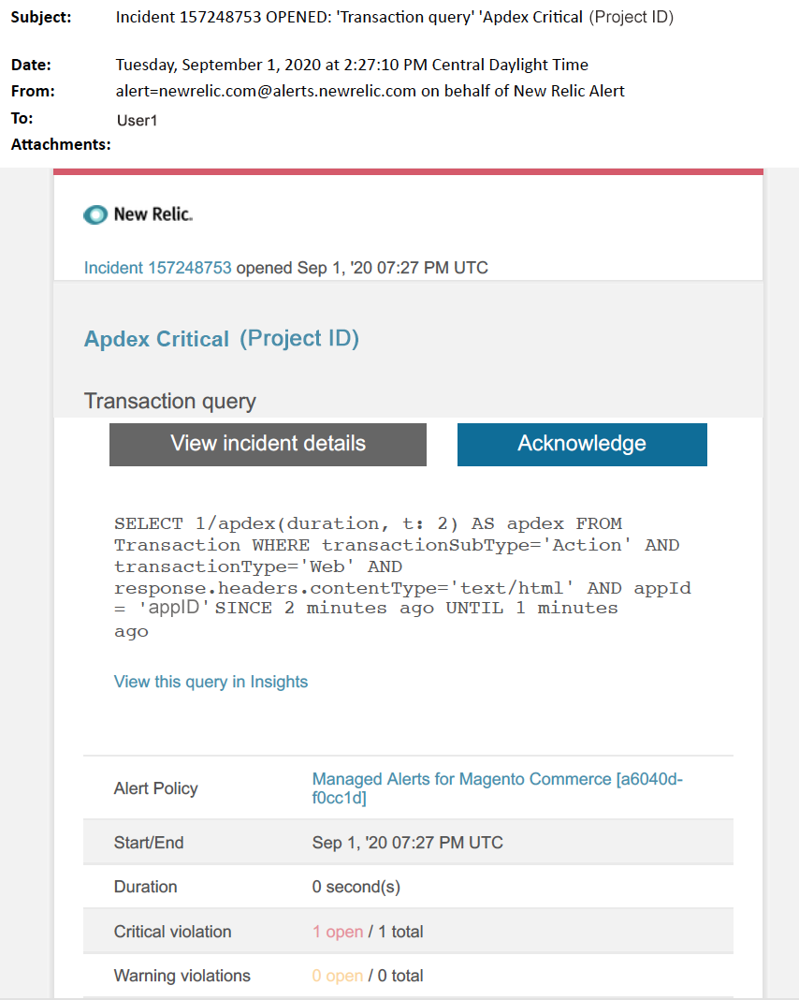

# Hanterade aviseringar för Adobe Commerce: [!DNL Apdex] kritisk avisering

Den här artikeln innehåller felsökningssteg när du får en [!DNL Apdex] viktig varning för Adobe Commerce i [!DNL New Relic]. [!DNL Apdex]-poängen mäter hur nöjda användarna är med svarstiden för webbprogram och tjänster. Det krävs omedelbara åtgärder för att åtgärda problemet. Varningen ser ut ungefär så här, beroende på vilken meddelandekanal du valt.

{width="500"}

## Berörda produkter och versioner

* Adobe Commerce om molninfrastruktur Pro planarkitektur
* Adobe Commerce om molninfrastruktur - arkitektur för Starter-plan

## Problem

Du får en hanterad avisering i [!DNL New Relic] om du har registrerat upp till [Hanterade aviseringar för Adobe Commerce](managed-alerts-for-magento-commerce.md) och ett eller flera av aviseringströskelvärdena har överskridits. Dessa varningar har utvecklats av Adobe för att ge säljarna en standarduppsättning med hjälp av insikter från support och konstruktion.

<u> **Gör!** </u>

* Avbryt all schemalagd distribution tills den här aviseringen har rensats.
* Placera platsen i underhållsläge omedelbart om platsen inte svarar eller inte svarar alls. Anvisningar om hur du gör detta finns i [Aktivera eller inaktivera underhållsläge](https://experienceleague.adobe.com/sv/docs/commerce-operations/installation-guide/tutorials/maintenance-mode) i Commerce installationshandbok. Se till att du lägger till din IP-adress i listan över undantagna IP-adresser för att vara säker på att du fortfarande kan komma åt din webbplats för felsökning. Anvisningar om hur du gör detta finns i [Underhåll listan över undantagna IP-adresser](https://experienceleague.adobe.com/sv/docs/commerce-operations/installation-guide/tutorials/maintenance-mode#maintain-the-list-of-exempt-ip-addresses) i Commerce installationshandbok.

<u>**Gör inte!**</u>

* lansera fler marknadsföringskampanjer som kan ge er webbplats fler sidvisningar.
* Kör indexerare eller ytterligare kroner som kan orsaka ytterligare stress på CPU eller disk.
* Utför några större administrativa uppgifter (t.ex. Commerce Admin, import/export av data).
* Rensa cachen.

Om du gör det ovan när du har fått en viktig varning, innan du har felsökt orsaken till aviseringen, kan det leda till att din webbplats inte svarar om du inte redan har ett avbrott i din webbplats.

## Lösning

Följ de här stegen för att identifiera och felsöka orsaken.

>[!WARNING]
>
>Eftersom det här är en viktig varning rekommenderar vi att du slutför **steg 1** innan du försöker felsöka problemet (steg 2 och framåt).

1. Kontrollera om Adobe Commerce supportanmälan finns. Anvisningar finns i [Spåra supportärenden](https://experienceleague.adobe.com/sv/docs/commerce-knowledge-base/kb/help-center-guide/magento-help-center-user-guide#track-support-case) i Commerce Support Knowledge Base. Supporten kan ha fått en [!DNL New Relic]-tröskelvärdesvarning, skapat en biljett och börjat arbeta med problemet. Om det inte finns någon biljett skapar du en. Biljetten ska ha följande information:
   * Kontaktorsak: välj **[!UICONTROL New Relic CRITICAL alert received]**.
   * Beskrivning av aviseringen.
   * [[!DNL New Relic] Incidentlänk](https://docs.newrelic.com/docs/alerts-applied-intelligence/new-relic-alerts/alert-incidents/view-violation-event-details-incidents). Detta ingår i dina [hanterade aviseringar för Adobe Commerce](managed-alerts-for-magento-commerce.md).
1. Identifiera källan till problemet genom att använda [[!DNL New Relic] APM:s transaktionssida](https://docs.newrelic.com/docs/apm/applications-menu/monitoring/transactions-page-find-specific-performance-problems) för att identifiera transaktioner med prestandaproblem:
   * Sortera transaktioner efter stigande [!DNL Apdex] poäng. [[!DNL Apdex]](https://docs.newrelic.com/docs/apm/new-relic-apm/apdex/apdex-measure-user-satisfaction) hänvisar till hur nöjda användarna är med svarstiden för dina webbprogram och tjänster. Ett lågt [!DNL Apdex]-poäng kan indikera en flaskhals (en transaktion med en högre svarstid). Vanligtvis är det databasen, [!DNL Redis] eller PHP. Anvisningar om hur du gör detta finns i [[!DNL New Relic] Visa transaktioner med högst missnöjd med apdex](https://docs.newrelic.com/docs/apm/new-relic-apm/apdex/apdex-measure-user-satisfaction/#dissatisfaction).
   * Sortera transaktioner efter högsta genomströmning, den långsammaste genomsnittliga svarstiden, den mest tidskrävande och andra tröskelvärden. Anvisningar finns i [[!DNL New Relic] Hitta specifika prestandaproblem](https://docs.newrelic.com/docs/apm/applications-menu/monitoring/transactions-page-find-specific-performance-problems). Om du fortfarande har problem med att identifiera problemet kan du använda [[!DNL New Relic] APM:s infrastruktursida](https://docs.newrelic.com/docs/infrastructure/infrastructure-ui-pages/infra-hosts-ui-page/).
1. Använd [[!DNL New Relic] APM:s infrastruktursida](https://docs.newrelic.com/docs/infrastructure/infrastructure-ui-pages/infra-hosts-ui-page/) för att identifiera resurskrävande processer. Anvisningar finns på sidan [[!DNL New Relic] Värdar för infrastrukturövervakning: [!UICONTROL Processes tab]](https://docs.newrelic.com/docs/infrastructure/infrastructure-ui-pages/infra-hosts-ui-page/#processes).
1. Om tjänster som [!DNL Redis] eller MySQL är den främsta källan för minnesförbrukning kan du försöka med följande:
   * Kontrollera att du har den senaste versionen. Nyare versioner kan ibland åtgärda minnesläckor. Om du inte har den senaste versionen bör du uppgradera. Anvisningar om hur du gör detta finns i [Ändra tjänster](https://experienceleague.adobe.com/docs/commerce-cloud-service/user-guide/configure/service/services-yaml.html?lang=sv-SE) i handboken för Commerce on Cloud.
   * Kontrollera om det finns MySQL-problem som långvariga frågor, odefinierade primärnycklar och dubblerade index. Anvisningar finns i [De vanligaste databasproblemen i Adobe Commerce i molninfrastruktur](https://experienceleague.adobe.com/docs/commerce-operations/implementation-playbook/best-practices/maintenance/resolve-database-performance-issues.html?lang=sv-SE) i Commerce Implementeringsspelningsbok.
   * Sök efter PHP-problem. Granska pågående processer genom att köra `ps aufx` i CLI/Terminal. I slutversionen ser du de kroniska jobb och processer som körs. Kontrollera utdata för processernas körningstid. Om det finns en kron med lång exekveringstid kan kronen hänga. Felsökningssteg finns i [Långsamma prestanda, långsamma och långvariga kroner](https://experienceleague.adobe.com/sv/docs/commerce-knowledge-base/kb/troubleshooting/miscellaneous/slow-performance-slow-and-long-running-crons) och [Kronjobb som fastnat i körningsstatus](https://experienceleague.adobe.com/sv/docs/commerce-knowledge-base/kb/troubleshooting/miscellaneous/cron-job-is-stuck-in-running-status) i Commerce Support Knowledge Base.

1. När källan har identifierats kan SSH ta sig in i miljön för att undersöka ytterligare. Anvisningar om hur du gör detta finns i [SSH i din miljö](https://experienceleague.adobe.com/sv/docs/commerce-cloud-service/user-guide/develop/secure-connections#ssh) i handboken för Commerce on Cloud.
1. Om du fortfarande har svårt att identifiera källan bör du granska de senaste trenderna för att identifiera problem med nyligen använda koddistributioner eller konfigurationsändringar (till exempel nya kundgrupper och stora ändringar i katalogen). Vi rekommenderar att du granskar de senaste sju dagarnas aktivitet för att se eventuella samband i koddistributioner eller ändringar.
1. Om du inte kan hitta en lösning inom rimlig tid kan du begära en uppgradering eller placera platsen i underhållsläge om du inte redan har gjort det. Anvisningar om hur du gör detta finns i [Begär tillfällig storleksändring](https://experienceleague.adobe.com/sv/docs/commerce-knowledge-base/kb/how-to/how-to-request-temporary-magento-upsize) i vår Commerce Support Knowledge Base och i [Aktivera eller inaktivera underhållsläge](https://experienceleague.adobe.com/sv/docs/commerce-operations/installation-guide/tutorials/maintenance-mode) i Commerce installationshandbok.
1. Om storleken på upp-sidan återställer webbplatsen till normal drift kan du begära en permanent uppstorlek (kontakta ditt Adobe-kontoteam), eller försöka återskapa problemet i din dedikerade mellanlagring genom att köra ett inläsningstest och optimera frågor, eller kod som minskar trycket på tjänsterna. Läs mer i [Läs in och stresstestning](https://experienceleague.adobe.com/sv/docs/commerce-cloud-service/user-guide/develop/test/staging-and-production#load-and-stress-testing) i Commerce on Cloud Guide.
