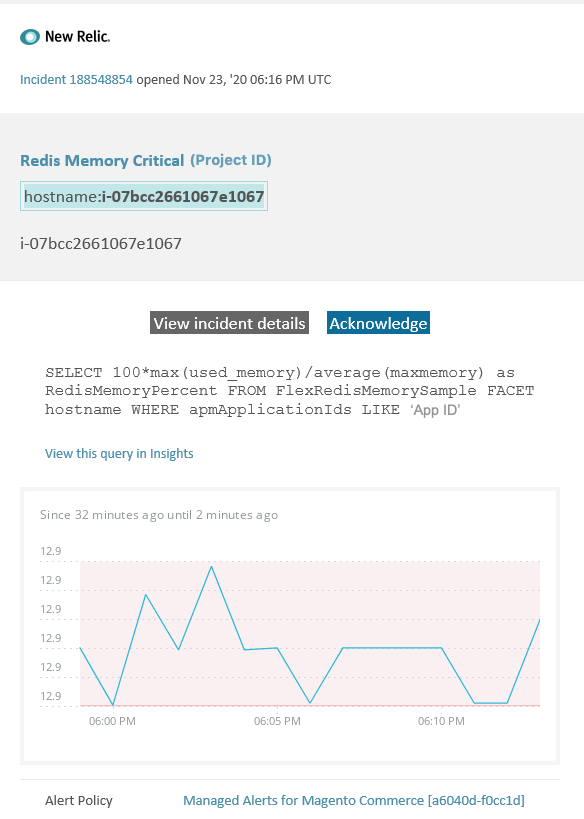

# Hanterade aviseringar på Adobe Commerce: [!DNL Redis] minneskritisk avisering

I den här artikeln finns felsökningssteg för när du får en [!DNL Redis]-minneskritisk avisering för Adobe Commerce i [!DNL New Relic]. Du måste vidta omedelbara åtgärder för att lösa problemet. Varningen ser ut ungefär så här, beroende på vilken meddelandekanal du valt.



## Berörda produkter och versioner

Alla versioner av Adobe Commerce om molninfrastruktur Pro planarkitektur

## Problem

Du får en avisering i [!DNL New Relic] om du har registrerat upp till [Hanterade aviseringar för Adobe Commerce](managed-alerts-for-magento-commerce.md) och ett eller flera av aviseringströskelvärdena har överskridits. Dessa varningar har utvecklats av Adobe för att ge säljarna en standarduppsättning med hjälp av insikter från support och tekniker.

**<u>Gör!</u>**

* Avbryt all schemalagd distribution tills den här aviseringen har rensats.
* Placera platsen i underhållsläge omedelbart om platsen inte svarar eller inte svarar alls. Anvisningar om hur du gör detta finns i [Aktivera eller inaktivera underhållsläge](https://experienceleague.adobe.com/en/docs/commerce-operations/installation-guide/tutorials/maintenance-mode) i Commerce installationshandbok. Se till att du lägger till din IP-adress i listan över undantagna IP-adresser för att vara säker på att du fortfarande kan komma åt din webbplats för felsökning. Anvisningar om hur du gör detta finns i [Underhåll listan över undantagna IP-adresser](https://experienceleague.adobe.com/en/docs/commerce-operations/installation-guide/tutorials/maintenance-mode#maintain-the-list-of-exempt-ip-addresses) i Commerce installationshandbok.

**<u>Gör inte!</u>**

* lansera fler marknadsföringskampanjer som kan ge er webbplats fler sidvisningar.
* Kör indexerare eller ytterligare kroner som kan orsaka ytterligare stress på CPU eller disk.
* Utför alla större administrativa uppgifter (dvs. större åtgärder i Commerce Admin, t.ex. import/export av data, tömning av media, sparande av kategorier med ett stort antal tilldelade produkter och massuppdateringar).
* Rensa cachen.

## Lösning

Följ de här stegen för att identifiera och felsöka orsaken.

**Eftersom det här är en viktig varning rekommenderar vi att du slutför steg 1 innan du försöker felsöka problemet (steg 2 och framåt).**

1. Kontrollera om Adobe Commerce supportanmälan finns. Anvisningar finns i [Spåra supportärenden](https://experienceleague.adobe.com/en/docs/commerce-knowledge-base/kb/help-center-guide/magento-help-center-user-guide#track-support-case) i Commerce Support Knowledge Base. Supporten kan redan ha fått en [!DNL New Relic]-tröskelvärdesvarning, skapat en biljett och börjat arbeta med problemet. Om det inte finns någon biljett skapar du en. Biljetten ska ha följande information:

   * Kontaktorsak: välj **[!UICONTROL New Relic CRITICAL alert received]**.
   * Beskrivning av aviseringen.
   * [[!DNL New Relic] incidentlänk](https://docs.newrelic.com/docs/alerts-applied-intelligence/new-relic-alerts/alert-incidents/view-violation-event-details-incidents/). Detta ingår i dina [hanterade aviseringar för Adobe Commerce](managed-alerts-for-magento-commerce.md).

1. Om det inte finns någon supportbiljett kontrollerar du om [!DNL Redis] använt minne ökar eller minskar genom att gå till sidan [.newrelic.com &#x200B;](https://login.newrelic.com) > **[!UICONTROL Infrastructure]** > **[!UICONTROL Third-party services]** och välja kontrollpanelen [!DNL Redis]. Om det är stabilt eller ökar [skickar du en supportanmälan](https://experienceleague.adobe.com/en/docs/commerce-knowledge-base/kb/help-center-guide/magento-help-center-user-guide#support-case) så att klustret storleksändras, eller ökar `maxmemory`-gränsen till nästa nivå.
1. Om du inte kan identifiera orsaken till den ökade minnesförbrukningen för [!DNL Redis] kan du granska de senaste trenderna för att identifiera problem med de senaste koddistributionerna eller konfigurationsändringarna (till exempel nya kundgrupper och stora ändringar i katalogen). Vi rekommenderar att du granskar de senaste sju dagarnas aktivitet för att se eventuella samband i koddistributioner eller ändringar.
1. Kontrollera om det finns tillägg från tredje part som inte fungerar som de ska:

   * Försök att hitta ett samband med nyligen installerade tillägg från tredje part och när problemet uppstod.
   * Granska tillägg som kan påverka cacheminnet i Adobe Commerce och få cacheminnet att växa snabbt. Exempel: anpassade layoutblock, åsidosätta cachefunktioner och lagra stora mängder data i cache.

1. Om ovanstående steg inte hjälper dig att identifiera eller felsöka problemkällan bör du överväga att aktivera L2-cache för att minska nätverkstrafiken mellan appen och [!DNL Redis]. Allmän information om vad som är L2-cache finns i [L2-cachning i Adobe Commerce-programmet](https://experienceleague.adobe.com/en/docs/commerce-operations/configuration-guide/cache/level-two-cache) i Commerce Configuration Guide. Så här aktiverar du L2-cache för molninfrastruktur:

   * Uppgradera ECE-verktygen om de är under version 2002.1.2.
   * Konfigurera L2-cache genom att använda [Använd REDIS\_BACKEND-variabeln](https://experienceleague.adobe.com/en/docs/commerce-on-cloud/user-guide/configure/env/stage/variables-deploy#redis_backend) och uppdatera `.magento.env.yaml`-filen:

   ```yaml
   stage:
       deploy:
           REDIS_BACKEND: '\Magento\Framework\Cache\Backend\RemoteSynchronizedCache'
   ```
