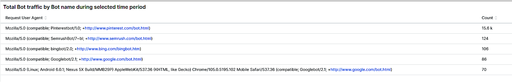
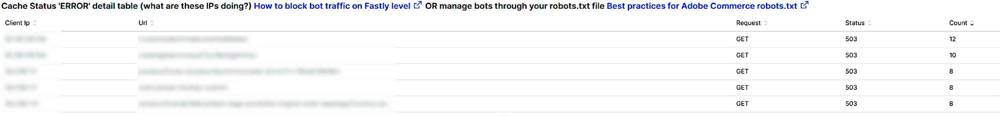
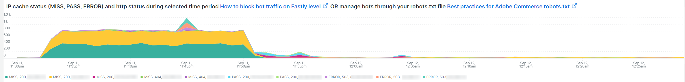
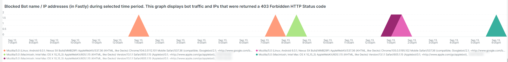
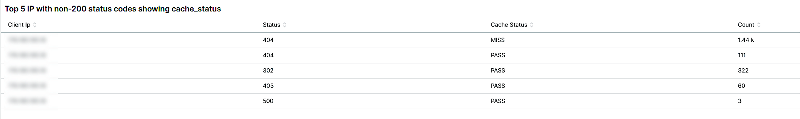

# Fliken [!UICONTROL bots]

På den här fliken finns information som förklarar hur du identifierar om och vad [!DNL bots] orsakar webbplatsproblem.

## Översikt över [!DNL bots] på hög nivå:

* Ett [!DNL bot] är ett program som kör återkommande automatiserade åtgärder. Med hjälp av artificiell intelligens och maskininlärning förändras uppgifterna, metoderna och interaktionerna för [!DNL bots]. Det finns *bra* [!DNL bots] som är till nytta för webbplatser genom att crawla och lägga till dem i sökmotorer på Internet. Detta leder till att Internetanvändare vägleds till webbplatsen med sökmotorresultat. En *bra* [!DNL bot] respekterar vanligtvis gränser som placerats på [!DNL bot] av en `robots.txt`-fil eller inställningar i en sökmotorkonsol. Gränser kan begränsa åtkomsten till platsen eller delar av platsen.
* Skadlig [!DNL bots] ignorerar `robots.txt`-filen eller så kan de hitta en bra [!DNL bot] via fältet för användaragent för begäran i HTTP-begärandata. Vissa saker som skadliga [!DNL bots] gör:
   * Lägg till inläsning på en webbplats för att neka legitima användare åtkomst till webbplatsen.
   * Rita och återanvänd material utan tillstånd.
   * Registrera falska konton för att flöda e-posttjänster eller adresser eller omdirigera till andra webbplatser ([!DNL SPAM bots]).
   * Skapa falska vyer ([!DNL Viewbots]).
   * Köp produkter eller biljetter ([!DNL Focused bots]).
* Hanterar [!DNL bots]
   * [!DNL Observation for Adobe Commerce] har vyer över [!DNL bot] trafik:
      * Den visar den totala icke-cachelagrade [!DNL bot]-aktiviteten som visar den belastning som [!DNL bot] lägger till på en plats och när den inläsningen sker.
      * Den visar [!DNL bots] som genererar fel. Vanligtvis om en [!DNL bot] lägger till inläsning som orsakar webbplatsproblem har den [!DNL bot] eller IP-adressen den högsta felfrekvensen.
      * Den visar [!DNL bot] namn (begär fältvärden för användaragent) och IP-adresser att hantera via:
         * [!DNL Fastly] (hastighetsbegränsning eller [!DNL VCLs] som blockerar IP-adresser, intervall eller [!DNL bots] efter namnvärde).
         * Lägger till bra [!DNL bot]-information till `robots.txt field` för att begränsa eller begränsa webbplatsens åtkomstfrekvens.
         * Hantera [!DNL Bing] eller [!DNL Google bots] via sökmotorkonsolen.

## [!UICONTROL Experimental Potential Malicious Bots frame]

Bildrutan **[!UICONTROL Experimental Potential Malicious Bots frame]** innehåller över 12 separata, komplexa frågor. Den upptäcker skadliga IP-förfrågningssignaturer och sammanställer sedan resultaten, summerar och sorterar dem efter antal i fallande ordning. Frågorna innehåller en mängd datasignaturer av CVE-explosioner och andra skadliga förfrågningar. Även om explosionerna blockeras av säkerhetskorrigeringar/patchar och inte utgör ett hot mot webbplatsen måste begäran fortfarande hanteras av webbplatsen. Antalet förfrågningar kan bli mycket stort på kort tid. Den här bildrutan visar inte totalt antal begäranden från IP-adressen, utan i stället begäranden som har signaler som indikerar att begäran hade misstänkt avsikt.

Kontrollera att trafiken är misstänkt och att den inte kommer från en [!DNL Content Distributed Network]-adress (CDN) som också kan leverera giltiga begäranden. Om förfrågningarna kommer från en CDN IP-adress kontaktar du tjänsteleverantören för att få hjälp med att blockera den misstänkta trafiken via nätverket. Om du behöver blockera adressen eller begära URL:en, se [Blockera skadlig trafik för Adobe Commerce på [!DNL Fastly] nivå](https://experienceleague.adobe.com/docs/commerce-knowledge-base/kb/how-to/block-malicious-traffic-for-magento-commerce-on-fastly-level.html?lang=sv-SE) i Adobe Commerce Support Knowledge Base.

## [!UICONTROL Rate of HTTP request per second (top 25) during requested time period]

Bildrutan **[!UICONTROL Rate of HTTP request per second (top 25) during requested time period]** visar de högsta begäranden per sekund om IP-adresser under den valda tidsramen. Om dessa adresser också finns i tabellen ovan kontrollerar du att de inte är CDN-adresser och skadliga och blockerar dem via [!DNL Fastly].

## [!UICONTROL Total Bot traffic by bot name]:

Tabellen **[!UICONTROL Total Bot traffic by bot name during selected time period]** innehåller det sammanlagda antalet icke-cachelagrade begäranden där fältet [!UICONTROL request_user_agent] har strängen [!DNL bots] i värdet. Detta kan vara namngivet [!DNL bot] eller inte, eftersom fältvärdet [!UICONTROL request_user_agent] kan vara förfalskat. Värdet under kolumnen [!UICONTROL Count] är det viktigaste.

## [!UICONTROL Total Bot Traffic by Bot name/IP address]

Tabellen **[!UICONTROL Total Bot Traffic by Bot name/IP address during selected time period How to block bot traffic on Fastly level OR manage bots through your robots.txt file Best practices for Adobe Commerce robots.txt]** visar samma data som föregående tabell, men lägger till IP-adresser som gör förfrågningar åt den namngivna [!DNL bot]. Som en skadlig [!DNL bots]-sked bra [!DNL bots] bör IP-adressen/IP-adresserna verifieras via webbplatser som identifierar IP-adresser som kan missbrukas eller via *vars*-tjänster eller [!DNL DNS lookups]. [!DNL Google] publicerar till exempel sina [[!DNL googlebot] IP-adresser](https://developers.google.com/search/apis/ipranges/googlebot.json) och [!DNL Microsoft] har ett verifieringsverktyg för [[!DNL Bingbots]](https://www.bing.com/webmasters/help/Verify-Bingbot-2195837f).

## [!UICONTROL Graph - Bots with HTTP status errors]

Diagrammet **[!UICONTROL Graph - Bots with HTTP status errors during selected time period How to block bot traffic on Fastly level OR manage bots through your robots.txt file Best practices for Adobe Commerce robots.txt]** visar fel på [!DNL bots] som deklarerar sig själv i fältet för användaragent för begäran. Detta behöver inte nödvändigtvis innebära att felet orsakas av volym från [!DNL bot] eller annan trafik. Felen kan vara att [!DNL bot] begär information som inte finns eller att det finns ett annat problem i begäran.

Om det finns en rad fel på IP-adresser under platsinstallationer eller driftavbrott kan de misstänkas för webbplatsproblemet.

## [!UICONTROL Table - IPs that do not identify as bots]

Tabellen **[!UICONTROL Table - IPs that do not identify as bots with HTTP status errors during selected time period How to block bot traffic on Fastly level OR manage bots through your robots.txt file Best practices for Adobe Commerce robots.txt]** visar IP-begäranden med icke-200 http-statuskoder som INTE är självidentifierande som [!DNL bots] i fältet för användaragent för begäran. Dessa IP-adresser kan vara skadliga IP-adresser, särskilt om antalet är högt för den valda tidsperioden.

Om antalet http-statuskoder som inte är 200 är lågt och IP-adressintervallen inte är lika, kanske inte adresserna bidrar till webbplatsproblemen.

## [!UICONTROL Table – Cache Status 'ERROR']

När IP-adresser genererar en hög frekvens av fel, fråga vad gör de? Tabellen **[!UICONTROL Table – Cache Status 'ERROR' detail table (what are these IPs doing?) How to block bot traffic on Fastly level OR manage bots through your robots.txt file Best practices for Adobe Commerce robots.txt]** visar den begärda URL:en tillsammans med HTTP-statusvärdet för begäranden som har cachestatusvärdet [!UICONTROL ERROR]. Frekvensen anges av URL:en så att antalet kan vara lågt. Kom ihåg att IP-adressen kan göra tusentals begäranden under den valda tidsperioden. Detta är en vy mot upp till 2 000 begäranden under tidsramen (gränsen för postvisning).

## [!UICONTROL Show 5XX status distribution]

Bildrutan **[!UICONTROL Show 5XX status distribution across IP addresses (top 200 addresses) How to block bot traffic on Fastly level OR manage bots through your robots.txt file Best practices for Adobe Commerce robots.txt]** är kraftfull. Den visar de IP-adresser som har 5XX http-statuskoder under den valda tidsperioden. Om en IP-adress gör stora mängder förfrågningar och platsen påverkas till den punkt där den inte kan hantera trafiken, har de IP-adresser som gör den högsta frekvensen av förfrågningar vanligtvis den högsta antalet fel. 5XX http-statuskoder indikerar vanligtvis en webbplats som har svårt att svara på förfrågningar.

Ju större fält, desto större är procentandelen fel som IP-adressen har i det totala antalet 5 gånger fel under den tidsperioden. Obs! En IP-adress kan ha flera segment i diagrammet om den har flera http-statuskoder (till exempel 502- och 503 http-statusar).

Normal fördelning anges till höger om fältet där IP-adresserna är lika breda eller där det finns några breda fält med mycket låga tal.

Om du håller markören över stapelsegmentet visas antalet angivna fel under den valda tidsperioden.

## [!UICONTROL IP cache status (MISS, PASS, ERROR) and HTTP status]

Den här **[!UICONTROL IP cache status (MISS, PASS, ERROR) and HTTP status during selected time period How to block bot traffic on Fastly level OR manage bots through your robots.txt file Best practices for Adobe Commerce robots.txt]**-bildrutan visar antalet HTTPS-statuskoder och icke-cachelagrade begäranden per IP i den valda tidsbildrutan. Detta anger den proportionella belastningen från varje IP-adress och den totala volymen. Den visar IP-adresserna med de flesta förfrågningar.

## [!UICONTROL Fastly Cache Summary for selected time period]

Om du klickar på ikonen [!UICONTROL Error] i diagrammet nedan kan du jämföra de två sista diagrammen med varandra. Detta kan visa var inläsningen bidrar till webbplatsproblem.

## [!UICONTROL Graph - IPs that do not identify as bots]

Bildrutan **[!UICONTROL Graph - IPs that do not identify as bots without error during selected time period How to block bot traffic on Fastly level OR manage bots through your robots.txt file Best practices for Adobe Commerce robots.txt]** visar det begärda fältet för användaragent, IP-adressen och statuskoden för begäranden där fältet för användaragent för begäran inte anger [!DNL bot]. Den här bildrutan kan visa förfrågningar med hög frekvens från alla IP-adresser, men du bör vara uppmärksam på förfrågningar med hög frekvens, särskilt under en tidsperiod då webbplatsen kan ha problem.

## [!UICONTROL Graph - Suspicious Non-Bot traffic]

Diagrammet **[!UICONTROL Graph - Suspicious Non-Bot traffic during selected time period]** söker efter användaragentvärdet för Go-http-client, men kommer att utökas för att undersöka andra värden för användaragent för misstänkt begäran. Det här användaragentvärdet för begäran används av webbplatser för anslutning från tjänster och kan vara giltigt, men används även av skadliga [!DNL bots].

## [!UICONTROL Graph - Bot traffic by Bot name]

Bildrutan **[!UICONTROL Graph - Bot traffic by Bot name during selected time period]** visar samma data som Total Bot-trafik med namnet [!DNL Bot] under den valda tidsperiodens tabell högst upp på fliken. Den visar data via tidslinjen så att du kan se när förfrågningar från [!DNL bots] görs och deras fördelningar.

## [!UICONTROL Graph - Top 250 Bot Names and IP addresses]

Bildrutan **[!UICONTROL Graph - Top 250 Bot Names and IP addresses during selected time period How to block bot traffic on Fastly level OR manage bots through your robots.txt file Best practices for Adobe Commerce robots.txt]** visar samma data som registret Total [!DNL Bot]-trafik per punktnamn/IP-adress under den valda tidsperioden högst upp på fliken. Den visar data via tidslinjen och facetterar dem med IP-adress. Detta visar när förfrågningarna från [!DNL bots] görs, vilken IP som gör förfrågningar och hur förfrågningarna distribueras.

## [!UICONTROL Blocked Bot name / IP addresses (in Fastly)]

Bildrutan **[!UICONTROL Blocked Bot name / IP addresses (in Fastly) during selected time period. This graph displays bot traffic and IPs that were returned a 403 Forbidden HTTP Status code]** visar robotnamnet och IP-adresserna som är blockerade. I det här diagrammet ser du hur alla begäranden blockeras i [!DNL Fastly].

## [!UICONTROL Blocked non-Bot name / IP addresses (in Fastly)]

Bildrutan **[!UICONTROL Blocked non-Bot name / IP addresses (in Fastly) during selected time period graph displays non-bot traffic and IPs that were returned a 403 Forbidden HTTP Status code]** visar IP-adresser som inte identifieras som en [!DNL bot] som har blockerats via [!DNL Fastly].

## [!UICONTROL This table shows the number of user agents per IP address, number of successful, unsuccessful and blocked requests:]

Skadlig [!DNL bots] spottar ofta andra [!DNL bots] genom värdet för fältet [!UICONTROL Request User Agent]. Tabellen visar hur många unika värden IP-adressen har i fältet. Ju högre värde i fältet [!UICONTROL Request User Agent], desto mer misstänkt är IP-adressen.

## [!UICONTROL IP with non-200 status errors]

Bildrutan **[!UICONTROL IP with non-200 status errors – without 403 status]** visar fördelningen över den valda tidsramen för IP-adresser med andra HTTP-statuskoder än 200. När du ser högre värden för en enskild IP-adress eller grupp av IP-adresser måste du undersöka dem ytterligare.

## [!UICONTROL IP with 403 status codes:]

Bildrutan **[!UICONTROL IP with 403 status codes]** visar icke-cachelagrade begäranden utan [!UICONTROL cache_status=ERROR] som har HTTP-statusen 403. Detta kan visa att den ursprungliga servern är källan till 403 (obehörig) i stället för ett block från [!DNL Fastly].

## [!UICONTROL Top 5 with non-200 status codes]

Tabellen **[!UICONTROL Top 5 with non-200 status codes showing cache_status]** visar antalet för varje IP/statusnivå med värdet [!UICONTROL cache_status].

## [!UICONTROL Pageview Latency will show as spikes]

Bildrutan **[!UICONTROL Pageview Latency will show as spikes on this graph:]** visar sidinläsnings-/API-svarstid som kan vara i linje med [!DNL bot]-trafiken.
