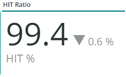
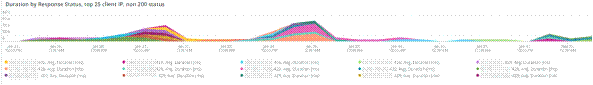

# Fliken [!UICONTROL CDN]

På den här fliken finns information som fokuseras på [!DNL content delivery network (CDN)]. För Adobe Commerce Cloud är det här [!DNL Fastly]-tjänsten.

## [!UICONTROL HIT rate]

Bildrutan **[!UICONTROL HIT rate]** visar antalet cachelagrade begäranden som resulterade i [!UICONTROL HITS] vid den sista minuten. Detta visar att cachelagring lyckades. Pilen till höger visar procentandelen över eller under samma tid för en vecka sedan.

## [!UICONTROL HIT Processing]

Den här **[!UICONTROL HIT processing]**-rutan visar antalet cachelagrade begäranden som resulterade i [!UICONTROL HITS] under veckan.

## [!UICONTROL MISS rate]

I den här **[!UICONTROL MISS rate]**-rutan visas antalet missar för cachelagrade begäranden i den sista minuten. Saknar är när begäran inte cachelagras och begäran måste skickas till den ursprungliga servern för att innehållet ska kunna hanteras. Värdet till höger är en jämförelse mellan ökning/minskning och antalet minuter per minut en vecka före.

## [!UICONTROL MISS time]

## [!UICONTROL HIT Ratio]

## [!UICONTROL Error Percentage]

I rutan **[!UICONTROL Error Percentage]** visas värdet för procentandelen FEL för begäranden och den relativa ökningen/minskningen visas jämfört med samma tid en vecka före.

## [!UICONTROL Total Requests]

## [!UICONTROL ERROR rate]

## [!UICONTROL Fastly Cache Average Response for selected time period in seconds]

Den här bildrutan visar längden i sekunder för cachelagrade begäranden, vilket innebär att om `cache_response` är en [!UICONTROL MISS], visas genomsnittet för missade cachelagrade svar för den valda tiden.

## [!UICONTROL Fastly Cache Average Response for selected time period in seconds, faceted by POP]

*POP* refererar i det här sammanhanget till en POP (Point of Presence) som är konfigurerad att fungera som en pool för cachelagring. Se [Visningspunkter](https://developer.fastly.com/learning/concepts/pop/).

## [!UICONTROL Total Bandwidth (All POPs) during the selected timeframe, compared with 1 week ago (% increase/decrease)]

## [!UICONTROL Requests – Since selected timeframe compared with one week ago]

Den här bildrutan liknar sammanfattningsrutan för [!UICONTROL Total Requests] överst, men visar antalet föregående veckors begäranden. Det här är alla begäranden, inte bara cachelagrade begäranden (där `is_cacheable` är true).

## [!UICONTROL Response Count]

## [!UICONTROL Bandwidth by POP]

## [!UICONTROL Top 5 URLs (5xx or 3xx status codes)]

Vyn **[!UICONTROL Top 5 URLs]** visar de fem vanligaste URL:erna som har 5 eller 3 x felsvar. På grund av utrymmesbegränsningen måste du föra musen över URL:en för att se den specifika felkoden som är kopplad till den URL:en. (exempel i den röda rutan i figuren ovan).

## [!UICONTROL Top 25 URLs (200 status)]

Bildrutan **[!UICONTROL Top 25 URLs]** visar de URL:er som returnerade statusen 200 efter antal under den valda tidsramen.

## [!UICONTROL Duration by Response Status]

Diagrammet **[!UICONTROL Duration by Response Status]** visar felsvaren utifrån antal under den valda tidsramen, som anges av felstatuskoden.

## [!UICONTROL Duration by Response Status, top 25 urls]

Diagrammet **[!UICONTROL Duration by Response Status, top 25 URLs]** visar de 25 översta URL:erna med svarstiden i sekunder. Du kan behöva hålla muspekaren över URL-adressen för att se hela sökvägen. Om du vill ta bort alla URL:er utom en klickar du på den URL:en. Du kan sedan lägga till andra URL:er igen genom att klicka på dem var för sig. Om du vill ta bort enskilda URL:er kan du hålla ned tangenten och klicka på varje URL för att ta bort dem från diagrammet.

## [!UICONTROL Duration by Response Status, top 25 non-200 status]

Diagrammet **[!UICONTROL Duration by Response Status, top 25 non-200 status]** liknar det sista förutom att fokus ligger på statuskoder som inte är 200 eller felstatuskoder. Den visar felkoden och sedan URL:en. Du kan behöva hålla muspekaren över URL-adressen för att se hela sökvägen. Om du vill ta bort alla URL:er utom en klickar du på den URL:en. Du kan sedan lägga till andra URL:er igen genom att klicka på dem var för sig. Om du vill ta bort enskilda URL:er kan du hålla ned tangenten och klicka på varje URL för att ta bort dem från diagrammet.

## [!UICONTROL Error Count by POP timeline]

Diagrammet **[!UICONTROL Error Count by POP timeline]** visar antalet felstatusvärden längs den valda tidslinjen för tidsbildrutor, som anges av felkoden.

## [!UICONTROL Duration by Response status, top 25 client IP, non-200 status]

Diagrammet **[!UICONTROL Duration by Response status, top 25 client IP, non 200 status]** visar IP-adresserna med den genomsnittliga längden över den valda tidsramen där det fanns statusfelkoder.

## [!UICONTROL IP Frequency]

Bildrutan **[!UICONTROL IP Frequency]** räknar statusen (&#39;MISS&#39; och &#39;PASS&#39;) för varje IP-adress från loggarna [!DNL Fastly]. Webbförfrågningar med dessa statusvärden kommer till den ursprungliga servern och kommer att lägga till inläsning till servern. Den visar de tjugo översta adresserna i frekvens. Den här bildrutan kan användas för att identifiera IP-attacker eller källor med hög belastning på en webbplats. Det här diagrammet finns också på sammanfattningsfliken och placeras här för att enkelt kunna jämföra med mer information om logginformationen för [!DNL Fastly] som visas på den här fliken.
