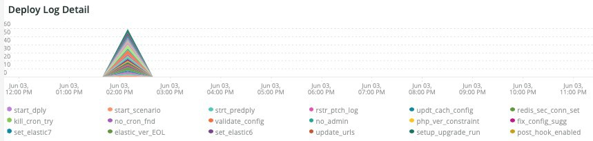

# Fliken [!UICONTROL Deploy]

Fliken är ett försök att snabbt isolera problem och orsaker till distributionsproblem.

## [!UICONTROL Deploy log Deployment Troubleshooter]

Bildrutan **[!UICONTROL Deploy log Deployment Troubleshooter]** visar antalet distribuerade logghändelser som inträffat under den valda tidsramen. Avsikten är att ge en överblick över distributionsaktiviteten och avgöra hur komplicerad distributionen är utifrån antalet. Ju mer loggade meddelanden, desto mer komplicerad är distributionen vanligtvis.

## [!UICONTROL Deploy State]

Bildrutan **[!UICONTROL Deploy State]** visar de distributionshändelser som inträffade under den valda tidsramen. Tolkaren för den här bildrutan söker efter dessa specifika signaler:

* `%NOTICE: Starting generate command%`) som `start_gen`
* `%git apply /app/vendor/magento/ece-tools/patches%`) som `apply_patches`
* `%Set flag: .static_content_deploy%`) som `SCD`
* `%NOTICE: Generate command completed%`) som `gen_compl`
* `%NOTICE: Starting deploy.%`) som `start_deploy`
* `%NOTICE: Deployment completed%`) som `deploy_compl`
* `%NOTICE: Starting post-deploy.%`) som `start_pdeploy`
* `%NOTICE: Post-deploy is complete%`) som `pdeploy`
* `%deploy-complete%`) som `cl_deploy_compl`

## [!UICONTROL Deploy Log Detail]

Bildrutan **[!UICONTROL Deploy Log Detail]** visar sammanfattningsinformation för distributionsloggmeddelanden som inträffade under den valda tidsramen. Bildrutan tolkas för följande strängar i distributionsloggarna:

* `%NOTICE: Starting deploy.%`) som `start_dply`
* `%INFO: Starting scenario(s): scenario/deploy.xml%`) som `start_scenario`
* `%NOTICE: Starting pre-deploy%`) som `strt_predply`
* `%INFO: Restoring patch log file%`) som `rstr_ptch_log`
* `%INFO: Updating cache configuration.%`) som `updt_cach_config`
* `%INFO: Set Redis slave connection%`) som `redis_sec_conn_set`
* `%INFO: Static content deployment was performed during build hook, cleaning old content%`) som `scd_build_hk`
* `%INFO: Clearing pub/static%`) som `clr_pub_static`
* `%NFO: Clearing redis cache:%`) som `clr_redis_cach`
* `%INFO: Clearing var/cache directory%`) som `clr_var_cach`
* `%NOTICE: Enabling Maintenance mode%`) som `enable_maint_mode`
* `%INFO: Disable cron%`) som `disable_cron`
* `%INFO: Trying to kill running cron jobs and consumers processes%`) som `kill_cron_try`
* `%INFO: Running Adobe Commerce cron and consumers processes were not found.%`) som `no_cron_fnd`
* `%NOTICE: Validating configuration%`) som `validate_config`
* `%The following admin data is required to create an admin user during initial installation%`) som `no_admin`
* `%recommended PHP version satisfying the constraint%`) som `php_ver_constraint`
* `%WARNING: Fix configuration with given suggestions:%`) som `fix_config_sugg`
* `%WARNING: [2003] The directory nesting level value for error reporting has not been configured.%`) som `nest_err_reporting`
* `%NOTICE: End of validation%`) som `end_validation`
* `%NOTICE: Starting update.%`) som `start_update`
* `%INFO: Updating env.php.%`) som `update_php_env`
* `%INFO: Updating env.php DB connection configuration.%`) som `update_php_env_db`
* `%INFO: Updating env.php AMQP configuration%`) som `update_php_env_amqp`
* `%INFO: Set search engine to: elasticsearch7%`) som `set_elastic7`
* `%elasticsearch 6.5.4 has passed EOL%`) som `elastic_ver_EOL`
* `%INFO: Set search engine to: elasticsearch6%`) som `set_elastic6`
* `%INFO: Updating secure and unsecure URLs%`) som `update_urls`
* `%INFO: Running setup upgrade.%`) som `setup_upgrade_run`
* `%INFO: Post-deploy hook enabled. Cron enabling, cache cleaning, and pre-warming operations are postponed%`) som `post_hook_enabled`
* `%NOTICE: Maintenance mode is disabled.%`) som `maint_mode_disabled`
* `%INFO: Scenario(s) finished%`) som `scenario_finished`
* `%WARNING: Command maintenance:enable finished with an error. Creating a maintenance flag file%`) som `enable_maintenance_fail`
* `%MySQL server has gone away%`) som `MySQL_has_gone_away`

## [!UICONTROL Post Deploy Log Detail]

Bildrutan **[!UICONTROL Post Deploy Log Detail]** visar logginformation som har inträffat efter distributionen under den valda tidsramen. Den här bildrutan fokuserar på särskilda loggmeddelanden som innehåller följande strängar:

* `%Disabled maintenance mode%`) som `disabled_maint_mode`
* `%INFO: Starting scenario(s): scenario/post-deploy.xml%`) som `start_pstdply_scenario`
* `%NOTICE: Validating configuration%`) som `val_config`
* `%NOTICE: End of validation%`) som `end_val_config`
* `%INFO: Enable cron%`) som `cron_enabled`
* `%INFO: Create backup of important files.%`) som `file_backup`
* `%INFO: Successfully created backup%`) som `file_backup_success`
* `%INFO: Starting page warming up%`) som `pg_warmup_start`
* `%INFO: Warmed up page:%`) som `warmed_up_pg`
* `%ERROR: Warming up failed:%`) som `warm_up_pg_err`
* `%INFO: Scenario(s) finished%`) som `scenario_finished`

## [!UICONTROL Cloud Log Detail]

Bildrutan **[!UICONTROL Cloud Log Detail]** visar molnloggsinformationen som inträffade under den valda tidsramen. Följande strängar tolkas och returneras med AS-etiketten nedan:

* `%DEBUG: /bin/bash -c "set -o pipefail; php ./bin/magento setup:upgrade%`) som `start_update`
* `%Schema creation/updates:%`) som `schema_updates`
* `%Nothing to import.%`) som `mod_import_finish`
* `%NOTICE: End of update.%`) som `update_finished`
* `%DEBUG: Running step: deploy-static-content%`) som `scd_run`
* `%NOTICE: Skipping static content deploy. SCD on demand is enabled.%`) som `scd_ondemand`
* `%INFO: Clearing%`) som `clr_dirs`
* `%DEBUG: Step "deploy-static-content" finished%`) som `scd_finished`
* `%NOTICE: Skipping static content compression. SCD on demand is enabled.%`) som `scd_compression_run`
* `%INFO: Clearing var/cache directory%`) som `clr_var_cach`
* `%DEBUG: Step "compress-static-content" finished%`) som `scd_compression_finished`
* `%DEBUG: Running step: deploy-complete%`) som `deploy_finished`
* `%INFO: Post-deploy hook enabled. Cron enabling, cache cleaning, and pre-warming operations are postponed to post-deploy stage.%`) som `Post_deploy_hook_enabled`
* `%NOTICE: Maintenance mode is disabled.%`) som `maint_mode_disabled`
* `%INFO: Scenario(s) finished%`) som `scenario_finished`
* `%post-deploy.xml%`) som `post_deploy_start`
* `%NOTICE: Validating configuration%`) som `validate_config`
* `%WARNING: [2003] The directory nesting level value for error reporting has not been configured.%`) som `nest_err_reporting`
* `%NOTICE: End of validation%`) som `end_validation`
* `%INFO: Enable cron%`) som `enable_cron`
* `%INFO: Create backup of important files%`) som `create_backup`
* `%DEBUG: Step "backup" finished%`) som `backup_finished`
* `%INFO: Starting page warming up%`) som `warmup_start`
* `%ERROR: Warming up failed:%`) som `warm_up_fail`
* `%DEBUG: Step "warm-up" finished%`) som `warmup_finished`
* `%DEBUG: Step "time-to-first-byte" finished%`) som `ttfb_finished`
* `%INFO: Scenario(s) finished%`) som `post_deploy_finished`
* `%DEBUG: Running step: pre-build%`) som `run_pre-build`
* `%DEBUG: Flag .static_content_deploy has already been deleted%`) som `scd_flag_del`
* `%DEBUG: Step "pre-build" finished%`) som `pre-build_completed`
* `%NOTICE: Applying patches%`) som `apply_patches`
* `%has been applied%`) som `patches_applied`
* `%DEBUG: Step "apply-patches" finished%`) som `apply_patches_complete`
* `%Deploy using quick strategy%`) som `quick_strategy_deploy`
* `%NOTICE: Running DI compilation%`) som `di_compliation_start`
* `%NOTICE: End of running DI compilation%`) som `di_compliation_finished`
* `%NOTICE: Generating fresh static content%`) som `gen_frsh_static_content`
* `%magento setup:static-content:deploy%`) som `scd_executing`
* `%NOTICE: End of generating fresh static content%`) som `gen_frsh_static_cont_finished`
* `%INFO: Starting scenario(s): scenario/build/transfer.xml%`) som `start_transferxml`
* `%INFO: Trying to kill running cron jobs%`) som `kill_crons`
* `%INFO: Clearing redis cache:%`) som `clear_redis_cache`
* `%INFO: Checking if db exists and has tables%`) som `db_check`
* `%WARNING: [2010] Elasticsearch service is installed at infrastructure layer, but is not used as a search engine.%`) som `es_not_used`
* `%NOTICE: Starting update.%`) som `starting_update`
* `%INFO: Set search engine to: mysql%`) som `mysql_search`
* `%SQLSTATE[HY000] [2006] MySQL server has gone away%`) som `mysql_gone`

## [!UICONTROL Count of modules imported during deploy]

Bildrutan **[!UICONTROL Count of modules imported during deploy]** visar antalet moduler som importerats under distributionen under den valda tidsramen.

## [!UICONTROL Deployed module list]

Bildrutan **[!UICONTROL Deployed module list]** visar distribuerade moduler under den valda tidsramen.
