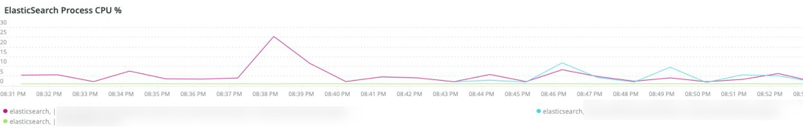
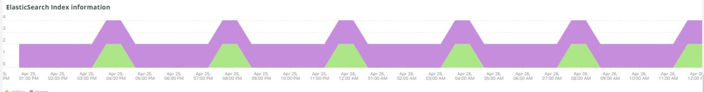
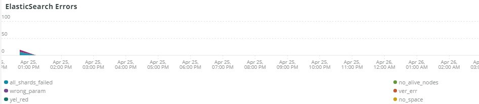

# Fliken [!UICONTROL Elasticsearch]

## [!UICONTROL Cluster Status Summary]:

Under den valda tidsramen visar **[!UICONTROL Cluster Status Summary]**-bildrutan färgstatusarna som klustret [!DNL Elasticsearch] har gått igenom. I det här exemplet hade klustret en gång i tiden status grönt under den valda tidsramen och hade en gult status en gång under den valda tidsramen.

## [!UICONTROL Active Primary Shards]

Bildrutan **[!UICONTROL Active Primary Shards]** visar de olika numren beroende på antalet aktiva primära kort för det valda kontots [!DNL Elasticsearch]-tjänst.

Från [!DNL Elasticsearch]: Den definitiva guiden [2.x]:

&quot;I [Dynamiskt uppdateringsbara index](https://www.elastic.co/guide/en/elasticsearch/guide/2.x/dynamic-indices.html) förklarade vi att en delning är ett Lucene-index och att ett [!DNL Elasticsearch] -index är en samling skärmar. Ditt program kommunicerar med ett index och [!DNL Elasticsearch] dirigerar dina förfrågningar till rätt fragment. Ett delsystem är skalenheten. Det minsta indexvärdet du kan ha är ett med en enda delning. Detta kan vara mer än tillräckligt för dina behov - en enda delmängd kan innehålla mycket data - men det begränsar din möjlighet att skala.&quot;

När ett index skapas, skapas flera skuggor med det indexet. Som standard tilldelas fem primära delningar till varje nytt index, vilket innebär att ett index kan spridas över fem noder (en delning per nod). Det finns också replikskevningar. Dessa är främst till för failover. Replikdelningar kan hantera läsbegäranden.

## [!UICONTROL Active Shards in Cluster]

Bildrutan **[!UICONTROL Active Shards in Cluster]** visar det totala antalet primära och replikerade delningar i ett [!DNL Elasticsearch]-kluster.

## [!UICONTROL Index health - this will show the index name and color status]

I den här bildrutan visas indexnamnet och antalet indexfärger. Om du bläddrar nedåt i tabellen ser du samma indexnamn med gula och röda färglägen. Siffran som följer efter 27 indexnamn är antalet statusfärger. Om det är noll fanns det inga instanser av indexet med den färgstatusen under de valda tidsbildrutorna.

## [!UICONTROL Elasticsearch Status by node information]

**[!UICONTROL Elasticsearch Status by node information]**-bildrutan visar [!DNL Elasticsearch]-klusterstatusen per färg och nod. Detta visar vilken nod i klustret [!DNL Elasticsearch] som returnerar vilken status under den valda tidsramen.

## [!UICONTROL Elasticsearch index information]

Tabellen **[!UICONTROL Elasticsearch index information]** visar indexnamnet, vilken nod det är på, antalet indexerade dokument, indexhälsan och indexstorleken i MB vid en viss tidpunkt.

## [!UICONTROL Elasticsearch process CPU %]

I bildrutan **[!UICONTROL Elasticsearch process CPU %]** visas processen CPU percent med processen [!DNL Elasticsearch] under den valda tidsramen.

## [!UICONTROL Elasticsearch Memory garbage collection]

[!DNL Elasticsearch] är en Java-process. Om det inte finns tillräckligt med tilldelat minne initieras skräpinsamlingen för att frigöra minne. Om skräpinsamlingen är vanlig är det en indikation på att det kan finnas för många index eller kort för det tilldelade minnet. Det kan finnas en möjlighet att rensa upp index och delningar eller så behöver [!DNL Elasticsearch] mer minne.

## [!UICONTROL Elasticsearch Index information]

När index skapas och uppdateras kan indexets hälsa ändras.

## [!UICONTROL Elasticsearch Index Size]

Bildrutan **[!UICONTROL Elasticsearch Index Size]** anger indexnamnet och storleken över den markerade tidsramen. Det kan tyda på problem med hur en webbplats indexeras.

## [!UICONTROL Elasticsearch Errors]

Bildrutan **[!UICONTROL Elasticsearch Errors]** innehåller fel med [!DNL Elasticsearch] som att utrymmet tar slut, att statusen Gul växlar till Röd, att alla kort inte fungerar, att det finns parameterproblem med sökningar, versionsfel och att alla noder inte är tillgängliga.

## [!UICONTROL Elasticsearch Unassigned Shards]:

Ej tilldelade kort gör att ett kluster går från grönt till gult.
