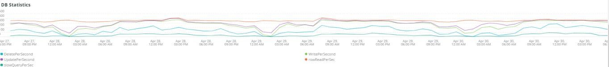

# The [!UICONTROL MySQL] tab

## [!UICONTROL MySQL% free storage by node]

Många problem orsakas av att MySQL-lagringsutrymmet i det tilldelade lagringsutrymmet för MySQL (`datadir` MySQL-konfigurationsinställning, standard är `/data/mysql`) eller `tmpdir` tar slut på utrymme. Standardvärdet `tmpdir` (MySQL-inställning) är `/tmp`. The **[!UICONTROL MySQL% free storage by node]** bildrutan ser ut på `/, /tmp` (om det definieras som en separat montering) och `/data/mysql` procenttal för gratis lagring. Från och med MySQL version 5.7 (MariaDB version 10.2), okomprimerad `tmp` tabeller skrivs till en `tmp` tabellutrymme i `/data/mysql` i filen (ibtmp1). Filen utökas automatiskt utan gräns som standard. Eftersom det är ett tabellutrymme minskar det inte i storlek och återställs till 12 MB när MySQL startas om.

## [!UICONTROL MySQL Connections by Node]

The **[!UICONTROL MySQL Connections by Node]** bildrutan anger perioder med databasnodavbrott eller stora volymer anslutningar.

## [!UICONTROL MySQL Node Summary]

The **[!UICONTROL MySQL Node Summary]** tabellen visar information om databasnoder, till exempel programversion och instanstyp (storlek).

## [!UICONTROL Galera Number of Nodes in cluster]

The **[!UICONTROL Galera Number of Nodes in cluster]** bildrutan visar information från MySQL-loggarna. När noder ansluts och lämnar ett kluster visas endast meddelanden för den valda tidsramen. Om en nod lämnar klustret före tidsramen visas inget meddelande under tidsramen. Om du misstänker att databasen kanske inte kommer att vara i närheten av en nod kan du utöka tidsramen till en större period för att se om du kan se mer information. Om det finns information under tidsperioden som anger mindre än alla noder i [!DNL Galera] expanderar du tidsramen för att se om du kan avgöra när noden lämnade klustret.

## [!UICONTROL MySQL shutdowns and starts]

The **[!UICONTROL MySQL shutdowns and starts]** frame identifierar när en nod stängs av. The [!DNL Galera] noderna kommer att avlägsnas och tas bort från [!DNL Galera] nod. Detta resulterar vanligtvis i en omstart av MySQL-tjänsten.

## [!UICONTROL Galera log]

The **[!UICONTROL Galera log]** bildrutan visar antalet särskilda signaler från MySQL-loggarna som gäller [!DNL Galera] noder, deras lägen och lägesändringar för [!DNL Galera] kluster.

* &#39;%1047 WSREP har ännu inte förberett nod för programanvändning (%) som &#39;node_not_prep_for_use&#39;
* %\[ERROR\] WSREP: Det gick inte att läsa från: wsrep_sst_xtrabackup-v2%) som xtrabackup_read_fails
* %\[ERROR\] WSREP: Processen slutfördes med fel: wsrep_sst_xtrabackup-v2 %) som xtrabackup_compl_w_err
* &#39;%\[ERROR\] WSREP: rbr write fails%&#39;) as &#39;rbr_write_fails&#39;
* &#39;%self-leave%&#39;) som &#39;sgroups_node&#39;
* &#39;%members = 3/3 (join/total)%&#39;) as&#39;3of3&#39;
* &#39;%members = 2/3 (join/total)%&#39;) as&#39;2of3&#39;
* &#39;%members = 2/2%&#39;) as &#39;2of2&#39;
* %members = 1/2%) as &#39;1of2&#39;
* %members = 1/3%) as &#39;1of3&#39;
* %members = 1/1%) as &#39;1of1&#39;
* &#39;%\[Obs\] /usr/sbin/mysqld (mysqld 10).%&#39;) as&#39;sql_launch&#39;
* %Quorum: Ingen nod med fullständigt tillstånd:%) som no_node_count
* %WSREP: Medlem 0%) som mem_0
* %WSREP: Medlem 1.0%) som mem_1
* &#39;%WSREP: Medlem 2%&#39;) som &#39;medm2&#39;
* %WSREP: Synkroniserad med grupp, klar för anslutningar%) som klar
* %/usr/sbin/mysqld, Version:%) som mysql_launch_mysql.slow
* %\[Obs\] WSREP: Ny klustervy: globalt tillstånd:%) som galera_Cluster_view_chng

## [!UICONTROL Galera Log by Host]

The **[!UICONTROL Galera Log by Host]** bildrutan är densamma som **[!UICONTROL Galera log]** bildruta, förutom att den är bruten per nod för att hjälpa till med felsökning.

## [!UICONTROL Database performance]

The **[!UICONTROL Database performance]** bildrutan visar databasprestanda vid specifika begäranden. Du kan se varje mätresultat genom att klicka på dem i de färgade ikonerna nedanför diagrammet. Många av mätvärdena i [Övervaka prestanda för MySQL-databas med New Relic](https://newrelic.com/blog/how-to-relic/how-to-monitor-mysql) finns i den här bildrutan.

* Average(query.queriesPerSecond)
* Average(query.slowQueriesPerSecond)
* medel(db.createdTmpDiskTablesPerSecond)
* medel(db.createdTmpFilesPerSecond)
* medel(db.tablesLocksWaitPerSecond)
* medelvärde(db.innovativa.rowLockTimeAvg)
* medelvärde(db.innovdb.rowLockWitsPerSecond)

## [!UICONTROL Transaction Database Call Count]

The **[!UICONTROL Transaction Database Call Count]** bildrutan visar antalet databasanrop som görs av varje transaktionsfaktor. Det här verkar vara radfokuserat och inte programsatser.

## [!UICONTROL Cron_schedule table updates]

The **[!UICONTROL Cron_schedule table updates]** frame visar den maximala längden för databasuppdateringar av cron_schedule-tabellen för den valda tidsperioden.

## [!UICONTROL Slow Query Traces]

The **[!UICONTROL Slow Query Traces]** -bildrutan visar tabellen och begärantypen där det finns långsamma frågekalkeringar. En långsam frågespårning skapas för frågetransaktioner som tar längre tid än fem sekunder. Uppdateringsfrågorna är av betydelse för den här bildrutan. Om en tabell uppdateras av `UPDATE`, `DELETE`och `INSERT` -programsatser kan de låsa tabeller för en viss tidsperiod.

Jämn `SELECT` kan låsa rader om de används med FOR UPDATE.

## [!UICONTROL Datastore Operations tables]

## [!UICONTROL Cron table change]

The **[!UICONTROL Cron table change]** söker efter felmeddelanden om att &quot;det inte gick att hämta lås för kron-jobb:&quot; tillsammans med ett specifikt PHP-minnesfel och lås som innehåller `cron_schedule` tabell. Om `cron_schedule` tabellen är låst (t.ex. av `DELETE` som körs mot den) kommer andra crons att hindras från att köras.

## [!UICONTROL Deadlocks]

The **[!UICONTROL Deadlocks]** läser följande strängar från MySQL-loggarna:

* &#39;%PHP Allvarligt fel: Tillåten minnesstorlek på %&#39;) som php_mem_error
* %get lock; försök starta om transaktionen, frågan var: DELETE FROM \`cron_schedule%) as cron_sched_lock_del
* % lås för cron-jobb: indexer_reindex_all_invalid%) som lock_indexer_reindex_all_invalid%
* % lås för cron-jobb: cron_schedule%) som lock_cron_schedule
* % lås för kronjobb:%) som total_cron_lock
* &#39;%Allmänt fel: 1205 Lås timeout överskreds%&#39;) som &#39;sql_1205_lock&#39;
* &#39;%ERROR 1213 (40001): Det gick inte att låsa%) som sql_1213_lock
* %SQLSTATE[40001]: Serialiseringsfel: 1213 Deadlock found%) as &#39;sql_1213_lock2&#39;
* % lås för cron-jobb: indexer_update_all_views%) som lock_indexer_update_all_views
* % lås för cron-jobb: sales_grid_order_invoice_async_insert%) som lock_sales_grid_order_invoice_async_insert,
* % lås för cron-jobb: staging_remove_updates%) som lock_staging_remove_updates
* % lås för cron-jobb: sales_grid_order_shipping_async_insert%) som lock_sales_grid_order_shipping_async_insert
* &#39;% lås för cron-jobb: amazon_payments_process_queued_reviews%&#39;) som &#39;lock_amazon_payments_process_queued_reviews&#39;
* % lås för cron-jobb: sales_send_order_shipping_emails%) som lock_sales_send_order_shipping_emails
* % lås för cron-jobb: staging_synchronize_entities_period%) som lock_staging_synchronize_entities_period
* &#39;% lås för cron-jobb: indexer_clean_all_changelgos%&#39;) som &#39;lock_indexer_clean_all_changelgos&#39;
* &#39;% lås för cron-jobb: magento_målrule_index_reindex%&#39;) as &#39;lock_magento_målrule_index_reindex&#39;
* % lock för cron-jobb: newsletter_send_all%) as &#39;lock_newsletter_send_all&#39;
* % lock för cron-jobb: newsletter_send_all%) as &#39;lock_newsletter_send_all&#39;
* % lås för cron-jobb: sales_send_order_emails%) som lock_sales_send_order_emails
* % lås för cron-jobb: sales_send_order_creditmemo_emails%) som lock_sales_send_order_creditmemo_emails
* % lås för cron-jobb: sales_grid_order_creditmemo_async_insert%) som lock_sales_grid_order_creditmemo_async_insert
* % lås för kronjobb: bulk_cleanup%) som lock_bulk_cleanup
* &#39;% lås för kroniskt jobb: flush_preview_Qurites%&#39;) som &#39;lock_flush_preview_Quoters&#39;
* % lås för cron-jobb: sales_send_order_invoice_emails%) som lock_sales_send_order_invoice_emails
* % lås för cron-jobb: sales_send_order_invoice_emails%) som lock_sales_send_order_invoice_emails
* % lås för cron-jobb: captcha_delete_utgången_images%) som lock_captcha_delete_utgången_images
* &#39;% lås för kronjobb: magento_newrelicreporting_cron%&#39;) as &#39;lock_magento_newrelicreporting_cron&#39;
* % lås för cron-jobb: outdated_authentication_Failure_cleanup%) som lock_outdated_authentication_errors_cleanup
* % lås för cron-jobb: send_notification%) som lock_send_notification
* % lock för cron-jobb: magento_presentcardaccount_generage_codes_pool%) as &#39;lock_magento_presentcardaccount_generage_codes_pool&#39;
* % lock för cron-jobb: catalog_product_front_actions_flush%) as &#39;lock_catalog_product_front_actions_flush&#39;
* % lås för kron-jobb: mysqlmq_clean_messages%) som mysqlmq_clean_messages
* % lås för cron-jobb: catalog_product_attribute_value_synchronize%) som lock_catalog_product_attribute_value_synchronize
* &#39;% lås för cron-jobb: ddg_automation_importer%&#39;) som &#39;lock_ddg_automation_importer&#39;
* &#39;% lås för cron-jobb: ddg_automation_reviews_and_önsklist%&#39;) som &#39;lock_ddg_automation_reviews_and_önsklist&#39;
* &#39;% lås för cron-jobb: captcha_delete_old_try%&#39;) som &#39;lock_captcha_delete_old_try&#39;
* % lås för cron-jobb: catalog_product_outdated_price_values_cleanup%) som lock_catalog_product_outdated_price_values_cleanup
* % lås för kronjobb: customers_runner%) som lock_customers_runner
* % lås för cron-jobb: ddg_automation_customer_subscriber_gäst_sync%) som lock_ddg_automation_customer_subscriber_gäst_sync
* % lås för cron-jobb: get_amazon_capture_updates%) som lock_get_amazon_capture_updates
* % lås för cron-jobb: get_amazon_permission_updates%) som lock_send_get_amazon_permission_updates
* % lås för cron-jobb: temando_process_platform_events%) som lock_temando_process_platform_events
* &#39;% lås för cron-jobb: ddg_automation_status%&#39;) som &#39;lock_ddg_automation_status&#39;
* &#39;% lås för cron-jobb: ddg_automation_status%&#39;) som &#39;lock_ddg_automation_status&#39;
* % lås för kronijobb: sales_clean_orders%) som lock_sales_clean_orders
* % lås för cron-jobb: catalog_index_refresh_price%) som lock_catalog_index_refresh_price
* &#39;% lås för cron-jobb: magento_belöning_balance_warning_notification%&#39;) som &#39;lock_magento_gain_balance_warning_notification&#39;
* % lås för cron-jobb: analytics_update%) som lock_analytics_update
* &#39;% lås för cron-jobb: messagequue_clean_outdated_locks%&#39;) som &#39;lock_messagequue_clean_outdated_locks&#39;
* &#39;% lås för cron-jobb: messagequue_clean_outdated_locks%&#39;) som &#39;lock_messagequue_clean_outdated_locks&#39;
* % lås för cron-jobb: staging_apply_version%) som lock_staging_apply_version
* &#39;% lås för cron-jobb: magento_belöning_expirate_points%&#39;) som &#39;lock_magento_belöning_expir_points&#39;
* % lås för cron-jobb: yotpo_order_sync%) som lock_yotpo_yotpo_orders_sync
* % lås för cron-jobb: catalog_event_status_checker%) som lock_catalog_event_status_checker
* &#39;% lås för cron-jobb: ddg_automation_campaign%&#39;) som &#39;lock_ddg_automation_campaign&#39;
* % lås för kron-jobb: visitor_clean%) som lock_visitor_clean
* % lås för cron-jobb: scconnector_verify_website%) som lock_scconnector_verify_website
* % lås för cron-jobb: ddg_automation_email_templates%) som lock_ddg_automation_email_templates
* % lås för cron-jobb: aggregat_sales_report_order_data%) som lock_aggregat_sales_report_order_data
* % lås för cron-jobb: ddg_automation_catalog_sync%) som lock_ddg_automation

## [!UICONTROL DB Statistics]

The **[!UICONTROL DB Statistics]** bildrutan visar borttagningar, skrivningar, rader som har lästs, uppdateringar och långsamma frågor per sekund.

## [!UICONTROL Request frequency]

## [!UICONTROL Database Errors]

The **[!UICONTROL Database Errors]** bildrutan visar en mängd olika databaser [varningar och fel](https://mariadb.com/kb/en/mariadb-error-codes/):

* %Minnesstorleken som allokerats för den temporära tabellen är mer än 20 % av oskuld_buffer_size% som temp_tbl_buff_pool
* &#39;%\[ERROR\] WSREP: rbr write fails%&#39;) as &#39;rbr_write_fails&#39;
* %mysqld: Disken är full%) som disk_full
* %Error number 28%) as &#39;err_28&#39;
* %rollback%) som rollback
* &#39;%Foreign key constrafor table%&#39;) as &#39;foreign_key_constraint&#39;
* %Error_code: 1114%) as &#39;sql_1114_full&#39;&#39;%CRITICAL: SQLSTATE[HY000] [2006] MySQL-servern har gått bort%) som sql_borta
* %SQLSTATE[HY000] [1040] För många anslutningar%) som sql_1040
* %CRITICAL: SQLSTATE[HY000] [2002]%) som sql_2002
* %SQLSTATE[08S01]:%) som &#39;sql_1047&#39;
* &#39;%[Varning] Avbruten anslutning (%) som &#39;aborted_conn&#39;
* %SQLSTATE[23000]: Överträdelse av integritetsbegränsning:%) som sql_23000
* %1205 Lås timeout%) som sql_1205
* %SQLSTATE[HY000] [1049] Okänd databas%) som sql_1049
* %SQLSTATE[42S02]: Bastabell eller vy hittades inte:%) som sql_42S02
* &#39;%Allmänt fel: 114%&#39;) som &#39;sql_1114&#39;
* %SQLSTATE[40001]%) som sql_1213
* %SQLSTATE[42S22]: Kolumnen hittades inte: 1054 Okänd kolumn%) som sq1_1054
* %SQLSTATE[42000]: Syntaxfel eller åtkomstfel:%&#39;) as&#39;sql_42000&#39;
* %SQLSTATE[21000]: Kardinalitetsöverträdelse:%) som &#39;sql_1241&#39;
* %SQLSTATE[22003]:%) som sql_22003
* %SQLSTATE[HY000] [9000] Klient med IP-adressen %) som sql_9000
* %SQLSTATE[HY000]: Allmänt fel: 2014%) som sql_2014
* %1927 Anslutningen avbröts%) som sql_1927
* %1062 \[ERROR\] InnoDB:%) som sql_1062_e
* &#39;%&#39;[Anteckning] WSREP: Tömmer minnesmappning till disk..%) som mem_map_flush
* &#39;%Internal MariaDB error code: 1146%&#39;) as &#39;sql_1146&#39;
* &#39;%Internal MariaDB error code: 1062%&#39;) as &#39;sql_1062&#39; * &#39;%1062&#39; [Varning] InnoDB:%) som sql_1062_w
* &#39;%Internal MariaDB error code: 1064%&#39;) as &#39;sql_1064&#39;
* %InnoDB: Kontrollfel i filen %) som assertion_err
* %mysqld_safe Antal processer som körs nu: 0%) som mysql_oom
* &#39;%\[ERROR\] mysqld fick signal%&#39;) som &#39;mysql_sigterm&#39;
* %1452 Kan inte lägga till%) som sql_1452
* %ERROR 1698%) som sql_1698
* %SQLSTATE[HY000]: Allmänt fel: 3%) som cnt_write_tmp
* %Allmänt fel: 1 %) som sql_syntax
* %42S22%) som sql_42S22
* &#39;%InnoDB: Error (Duplicate key)%&#39;) as &#39;oidentidb_dup_key&#39; FROM Log TIMESERIES

## [!UICONTROL DB Error Table]

The **[!UICONTROL DB Error Table]** visas samma information som **[!UICONTROL Database Errors]** -bildrutan, men du kan se den efter nod och i tabellformat. Se [MariaDB-felkoder](https://mariadb.com/kb/en/mariadb-error-codes/) för mer information.

## [!UICONTROL Database Traces]

The **[!UICONTROL Database Traces]** -bildrutan visar databasspårningarna efter typ på den markerade tidslinjen.

## [!UICONTROL Database processes]

The **[!UICONTROL Database processes]** bildrutan visar databasprocesser, miljöer och nodidentifierare.

## [!UICONTROL MySQL Non-Sleeping Threads by Node]

The **[!UICONTROL MySQL Non-Sleeping Threads by Node]** -bildrutan visar anslutningstrådarna till databasen. Den här bildrutan visar de aktiva kopplingarna.

## [!UICONTROL MySQL Running and Sleeping Threads by environment]

The **[!UICONTROL MySQL Running and Sleeping Threads by environment]** -bildrutan visar både aktiva och inaktiva anslutningar till databasen. Om det finns anslutningar till databasen där långsamma frågor har gått in i viloläge, kommer det att finnas anslutningar i viloläge. Sömmande anslutningar kan vara databasfrågor som blockeras av låsta rader eller tabeller. De här sovande anslutningarna innehåller även PHP-arbetaranslutningar.

## [!UICONTROL MySQL mem used by node]

The **[!UICONTROL MySQL mem used by node]** bildrutan visar hur mycket minne som används av MySQL. På större platser kan den här bildrutan vara kontinuerliga fält med GB-minne som används.

## [!UICONTROL Database mysql-slow.log]

The **[!UICONTROL Database mysql-slow.log]** bildrutan visar frågesutdragstyperna som finns i `mysql-slow.log` över den valda tidsramen.
