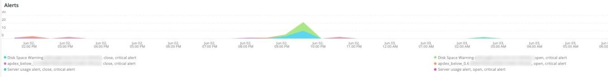

# Fliken [!DNL QuickView]

Fliken **[!UICONTROL QuickView]** förklarar de olika varningstyper som du kan se, inklusive de som ligger på låg diskutrymme och serveranvändning. Därefter beskrivs flikens ramar.

## [!UICONTROL Alerts]

Bildrutan **[!UICONTROL Alerts]** visar olika varningar, inklusive varningar om diskutrymme och serveranvändning, för en vald tidsram. Den här bildrutan tittar på databastabellåtgärder som omfattar `SELECT`, `DELETE` och `UPDATE` över en vald tidsram.

## [!UICONTROL Upsize / Downsize by node]

Bildrutan **[!UICONTROL Upsize / Downsize by node]** visar upp- och nedstorlekar per nod för en vald tidsram. Detta används för att utvärdera om det fanns en ändring i klusterstorleken under den valda tidsperioden.

## [!UICONTROL CPU Utilization]

Bildrutan **[!UICONTROL CPU Utilization]** visar CPU-användning i noder under den valda tidsramen.
