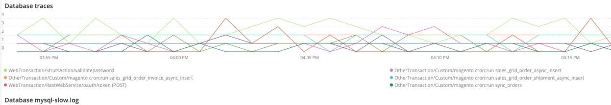

# The [!UICONTROL PHP] tab

The **PHP** Fliken visar PHP-processproblem för att ge en mer detaljerad analys av PHP-problem.

## [!UICONTROL PHP active process details]

The **[!UICONTROL PHP active process details]** bildrutan visar PHP-processerna, inklusive php-fpm, över den valda tidsramen.

## [!UICONTROL PHP process load (# of PHP processes and % of CPU load)]

The **[!UICONTROL PHP process load (# of PHP processes and % of CPU load)]** bildrutan visar processorbelastningen från PHP-FPM-processer under den valda tidsramen.

## [!UICONTROL PHP Memory detail]

The **[!UICONTROL PHP Memory detail]** bildrutan visar minnesanvändningen för PHP-processer under den valda tidsramen.

## [!UICONTROL PHP CPU Utilization]

The **[!UICONTROL PHP CPU Utilization]** bildrutan visar processoranvändningen i procent för PHP-processer under den valda tidsramen.

## [!UICONTROL PHP Process states]

The **[!UICONTROL PHP Process states]** bildrutan visar PHP-processlägena över den valda tidsramen. Den visas när PHP-processerna avslutas och startas om. Se upp för avslutade PHP-processer som inte visar omstarter.

* &#39;%OBS! Avslutar ...%&#39;) som &#39;php_term&#39;
* &#39;% MEDDELANDE: avslutar, hej då!%&#39;) som &#39;php_exit&#39;
* &#39;% MEDDELANDE: fpm körs, pid%) som fpm_start
* &#39;%OBS! ready to handle connections%&#39;) as &#39;php_ready&#39;

## [!UICONTROL PHP Errors]

The **[!UICONTROL PHP Errors]** antalet PHP-arbetarfel under den valda tidsramen. Felmeddelanden som tolkas och visas är:

* %worker_connections are not enough%) as &#39;worker&#39;
* &#39;%PHP Allvarligt fel: Tillåten minnesstorlek!%&#39;) som &#39;mem_size&#39;
* &#39;%11 (SIGSEGV)%&#39;) har avslutats som &#39;sig_11&#39;
* &#39;%utgick på signal 7 (SIGBUS)%&#39;) som &#39;sig_7&#39;
* %ökning pm.start_servers%) som pmstart_serv
* &#39;%max_children%&#39;) som &#39;max_children_cnt&#39;
* &#39;%PHP Allvarligt fel: Tillåten minnesstorlek på %) som mem_exhst_coun
* &#39;%Det gick inte att allokera minne för pool%&#39;) som &#39;opc_mem_count&#39;
* &#39;%Warning Interned string buffer overflow%&#39;) as &#39;opc_str_buf&#39;
* %Illegal string offset%) as &#39;opc_sv_comments&#39;
* &#39;%PHP Allvarligt fel: Ohanterat RedisException: läsfel vid anslutning%) som php_exc

## [!UICONTROL PHP processes count]

The **[!UICONTROL PHP processes count]** bildrutan visar antalet PHP-processer för den valda tidsramen.

## [!UICONTROL Database Errors]

The **[!UICONTROL Database Errors]** bildrutan visar databasfel i den valda tidsramen. Följande fel har tolkats:

* %Minnesstorleken som allokerats för den temporära tabellen är mer än 20 % av oskyldig_buffer_pool_size%) som temp_tbl_buff_pool
* %\[FEL\] WSREP: rbr write fails%) as &#39;rbr_write_fails&#39;
* %mysqld: Disken är full%) som disk_full
* &#39;%Error number 28%&#39;) as &#39;err_28&#39;
* %rollback%) som rollback
* &#39;%Foreign key constrafor table%&#39;) as &#39;foreign_key_constraint&#39;
* &#39;%Error_code: 1114%) som &#39;sql_1114_full&#39;
* %CRITICAL: SQLSTATE[HY000] [2006] MySQL-servern har gått bort%) som sql_borta
* %SQLSTATE[HY000] [1040] För många anslutningar%) som sql_1040
* %CRITICAL: SQLSTATE[HY000] [2002]%) som sql_2002
* %SQLSTATE[08S01]:%) som &#39;sql_1047&#39;
* &#39;%[Varning] Avbruten anslutning (%) som &#39;aborted_conn&#39;
* %SQLSTATE[23000]: Överträdelse av integritetsbegränsning:%) som sql_23000
* &#39;%1205 Lock wait timeout%&#39;) as &#39;sql_1205&#39;
* %SQLSTATE[HY000] [1049] Okänd databas%) som sql_1049
* %SQLSTATE[42S02]: Bastabell eller vy hittades inte:%) som sql_42S02
* &#39;%Allmänt fel: 1114%) som &#39;sql_1114&#39;
* %SQLSTATE[40001]%) som sql_1213
* %SQLSTATE[42S22]: Kolumnen hittades inte: 1054 Okänd kolumn%) som &#39;sq1_1054&#39;
* %SQLSTATE[42000]: Syntaxfel eller åtkomstfel:%) som sql_42000
* %SQLSTATE[21000]: Kardinalitetsöverträdelse:%) som sql_1241
* %SQLSTATE[22003]:%) som sql_22003
* %SQLSTATE[HY000] [9000] Klient med IP-adressen %) som sql_9000
* %SQLSTATE[HY000]: Allmänt fel: 2014%) som &#39;sql_2014&#39;
* %1927 Anslutningen avbröts%) som sql_1927
* &#39;%1062 \[ERROR\] InnoDB:%&#39;) som &#39;sql_1062_e&#39;
* &#39;%[Anteckning] WSREP: Tömmer minnesmappning till disk...%&#39;) som &#39;mem_map_flush&#39;
* %Internal MariaDB-felkod: 1146%) som &#39;sql_1146&#39;
* %Internal MariaDB-felkod: 1062%) som &#39;sql_1062&#39; * &#39;%1062 [Varning] InnoDB:%) som sql_1062_w
* %Internal MariaDB-felkod: 1064%) som &#39;sql_1064&#39;
* &#39;%InnoDB: Kontrollfel i filen %) som assertion_err
* &#39;%mysqld_safe Antal processer som körs nu: 0%) som mysql_oom
* &#39;%\[ERROR\] mysqld fick signal%&#39;) som &#39;mysql_sigterm&#39;
* &#39;%1452 Cannot add%&#39;) as &#39;sql_1452&#39;
* &#39;%ERROR 1698%&#39;) som &#39;sql_1698&#39;
* %SQLSTATE[HY000]: Allmänt fel: 3%) som cnt_write_tmp
* &#39;%Allmänt fel: 1 %) som sql_syntax
* &#39;%42S22%&#39;) som &#39;sql_42S22&#39;
* &#39;%InnoDB: Fel (dubblettnyckel)%&#39;) som &#39;oskuld_dup_key&#39;

## [!UICONTROL Database traces]

The **[!UICONTROL Database traces]** bildrutan visar databasspårningsinformation. Den här bildrutan justeras mot sammanfattningsvyn för APM-transaktioner för den valda tidslinjen.

## [!UICONTROL Database mysql-slow.log]

The **[!UICONTROL Database mysql-slow.log]** bildrutan visar frågesutdragstyperna som finns i `mysql-slow.log` över den valda tidsramen.
