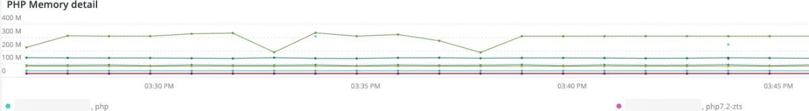
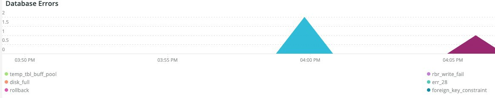

# Fliken [!UICONTROL PHP]

Fliken **PHP** visar PHP-processproblem som ger en mer detaljerad analys av PHP-problem.

## [!UICONTROL PHP active process details]

Bildrutan **[!UICONTROL PHP active process details]** visar PHP-processerna, inklusive php-fpm, över den valda tidsramen.

## [!UICONTROL PHP process load (# of PHP processes and % of CPU load)]

Bildrutan **[!UICONTROL PHP process load (# of PHP processes and % of CPU load)]** visar CPU-inläsningen från PHP-FPM-processer under den valda tidsramen.

## [!UICONTROL PHP Memory detail]

Bildrutan **[!UICONTROL PHP Memory detail]** visar minnesanvändningen för PHP-processer under den valda tidsramen.

## [!UICONTROL PHP CPU Utilization]

Bildrutan **[!UICONTROL PHP CPU Utilization]** visar CPU procentuella utnyttjande av PHP-processer under den valda tidsramen.

## [!UICONTROL PHP Process states]

Bildrutan **[!UICONTROL PHP Process states]** visar PHP-processlägena över den valda tidsramen. Den visas när PHP-processerna avslutas och startas om. Se upp för avslutade PHP-processer som inte visar omstarter.

* &#39;%OBS: Avslutar ...%&#39;) som &#39;php_term&#39;
* % MEDDELANDE: Avslutar, adjö!%&#39;) som &#39;php_exit&#39;
* % Obs! fpm körs, pid%) som fpm_start
* &#39;%NOTICE: ready to handle connections%&#39;) as &#39;php_ready&#39;

## [!UICONTROL PHP Errors]

Bildrutan **[!UICONTROL PHP Errors]** visar antalet PHP-arbetarfel under den valda tidsramen. Felmeddelanden som tolkas och visas är:

* %worker_connections are not enough%) as &#39;worker&#39;
* &#39;%PHP Allvarligt fel: Tillåten minnesstorlek!%&#39;) som &#39;mem_size&#39;
* %1 avslutades på signal 11 (SIGSEGV)%) som sig_11
* %1 avslutades på signal 7 (SIGBUS)%) som sig 7
* %ökning pm.start_servers%) som pmstart_serv
* &#39;%max_children%&#39;) som &#39;max_children_cnt&#39;
* %PHP Allvarligt fel: Tillåten minnesstorlek på %) som mem_exhst_coun
* &#39;%Det gick inte att allokera minne för pool%&#39;) som &#39;opc_mem_count&#39;
* &#39;%Warning Interned string buffer overflow%&#39;) as &#39;opc_str_buf&#39;
* %Illegal string offset%) as &#39;opc_sv_comments&#39;
* %PHP Allvarligt fel: Ohanterat RedisException: läsfel vid anslutning%) som php_exc

## [!UICONTROL PHP processes count]

Bildrutan **[!UICONTROL PHP processes count]** visar antalet PHP-processer under den valda tidsramen.

## [!UICONTROL Database Errors]

Ramen **[!UICONTROL Database Errors]** visar databasfel över den valda tidsramen. Tolkade fel:

* %Minnesstorleken som allokerats för den temporära tabellen är mer än 20 % av oskuld_buffer_size%) som temp_tbl_buff_pool
* &#39;%\[ERROR\] WSREP: rbr write fails%&#39;) as &#39;rbr_write_fails&#39;
* %mysqld: Disken är full%) som disk_full
* %Error number 28%) as &#39;err_28&#39;
* %rollback%) som rollback
* &#39;%Foreign key constrafor table%&#39;) as &#39;foreign_key_constraint&#39;
* &#39;%Error_code: 1114%&#39;) as &#39;sql_1114_full&#39;
* %CRITICAL: SQLSTATE[HY000] [2006] MySQL-servern har gått bort%) som sql_borta
* %SQLSTATE[HY000] [1040] För många anslutningar%) som sql_1040
* %CRITICAL: SQLSTATE[HY000] [2002]%) as &#39;sql_2002&#39;
* %SQLSTATE[08S01]:%) som sql_1047
* %[Varning] Avbruten anslutning%) som aborted_conn
* &#39;%SQLSTATE[23000]: Överträdelse av integritetsbegränsning:%&#39;) som &#39;sql_23000&#39;
* %1205 Lås timeout%) som sql_1205
* &#39;%SQLSTATE[HY000] [1049] Okänd databas%&#39;) som &#39;sql_1049&#39;
* %SQLSTATE[42S02]: Bastabellen eller vyn hittades inte:%) som sql_42S02
* &#39;%Allmänt fel: 114%&#39;) som &#39;sql_1114&#39;
* %SQLSTATE[40001]%) som sql_1213
* &#39;%SQLSTATE[42S22]: Det gick inte att hitta kolumnen: 1054 Okänd kolumn%) som &#39;sq1_1054&#39;
* %SQLSTATE[42000]: Syntaxfel eller åtkomstfel:%) som sql_42000
* &#39;%SQLSTATE[21000]: Kardinalitetsöverträdelse:%) som &#39;sql_1241&#39;
* %SQLSTATE[22003]:%) som sql_22003
* %SQLSTATE[HY000] [9000] Klient med IP-adressen %) som sql_9000
* %SQLSTATE[HY000]: Allmänt fel: 2014%) som sql_2014
* %1927 Anslutningen avbröts%) som sql_1927
* %1062 \[ERROR\] InnoDB:%) som sql_1062_e
* %[Obs!] WSREP: Tömmer minnesmappning till disk..%) som mem_map_flush
* &#39;%Internal MariaDB error code: 1146%&#39;) as &#39;sql_1146&#39;
* %Internal MariaDB-felkod: 1062%) som sql_1062 * &#39;%1062 [Varning] InnoDB:%&#39;) som &#39;sql_1062_w&#39;
* &#39;%Internal MariaDB error code: 1064%&#39;) as &#39;sql_1064&#39;
* %InnoDB: Kontrollfel i filen %) som assertion_err
* %mysqld_safe Antal processer som körs nu: 0%) som mysql_oom
* &#39;%\[ERROR\] mysqld fick signal%&#39;) som &#39;mysql_sigterm&#39;
* %1452 Kan inte lägga till%) som sql_1452
* %ERROR 1698%) som sql_1698
* %SQLSTATE[HY000]: Allmänt fel: 3%) som cnt_write_tmp
* %Allmänt fel: 1 %) som sql_syntax
* %42S22%) som sql_42S22
* &#39;%InnoDB: Error (Duplicate key)%&#39;) as &#39;oidentidb_dup_key&#39;

## [!UICONTROL Database traces]

Ramen **[!UICONTROL Database traces]** visar databasspårningsinformation. Den här bildrutan justeras mot sammanfattningsvyn för APM-transaktioner för den valda tidslinjen.

## [!UICONTROL Database mysql-slow.log]

Bildrutan **[!UICONTROL Database mysql-slow.log]** visar frågesatstyperna som fanns i filen `mysql-slow.log` över den valda tidsramen.
