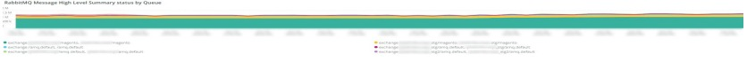

# The [!UICONTROL RabbitMQ] tab

The **[!UICONTROL RabbitMQ]** har information som är fokuserad på [!DNL RabbitMQ] signaler.

## [!UICONTROL RabbitMQ Infrastructure events]

The **[!UICONTROL RabbitMQ Infrastructure events]** bildruta visar infrastrukturshändelser som innehåller [!DNL RabbitMQ] som inträffade under den valda tidsramen:

* %Svar [fel] för nod [rabbit@host1]: oväntat http-svar från %) som &#39;unknown_resp_node1&#39;
* %Svar [fel] för nod [rabbit@host2]: oväntat http-svar från %) som &#39;unknown_resp_node2&#39;
* %Svar [fel] för nod [rabbit@host3]: oväntat http-svar från %) som &#39;unknown_resp_node3&#39;
* %Svar [fel] för nod [rabbit@host3]: Hämta &quot;http://localhost:15672/api/healthchecks/node/rabbit@host3&quot;: deadline för kontext har överskridits%) som node3_timeout_har överskridits
* %Svar [fel] för nod [rabbit@host1]: Hämta &quot;http://localhost:15672/api/healthchecks/node/rabbit@host1&quot;: deadline för kontext har överskridits%) som node1_timeout_har överskridits
* %Svar [fel] för nod [rabbit@host2]: Hämta &quot;http://localhost:15672/api/healthchecks/node/rabbit@host2&quot;: deadline för kontext har överskridits%) som node2_timeout_har överskridits
* &quot;%401 Unauthorized%&quot;) as &#39;401_unauth&#39;
* &#39;%401 Unauthorized%&#39;) as &#39;401_unauth&#39;
* %Tjänsten har startats om: rabbitmq-server%) as &#39;rmq_service_launch&#39;
* %Svar [misslyckades] för nod [rabbit@host1]: nodedown%) as &#39;rmq_node1_down&#39;
* %Svar [misslyckades] för nod [rabbit@host2]: nodedown%) as &#39;rmq_node2_down&#39;
* %Svar [misslyckades] för nod [rabbit@host2]: nodedown%) as &#39;rmq_node2_down&#39;
* %Entiteten har ändrats: exchange/bindings.destination%) as &#39;rmq_entity_modified&#39;
* %Entiteten har ändrats: exchange/bindings.destination%) as &#39;rmq_entity_modified&#39;
* %Entiteten har ändrats: queue/exclusive%&#39;) as &#39;rmq_entity_created_q_exclusive&#39;&#39;%Entity modified: queue/auto_delete%) as &#39;rmq_entity_q_delete&#39;
* %Entiteten har ändrats: queue/durable%&#39;) as &#39;rmq_entity_modified_q_durable&#39;
* %Entiteten har ändrats: version/management%&#39;) as &#39;rmq_entity_modified_ver_mgt&#39;
* %Entiteten har ändrats: version/management%&#39;) as &#39;rmq_entity_modified_ver_mgt&#39;

## [!UICONTROL RabbitMQ service start/stop signals]

Den här bildrutan visas [!DNL RabbitMQ] start-/stoppsignaler för tjänsten som inträffade under den valda tidsramen:

* &#39;%RabbitMQ har ombetts att stoppa..%&#39;) som &#39;kaninitmq_stop&#39;
* &#39;%Startar RabbitMQ%&#39;) som &#39;kanitmq_start&#39;

## [!UICONTROL RabbitMQ errors]

Den här bildrutan visas [!DNL RabbitMQ] fel som inträffade under den valda tidsramen:

* &#39;%exit med orsak {case_clause,timeout} och stacktrace {rabbit_mgmt_wm_hälsothchecks%&#39;} som &#39;exit_timeout&#39;
* %client oväntat stängd TCP-anslutning%) som client_closed_tcp_conn
* &#39;%vid odefinierad avslutning med orsak avstängning i kontextavstängning_error%) som &#39;undef_exit&#39;
* %Connection try from disallowed node%) as &#39;disallowed_node&#39;
* %closing AMQP connection%) as &#39;rmq_err_amqp_conn&#39;

## [!UICONTROL RabbitMQ node status]

* &#39;%kanin på nod rabbit@host1 ned%&#39;) som &#39;rmq_node1_down&#39;
* &#39;%kanin på nod rabbit@host2 ned%&#39;) som &#39;rmq_node2_down&#39;
* &#39;%kanin på nod rabbit@host3 ned%&#39;) som &#39;rmq_node3_down&#39;
* %rabbit på nod rabbit@host1 up%) as &#39;rmq_node1_up&#39;
* %rabbit på nod rabbit@host2 up%) as &#39;rmq_node2_up&#39;
* %rabbit på nod rabbit@host3 up%) as &#39;rmq_node3_up&#39;

## [!UICONTROL RabbitMQ Message High-Level Summary status by Queue]

The **[!UICONTROL RabbitMQ Message High-Level Summary status by Queue]** diagram visar antalet publicerade meddelanden i [!DNL RabbitMQ] kön för den valda tidsramen.

## [!UICONTROL RabbitMQ Message Detail Summary]

* &#39;%report.ERROR: Cron Job containers_runner har ett fel: NOT_FOUND - ingen kö%) som queue_err
* &#39;%report.ERROR: Cron Job containers_runner har ett fel: NOT_FOUND - ingen kö%) som queue_err
* %authenticated and granted access to vhost%&#39;) as &#39;auth&#39;
* %closing AMQP connection%) as &#39;close_conn&#39;

## [!UICONTROL RabbitMQ Queue Consumption MB]

The **[!UICONTROL RabbitMQ Queue Consumption MB]** diagram visar hur många byte som används av varje [!DNL RabbitMQ] kön över den valda tidsramen.

## [!UICONTROL RabbitMQ Published Messages by Queue]

The **[!UICONTROL RabbitMQ Published Messages by Queue]** diagram visar hur många byte som används av varje [!DNL RabbitMQ] kön över den valda tidsramen.

## [!UICONTROL RabbitMQ Published Message Throughput by Queue]

The **[!UICONTROL RabbitMQ Published Message Throughput by Queue]** diagram visar det genomsnittliga antalet publicerade meddelanden per sekund för varje [!DNL RabbitMQ] kön över den valda tidsramen.

## [!UICONTROL RabbitMQ Total Message Throughput by Queue]

The **[!UICONTROL RabbitMQ Total Message Throughput by Queue]** diagram visar det genomsnittliga totala antalet meddelanden per sekund för varje [!DNL RabbitMQ] kön över den valda tidsramen.

## [!UICONTROL RabbitMQ Consumers by Queue]

The **[!UICONTROL RabbitMQ Consumers by Queue]** diagram visar det genomsnittliga totala antalet konsumenter per [!DNL RabbitMQ] kön över den valda tidsramen.
