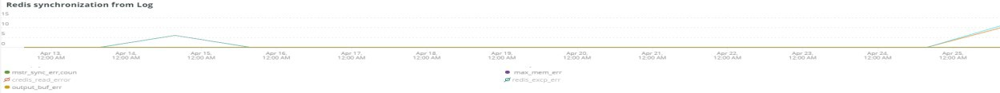

# The [!DNL Redis] tab

## [!UICONTROL Redis Node summary]

The **[!UICONTROL Redis Node summary]** innehåller alla noder i en miljö. Det här exemplet innehåller noderna för delad mellanlagring. Det finns en primär och två sekundära i produktionen och dessutom en primär och två sekundära i testperioden.

## [!UICONTROL Redis node detail]

The **[!UICONTROL Redis node detail]** bildruta visar miljön, [!DNL Redis] roll, programversion och nodstorlek.

## [!UICONTROL Redis node roles timeline]

The **[!UICONTROL Redis node roles timeline]** bildrutan visar förlusten av [!DNL Redis] i synnerhet roller. Om en rad försvinner visar det att den speciella roll som raden representerar har förlorat en eller flera noder.

## [!UICONTROL Connection to Redis]

The **[!UICONTROL Connection to Redis]** frame visar net.connectedClients-värdet från [!DNL New Relic Redis] exempeldata. Den visar antalet anslutningar med [!DNL New Relic] program (miljö) och nod.

## [!UICONTROL Commands per second by node]

The **[!UICONTROL Commands per second by node]** bildrutan visar [!DNL Redis] kommandon per nod per sekund över den valda tidsramen.

## [!UICONTROL Redis % of memory used]

The **[!UICONTROL Redis % of memory used]** bildrutan visar hur mycket av det maximala minnet som används av [!DNL Redis] servrar.

## [!UICONTROL Redis used memory]

The **[!UICONTROL Redis used memory]** bildrutan visar nodanvändningen för minne i GB/MB.

## [!UICONTROL Redis changes since last db save]

[!DNL Redis] är en minnesplats och sparar informationen i lagringsutrymmet. The **[!UICONTROL Redis changes since last db save]** bildrutan anger antalet minnesändringar som har gjorts sedan den senaste databasen sparades i lagringen. [Denna information](https://redis.io/docs/manual/persistence/) förklarar [!DNL Redis's] beständighet.

## [!UICONTROL Redis synchronization from Log]

The **[!UICONTROL Redis synchronization from Log]** bildrutan fokuserar på de fel som uppstår under [!DNL Redis] synkronisering eller fel som inträffar på grund av synkroniseringsproblem. Se [Redis Documentation](https://redis.io/docs/).
