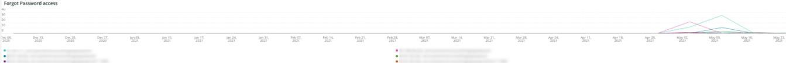

# The [!UICONTROL Security] tab

The **[!UICONTROL Security]** på fliken förklaras säkerhetsproblem och deras potentiella orsaker isoleras. Dessutom beskrivs bildrutorna på fliken.

## [!UICONTROL API calls by IP, details by URL]

The **[!UICONTROL API calls by IP, details by URL]** bildrutan visar ett antal API-anrop per IP för en vald tidsram. I den här bildrutan visas IP-adressen och API-URL:en som den IP-adressen användes till.

## [!UICONTROL Forgot Password]

The **[!UICONTROL Forgot Password]** åtkomstbildrutan visar antalet försök till glömt lösenord under en vald tidsram. Hög aktivitet mot en IP-adress kan vara en attack på webbplatsen.

## [!UICONTROL Create Account access]

The **[!UICONTROL Create Account access]** visas antalet nya kontoaktiviteter under en vald tidsram. Hög aktivitet från en enda IP-adress kan tyda på en attack.

## [!UICONTROL POST activities]

The **[!UICONTROL POST activities]** bildrutan visar `POST` aktiviteter för platsen, facetterade på `client_ip` från [!DNL Fastly] loggar. Den visar också den URL som är tillgänglig för IP-adressen.

## [!UICONTROL POST activities summary table]

The **[!UICONTROL POST activities summary table]** bildrutan visar sammanfattningen `POST` aktiviteter för platsen, facetterade på `client_ip` från [!DNL Fastly] loggar. Den visar även antalet för den URL som är tillgänglig för IP-adressen. Antalet gäller för den valda tidsramen.

## [!UICONTROL POST activities details table]

The **[!UICONTROL POST activities details table]** bildrutan visar `POST` aktiviteter för webbplatsen från [!DNL Fastly] loggar. Den visar även all information från [!DNL Fastly] logga för dessa förfrågningar. Den är begränsad till de senaste 2000 ansökningarna.

## [!UICONTROL Guest Carts activities]

The **[!UICONTROL Guest Carts activities]** Bildrutan visar antalet gästvagnsaktiviteter under en vald tidsram, uppdelat efter IP-adress och URL. Gästvagnar kan användas i en kardinfarkt. I den här bildrutan visas det totala antalet begäranden där gästvagnens URL:er är tillgängliga.

## [!UICONTROL API – forgot password, create account by Countries]

The **[!UICONTROL API – forgot password, create account by Countries]** visas antalet konton som skapats och begäranden om att återställa ett glömt lösenord under en vald tidsram. Det är även lättare att visa ursprungslandet för begäran. Denna ram fokuserar på det land som begäran kommer från.

## [!UICONTROL API - forgot password, create account by Countries and IP address]

The **[!UICONTROL API - forgot password, create account by Countries and IP address]** visas antalet konton som skapats och begäranden om att återställa ett glömt lösenord under en vald tidsram. Det är även lättare att visa IP-adressen, URL-adressen som används och ursprungslandet för begäran. Den här bildrutan fokuserar på antalet IP-adresser.

## [!UICONTROL Guest cart activities by IP]

The **[!UICONTROL Guest cart activities by IP]** bildrutan visar gästvagnsaktiviteter per IP under en vald tidsram.

## [!UICONTROL Guest cart activities by Countries]

The **[!UICONTROL Guest cart activities by Countries]** bildrutan visar gästvagnsaktiviteter per land under en vald tidsram.

