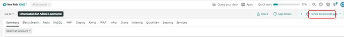

# Välj konto och tidsram:

Klicka på [!UICONTROL Observation for Adobe Commerce] -ikonen, [!DNL Observation for Adobe Commerce] nördleten öppnas.

1. Klicka på **Välj ett konto** nedrullningsbar meny. Om du inte ser **Välj ett konto** nedrullningsbar meny, du kanske inte har åtkomst. Klicka [här](https://adobe.sharepoint.com/sites/MG/it/IT%20Services%20Wiki/Requesting%20access%20to%20Magento%20Commerce%20New%20Relic.aspx) för att begära åtkomst.

   

1. Du kan klistra in project_id, skriva i [!DNL New Relic] kontonummer eller kontonamn, eller bläddra igenom listan med konton.

   

1. Klicka på **ljusblå** (i navelfönstrets övre högra hörn) rullgardinsmeny med klockikonen.

   

1. Du bör ange tiden före biljettens datumtid för att se om det fanns några föregående händelser/data. Du kan använda förinställda tidsramar till vänster eller ange en anpassad tidsram genom att markera **Ange anpassad**.
