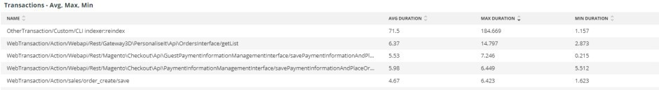

# The [!UICONTROL Summary] tab

The [!UICONTROL Summary] flik för [!DNL Observation for Adobe Commerce] är tänkt att snabbt se några av de problem som webbplatser har, så att du kan lösa dem automatiskt eller identifiera möjliga orsaker till platsproblem. De extra flikarna ger mer detaljerad information om komponenttjänster, databaser, infrastruktur och processlägen.

## [!UICONTROL Transaction Overview]

### [Vad är en transaktion?](https://docs.newrelic.com/docs/apm/transactions/intro-transactions/transactions-new-relic-apm/#:%7E:text=transactions%20are%20reported.-,What%20is%20a%20transaction%3F,work%20in%20a%20software%20application.&amp;text=For%20APM%2C%20it%20will%20Ofta,when%20the%20response%20is%20sent)

&quot;At [!DNL New Relic], definieras en transaktion som en logisk arbetsenhet i ett program. Det avser i synnerhet funktionsanrop och metodanrop som utgör den aktuella arbetsenheten. Det avser ofta en webbtransaktion, som representerar en aktivitet som inträffar när programmet tar emot en webbförfrågan när svaret skickas.&quot;

### Typer av transaktioner:

**Webb:** Webbtransaktioner initieras med en HTTP-begäran. För de flesta organisationer representerar dessa kundcentrerade interaktioner och är därför de viktigaste transaktionerna att övervaka.

**Ej webb:** Andra transaktioner än webbtransaktioner initieras inte med en webbförfrågan. De kan omfatta icke-webbarbetsprocesser, bakgrundsprocesser, skript, meddelandeköaktivitet och andra uppgifter.

Om du tittar på **[!UICONTROL Transaction Overview]** ovan fanns det nästan 53 000 transaktioner med ett genomsnittligt APDEX-poäng på 0,76, och 95 % av dessa transaktioner gjordes på under 2 313 sekunder. Detta är en bildruta där en tätare tidsram kan visa avvikelser från det aktuella genomsnittet om en APDEX-träff inträffar under en kort tidsram.

## [!UICONTROL 404 page errors frame]

The **[!UICONTROL 404 page errors]** ramlistor [URI](https://en.wikipedia.org/wiki/Uniform_Resource_Identifier) och antalet 404 sidfel för en vald tidsram.

## [!UICONTROL % of Storage Free frame]

The **[!UICONTROL % of Storage Free]** bildrutan visar den genomsnittliga procentandelen fritt lagringsutrymme över alla noder i klustret. Om du till exempel har ett kluster med tre noder visas \&lt;mount point=&quot;&quot;>, \&lt;environment name=&quot;&quot;>. Den här bildrutan kan vara bedräglig om det finns en varians över tre noder. Ett exempel på en avvikelse är om `/data/mysql` den kostnadsfria monteringspunkten var ett annat värde i det tre nodklustret. Det finns en ram under [!UICONTROL MySQL] som facetterar monteringspunkterna efter nodnamn för att mer exakt se vilka `/data/mysql` lagringsutrymme på varje nod är faktiskt fritt.

## [!UICONTROL % of system memory that is free frame]

The **% ledigt systemminne** bildrutan visar, per nod, mängden systemminne som är ledigt på varje nod.

## [!UICONTROL Swap memory free in bytes]

The **[!UICONTROL Swap memory free in bytes]** bildrutan visar, per nod, mängden SWAP-minne som är ledigt på noden.

## [!UICONTROL CPU % by host]

Sammanställningen av alla miljöer och noder visas i **[!UICONTROL CPU % by host]** bildruta. Du bör avmarkera icke-produktionsmiljöer. Observera även alla instanser där alla noder för produktionsmiljön inte finns. Mer tips om hög processoranvändning finns i [Felsöka prestanda med New Relic på Adobe Commerce](https://experienceleague.adobe.com/docs/commerce-knowledge-base/kb/troubleshooting/miscellaneous/troubleshoot-performance-using-new-relic-on-magento-commerce.html).

## [!UICONTROL Alerts during timeframe]

The **[!UICONTROL Alerts during timeframe]** visar alla varningar, inklusive [!UICONTROL Managed Alerts] som lagts till av Adobe Commerce support.

## [!UICONTROL CPU Usage]

Om **[!UICONTROL CPU Usage]** bildrutan är tom, det är en indikation på att infrastrukturtillämpningen av [!DNL New Relic] är inte aktiverat. Om din webbplats finns på Starter visas inte den här informationen. Öppna en [supportbiljett](https://experienceleague.adobe.com/docs/commerce-knowledge-base/kb/help-center-guide/magento-help-center-user-guide.html) att ha [!DNL New Relic Infrastructure] aktiverat för din webbplats.

## [!UICONTROL Average Response Time]

The **[!UICONTROL Average Response Time]** diagram visar den genomsnittliga svarstiden för transaktioner (webb och andra).

## [!UICONTROL Long duration cron_schedule updates]

The **[!UICONTROL cron_schedule]** tabellen skrivs i början och slutet av kronijobb. Kronjobb med lång varaktighet kan indikera fördröjning vid uppdatering av den här tabellen, vilket kan indikera kronstackning eller ett problem med schemalagda kroner.

## [!UICONTROL Response Code]

The **[!UICONTROL Response Code]** frame är en bra indikation på webbtrafik och svarskoden för förfrågningar. Det är [!DNL New Relic's] transaktionsdata, och de kan hanteras av `httpResponseCode` returnerat.

## [!UICONTROL Web Traffic volume compared with one week ago Magento Managed Alerts Information]

Den här bildrutan visar den jämförande webbtrafikvolymen för den senaste veckan och den aktuella veckan.

## [!UICONTROL Deployment Log Entries]

The **[!UICONTROL Deployment Log Entries]** bildrutan visar antalet distribuerings- och molnloggposter och antalet upphöjs efter distributionsloggens namn.

## [!UICONTROL Deployment State]

The **[!UICONTROL Deployment State]** bildrutan utnyttjar särskilda distributionsfaser från distributionsloggarna. Här är några exempel på faser som räknas i loggen och ansiktsnamnet:

**Distributionsloggfaser:**

* %Startar genereringskommando%) som start_gen
* &#39;%git apply /app/vendor/magento/ece-tools/patches%&#39;) as &#39;apply_patches&#39;
* %Set-flagga: .static_content_deploy%) som SCD
* &#39;%OBS: kommandot Generate slutfördes%&#39;) som &#39;gen_compl&#39;
* %OBS: Distributionen slutfördes%) som deploy_compl
* &#39;%OBS! Påbörjar efterdistribution.%) som start_pdeploy
* &#39;%OBS! Efterdistributionen är klar%&#39;) som &#39;pdeploy&#39;
* %deploy-complete%) som cl_deploy_compl

## [!UICONTROL IP Frequency]

The **[!UICONTROL IP Frequency]** bildrutan räknar (&#39;MISS&#39; och &#39;PASS&#39;)-status för varje IP-adress från [!DNL Fastly] loggar. Webbförfrågningar med dessa statusvärden når den ursprungliga servern och lägger till inläsning till servern. Den visar de tjugo översta adresserna i frekvens. Den här bildrutan kan användas för att identifiera IP-attacker eller källor med hög belastning på en webbplats.

## [!UICONTROL IP Response – top 20 URLs in duration]

The **[!UICONTROL IP Response – top 20 URLs in duration]** bildrutan visar URL-adresser med den längsta svarstiden. Det kan indikera stora bildfiler eller sidor, API eller sidor med den längsta svarstiden.

## [!UICONTROL API Calls by IP]

The **[!UICONTROL API Calls by IP]** frame hjälper till att identifiera tung trafik mot API:erna och IP-adresserna som gör förfrågningar från API-URL:erna.

## [!UICONTROL API Calls by IP, details by URL]

The **[!UICONTROL API Calls by IP, details by URL]** frame innehåller information om stor trafik mot API:erna och information om de URL:er som gör förfrågningarna.

## [!UICONTROL IP Frequency Rate per minute]

Ibland är det svårt att se vilken IP-adress som har flest förfrågningar på de andra bildrutorna. The **[!UICONTROL IP Frequency Rate per minute]** bildrutan visar hastigheten per minut per IP-adress.

## [!UICONTROL Potential Bots]

The **[!UICONTROL Potential Bots]** frame tittar på begäranden med ett request_user_agent-namn som NULL eller &#39;%bot%&#39;. Vanligtvis följer %bot%&#39; request_user_agent principinställningarna i `robots.txt` -fil.

## [!UICONTROL Transaction Errors]

The **[!UICONTROL Transaction Errors]** bildrutan visar antalet transaktionsfel från [!DNL New Relic].

## [!UICONTROL Nginx access by node]

The **[!UICONTROL Nginx access by node]** bildrutan tittar på antalet från `access.log` efter nod. Det är praktiskt att se om lasten är jämnt fördelad. Det visas ofta när en nod släpps. Bildrutan visar även inläsningen över webbplatsen.

## [!UICONTROL Galera Log]

[[!DNL Galera]](https://galeracluster.com/library/galera-documentation.pdf) används för databaskluster. Den här bildrutan fokuserar på särskilda signaler från [!UICONTROL Galera] kluster. Signalerna fokuserar på noder som kommer in i och avslutar klustret, vilket är ett normalt beteende för att upprätthålla databasens dataintegritet. Noderna hålls synkroniserade som [!UICONTROL Galera] klusterstatus ändras.

**Lista över [!UICONTROL Galera] lägesändringar:**

* &#39;%1047 WSREP har ännu inte förberett nod för programanvändning (%) som &#39;node_not_prep_for_use&#39;
* %\[ERROR\] WSREP: Det gick inte att läsa från: wsrep_sst_xtrabackup-v2%) som xtrabackup_read_fails
* %\[ERROR\] WSREP: Processen slutfördes med fel: wsrep_sst_xtrabackup-v2 %) som xtrabackup_compl_w_err
* &#39;%\[ERROR\] WSREP: rbr write fails%&#39;) as &#39;rbr_write_fails&#39;
* &#39;%self-leave%&#39;) som &#39;sgroups_node&#39;
* &#39;%members = 3/3 (join/total)%&#39;) som &#39;3of3&#39;
* &#39;%members = 2/3 (join/total)%&#39;) as &#39;2of3&#39;
* &#39;%members = 2/2%&#39;) as &#39;2of2&#39; * &#39;%members = 1/2%&#39;) as &#39;1of2&#39; * &#39;%members = 1/3%&#39;) as &#39;1of3&#39;
* %members = 1/1%) as &#39;1of1&#39;
* &#39;%\[Obs\] /usr/sbin/mysqld (mysqld 10).%) som sql_launch
* %Quorum: Ingen nod med fullständigt tillstånd:%) som no_node_count
* %WSREP: Medlem 0%) som mem_0
* %WSREP: Medlem 1.0%) som mem_1
* &#39;%WSREP: Medlem 2%&#39;) som &#39;medm2&#39;
* %WSREP: Synkroniserad med grupp, klar för anslutningar%) som klar
* %/usr/sbin/mysqld, Version:%) som mysql_launch_mysql.slow
* %\[Obs\] WSREP: Ny klustervy: globalt tillstånd:%) som galera_Cluster_view_chng

Dessa signaler kan tyda på problem med lagring, minne eller frågor om tillståndet ändras ofta.

## [!UICONTROL Database errors]

**Lista över databasfel eller meddelanden som har identifierats:**

* %Minnesstorleken som allokerats för den temporära tabellen är mer än 20 % av oskuld_buffer_size%) som temp_tbl_buff_pool
* &#39;%\[ERROR\] WSREP: rbr write fails%&#39;) as &#39;rbr_write_fails&#39;
* %mysqld: Disken är full%) som disk_full
* %Error number 28%) as &#39;err_28&#39;
* %rollback%) som rollback
* &#39;%Foreign key constrafor table%&#39;) as &#39;foreign_key_constraint&#39;
* &#39;%Error_code: 1114%&#39;) as &#39;sql_1114_full&#39;
* %CRITICAL: SQLSTATE\[HY000\] \[2006\] MySQL server har gått bort%) som sql_borta
* %SQLSTATE\[HY000\] \[1040\] För många anslutningar%) som sql_1040
* %CRITICAL: SQLSTATE\[HY000\] \[2002\]%) as &#39;sql_2002&#39;
* &#39;%SQLSTATE\[08S01\]:%&#39;) som &#39;sql_1047&#39;
* %\[Warning\] Avbröt anslutningen%) som &#39;aborted_conn&#39;
* %SQLSTATE\[23000\]: Överträdelse av integritetsbegränsning:%) som sql_23000
* %1205 Lås timeout%) som sql_1205
* &#39;%SQLSTATE\[HY000\] \[1049\] Okänd databas%&#39;) som &#39;sql_1049&#39;
* &#39;%SQLSTATE\[42S02\]: Bastabellen eller vyn hittades inte:%) som &#39;sql_42S02&#39;
* &#39;%Allmänt fel: 114%&#39;) som &#39;sql_1114&#39;
* %SQLSTATE\[40001\]%) som sql_1213
* &#39;%SQLSTATE\[42S22\]: Kolumnen hittades inte: 1054 Okänd kolumn%) som &#39;sq1_1054&#39;
* %SQLSTATE\[42000\]: Syntaxfel eller åtkomstfel:%) som sql_42000
* &#39;%SQLSTATE\[21000\]: Kardinalitetsöverträdelse:%&#39;) som &#39;sql_1241&#39;
* &#39;%SQLSTATE\[2003\]:%&#39;) som &#39;sql_22003&#39;
* &#39;%SQLSTATE\[HY000\] \[9000\] Klient med IP-adress%&#39;) som &#39;sql_9000&#39;
* &#39;%SQLSTATE\[HY000\]: Allmänt fel: 2014%&#39;) som &#39;sql_2014&#39;
* %1927 Anslutningen avbröts%) som sql_1927
* %1062 \[\ERROR\] InnoDB:%) som sql_1062_e
* %\[Obs\] WSREP: Tömmer minnesmappning till disk..%) som mem_map_flush
* &#39;%Internal MariaDB error code: 1146%&#39;) as &#39;sql_1146&#39;
* &#39;%Internal MariaDB error code: 1062%&#39;) as &#39;sql_1062&#39; * &#39;%1062 \[Warning\] InnoDB:%&#39;) as &#39;sql_1062_w&#39;
* &#39;%Internal MariaDB error code: 1064%&#39;) as &#39;sql_1064&#39;
* %InnoDB: Kontrollfel i filen %) som assertion_err
* %mysqld_safe Antal processer som körs nu: 0%) som mysql_oom
* &#39;%\[ERROR\] mysqld fick signal%&#39;) som &#39;mysql_sigterm&#39;
* %1452 Kan inte lägga till%) som sql_1452
* %ERROR 1698%) som sql_1698
* %SQLSTATE\[HY000\]: Allmänt fel: 3%) som cnt_write_tmp
* %Allmänt fel: 1 %) som sql_syntax
* %42S22%) som sql_42S22
* &#39;%InnoDB: Error (Duplicate key)%&#39;) as &#39;oidentidb_dup_key&#39;

## [!UICONTROL Database traces]

The **[!UICONTROL Database traces]** bildrutan tittar på data från [sql-spår](https://docs.newrelic.com/docs/apm/transactions/transaction-traces/transaction-traces-database-queries-page/) enhet [!DNL New Relic] och returnerar spårningens sökväg.

## [!UICONTROL Database mysql-slow.log]

The **[!UICONTROL Database mysql-slow.log]** bildrutan innehåller ett antal poster i [mysql-slow.log](https://dev.mysql.com/doc/refman/5.7/en/slow-query-log.html) efter frågebegärandetyp. Den isolerar tidsramar som kan vara intressanta i mysql-slow.log (slow query log). Frågor om tabeller utan index eller frågor som uppdaterar stora tabeller kan blockera andra frågor.

## [!UICONTROL Redis synchronization from Log]

[[!DNL Redis]](https://redis.io/docs/about/) är ett databasarkiv med öppen källkod (BSD-licensierad) i minnet som används som databas, cache och meddelandehanterare. Den kan utföra databas- och sessionscachning om den är konfigurerad. The **[!UICONTROL Redis synchronization from Log]** fokuserar bildrutan på [[!DNL Redis] synkronisering](https://redis.io/docs/manual/replication/). Ju större desto [!DNL Redis] datauppsättningen, desto större sannolikhet kommer det att uppstå problem med synkroniseringen (fler data att synkronisera).

**[!DNL Redis]fel och meddelanden:**

* %SLAVE-synkronisering: Det finns inget utrymme kvar på enheten%) som space
* %Server startad, Redis version%) som serv_start
* &#39;%Servern är nu klar att acceptera anslutningar%&#39;) som &#39;färdig&#39;
* &#39;%Anslutningen till huvuddatorn bröts.%&#39;) som &#39;mstr_loss&#39;
* &#39;%+nedåt sentinel%&#39;) som &#39;+sentinal&#39;
* &#39;%-sdown sentinel%&#39;) som &#39;-sentinal&#39;
* % nedåtgående slav %) som &#39;-slave&#39;, &#39;%+sdown slave%&#39;) som &#39;+slave&#39;
* %-failover-abort-not-selected master mymaster%) as -failover
* %+failover-abort-not-selected master mymaster%) as + failover
* %Partiell omsynkronisering är inte möjlig (ingen cachelagrad master)%) som part_sync_err
* %MASTER avbröt replikeringen med ett fel: ERR Can%) som mstr_sync_err
* %Master stöder inte PSYNC eller är i feltillstånd (%1) som mstr_psync_err
* %SLAVE-synkronisering: Slutfördes med success%) som slv_sync_suc
* %MASTER avbröt replikering med ett fel: ERR Can%) som mstr_sync_err,coun
* &#39;%OOM-kommandot tillåts inte när minne används%&#39;) som &#39; max_mem_err&#39;
* &#39;%CredisException(code: 0): läsfel i anslutning%&#39;) som &#39;credis_read_error&#39;
* %Uncaught RedisException:%) as &#39;redis_excp_err&#39;
* &#39;%psync schemalagd att stängas av ASAP för att täcka över utdatabufferten%&#39;) som &#39;output_buf_err&#39;

## [!UICONTROL PHP process states]

Hur PHP-processer fungerar beror på [konfiguration](https://www.php.net/manual/en/install.fpm.configuration.php). Konfigurationen är komplex, med många variabler och alternativ. The **[!UICONTROL PHP process states]** bildruta hjälper dig att förstå när PHP-processer avslutas och startas om.

### [!UICONTROL PHP errors]

The **[!UICONTROL PHP errors]** antalet PHP-fel med arbetare under den valda tidsramen. Mer information finns i [Adobe Commerce PHP-inställningar](../../installation/prerequisites/php-settings.md).

**PHP-fel och -meddelanden:**

* %worker_connections are not enough%) as &#39;worker&#39;
* &#39;%PHP Allvarligt fel: Tillåten minnesstorlek!%&#39;) som &#39;mem_size&#39;
* %1 avslutades på signal 11 (SIGSEGV)%) som sig_11
* %1 avslutades på signal 7 (SIGBUS)%) som sig 7
* %ökning pm.start_servers%) som pmstart_serv
* &#39;%max_children%&#39;) som &#39;max_children_cnt&#39;
* %PHP Allvarligt fel: Tillåten minnesstorlek på %) som mem_exhst_coun
* &#39;%Det gick inte att allokera minne för pool%&#39;) som &#39;opc_mem_count&#39;
* &#39;%Warning Interned string buffer overflow%&#39;) as &#39;opc_str_buf&#39;
* %Illegal string offset%) as &#39;opc_sv_comments&#39;
* %PHP Allvarligt fel: Ohanterat RedisException: läsfel vid anslutning%) som php_exc

## [!UICONTROL PHP processes]

[PHP-FPM](https://php-fpm.org/) är en [!UICONTROL FastCGI Process Manager] används av [!DNL Nginx]. Mer information om systemkrav finns i [Krav för PHP-versioner mappade till Adobe Commerce-versioner](../../installation/system-requirements.md). The **[!UICONTROL PHP processes]** bildrutan visar antalet PHP-processer som körs vid en viss tidpunkt på den valda tidslinjen.

## [!UICONTROL Secondary processes]

Sekundära processer kan påverka webbplatsens respons. The **[!UICONTROL Secondary processes]** bildruta anger en eller flera processer som kan lägga till inläsning på platsen. Databasen har i första hand de mest sekundära processerna som körs.

## [!UICONTROL Traffic vs Week Ago]

The **[!UICONTROL Traffic vs Week Ago]** läser webbplatsens trafik (förfrågningar) från [!DNL Fastly] loggar med cachestatus (&#39;MISS&#39;, &#39;PASS&#39;). De här förfrågningarna lägger till inläsning till de ursprungliga servrarna. Den här bildrutan visar den jämförande volymen för webbförfrågningar för den aktuella veckan och den senaste veckan under samma tidsram.

## [!UICONTROL Fastly Cache]

The **[!UICONTROL Fastly Cache]** bildrutan visar en sammanställd vy över cachestatus för begäranden från [!DNL Fastly] loggar. Om du väljer FEL visas procentandelen fel i begäran. Detta ökar vanligtvis när den ursprungliga servern inte svarar tillräckligt snabbt på sidförfrågningar.

## [!UICONTROL Page Rendering]

The **[!UICONTROL Page Rendering]** bildrutan visar den aktuella veckans genomsnittliga återgivningstid från sidvykällan för [!DNL New Relic] jämfört med föregående vecka under samma tidsperiod.

## [!UICONTROL Page loading detail]

The **[!UICONTROL Page loading detail]** frame beskriver sidans inläsningshändelser. Den beskriver innebörden av dessa aspekter. Här är frågan som körs för den här bildrutan:

`SELECT percentile(timeToResponseStart, 50) AS 'first byte', percentile(firstPaint, 50) as 'First paint', percentile(firstContentfulPaint, 50) as 'First contentful paint', percentile(timeToDomContentLoadedEventEnd, 50) AS 'DOM content loaded', percentile(duration, 50) AS 'Window load + AJAX' FROM BrowserInteraction TIMESERIES`

## [!UICONTROL Transactions – Avg, Max, Min]

Transaktionstiden är i sekunder. Beroende på transaktionen kan den påverka andra transaktioner om den är långvarig. De transaktioner som anges under namn och varaktighet gäller för den specifika tidsperioden. Om det finns en kortfattad tidsram för ett problem ändrar du storlek på [!DNL Observation for Adobe Commerce] datum-/tidsväljare till den smala tidsramen.

## [!UICONTROL Admin Activities]

The **[!UICONTROL Admin Activities]** bildruta identifierar transaktioner med en administratörsanvändare.

## [!UICONTROL Order transactions (default?)]

The **[!UICONTROL Order transactions (default?)]** ramutseenden för transaktioner `request.headers.host` från transaktioner, där namnet = `WebTransaction/Action/checkout/onepage/success`. Om orderns URL är en annan kommer den här bildrutan inte att ha några data.

## [!UICONTROL Elasticsearch Index information]

**[Statusen Elasticsearch:](https://www.elastic.co/guide/en/elasticsearch/reference/current/cluster-health.html)**

* Grön: Alla skuggningar tilldelas.
* Gult: Alla primära kort tilldelas, men en eller flera replikeringskort är inte tilldelade. Om en nod i klustret misslyckas kan vissa data vara otillgängliga tills den noden har reparerats.
* Röd: En eller flera primära kort är inte tilldelade, så vissa data är inte tillgängliga. Detta kan inträffa under klusterstart när primära kort har tilldelats.

## [!UICONTROL Elasticsearch Errors]

**[!DNL Elasticsearch]fel:**

* &#39;%all shards failed%&#39; as &#39;all_shards_failed&#39;
* &#39;%NoNodesAvailableException%&#39; som &#39;no_alive_nodes&#39;
* &#39;%PHP Allvarligt fel: Ohanterat fel: Felaktiga parametrar för Elasticsearch%&#39; som &#39;fel_param&#39;
* %Du kan åtgärda det här problemet genom att uppgradera tjänsten Elasticsearch i Magento Cloud-infrastrukturen till version % som ver_err
* &#39;%klusterhälsostatus har ändrats från \[YELLOW\] till \[RED\] (orsak:%) som &#39;yel_red&#39;
* &#39;%Inget utrymme återstår på enheten%&#39; som &#39;inget_utrymme&#39;
* &#39;% misslyckades med att köra [SearchRequest{searchType=%&#39; som &#39;failed_query&#39;

## [!UICONTROL Cron view]

The **[!UICONTROL Cron view]** bildrutan söker i kronloggen efter en balans mellan antalet påbörjade kroner och antalet färdiga kroner.

## [!UICONTROL Cron error]

**Kronfel från cron.log:**

* %_stg% som stg_crons
* %Could not obtain lock for cron job%&#39; as &#39;cron_lock&#39;
* &#39;%Allmänt fel: 2006 MySQL-servern har gått bort%&#39; som &#39;mysql_has_away&#39;
* &#39;%error%&#39; som &#39;error&#39;
* &#39;%Allmänt fel: 1205 Timeout för låsning överskreds%&#39; som sql_1205_cron

## [!UICONTROL cron_schedule table updates]

The **[!UICONTROL cron_schedule table updates]** bildrutan tittar på den maximala längden i sekunder där datalagrets operationsuppdateringar omfattar tabellen cron_schedule. Den är facetterad i SQL-begärandetypen.

## [!UICONTROL Datastore Operations Tables]

Detta **[!UICONTROL Datastore Operations Tables]** bildrutan visar de 25 viktigaste åtgärderna efter varaktighet, tabellnamn och SQL-begärandetyp. Håll pekaren över topparna för att se vilka tabeller som öppnats och av vilken typ av begäran det var.

## [!UICONTROL Cache Flush]

**Cache-tömningar har identifierats:**

* %config% som config_cache_flushed
* %layout% som layout_cache_flush
* %block_html% som block_html_cache_flush
* %collections% som collections_cache_flush
* &#39;%refling%&#39; som &#39;mirror_cache_flush&#39;
* %db_ddl% som db_ddl_cache_flush
* &#39;%compiled_config%&#39; som &#39;compiled_config_cache_flush&#39;
* %eav% som eav_cache_flush
* &#39;%customer_notification%&#39; som &#39;cust_notif_cache_flush&#39;
* %config_integration% som config_intg_cache_flush
* %config_integration_api% som config_integ_api_cache_flush
* %full_page% som full_page_cache_flush
* &#39;%config_webservice%&#39; som &#39;config_webserv_cache_flush&#39;
* %translate% som translate_cache_flush
