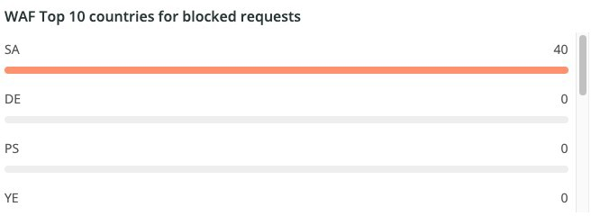
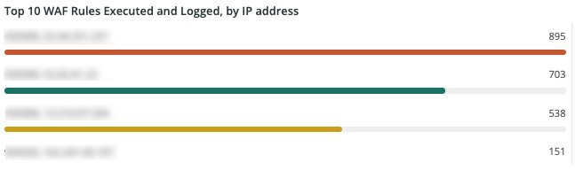
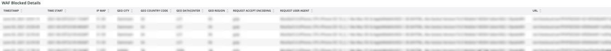

# Fliken [!DNL WAF]

Fliken **[!DNL WAF]** visar trafik som skickas och blockeras av [!DNL firewall].

## [!DNL WAF traffic summary]

Bildrutan **[!DNL WAF traffic summary]** visar antalet trafik som har passerat, loggats, blockerats och misslyckats av [!DNL firewall].

## [!DNL WAF Top 10 blocked IP Addresses]

Bildrutan **[!DNL WAF Top 10 blocked IP Addresses]** visar de 10 mest blockerade IP-adresserna av [!DNL firewall].

## [!DNL WAF Top 10 countries for blocked requests]

Bildrutan **[!DNL WAF Top 10 countries for blocked requests]** visar antalet blockerade begäranden för länder inom de 10 översta för blockerade begäranden från [!DNL firewall].

## [!DNL WAF Top 10 logged IP Addresses]

Bildrutan **[!DNL WAF Top 10 logged IP Addresses]** visar IP-adresser i de 10 mest loggade IP-adresserna av [!DNL firewall].

## [!DNL Top 10 WAF Rules Executed and Logged by IP address]

Bildrutan **[!DNL Top 10 WAF Rules Executed and Logged by IP address]** visar IP-adresser som finns i de 10 översta, oftast matchande [!DNL firewall]-reglerna.

## [!DNL WAF Logged Details]

Bildrutan **[!DNL WAF Logged Details]** visar begäranden som loggats av [!DNL firewall], inklusive information som tidsstämpel, ort, region och datacenter.

## [!DNL WAF Blocked Details]

Bildrutan **[!DNL WAF Blocked Details]** visar begäranden som blockerats av [!DNL firewall], inklusive information som tidsstämpel, ort, region och datacenter.
