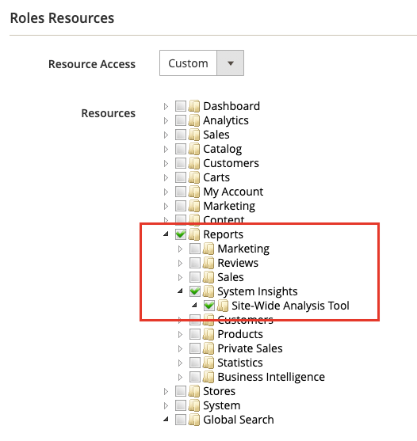
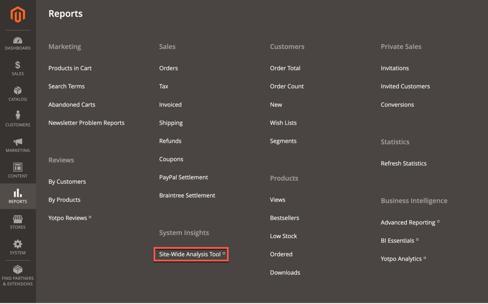

# Åtkomst till [!DNL Site-Wide Analysis Tool]

Du kan komma åt [!DNL Site-Wide Analysis Tool]-instrumentpanelen från butikens [!UICONTROL Admin Panel].

Tjänsten [!DNL Site-Wide Analysis Tool] är tillgänglig i [produktionsläge](https://experienceleague.adobe.com/sv/docs/commerce-admin/systems/tools/developer-tools#operation-modes) för [!UICONTROL Admin]-användare med behörighet att komma åt användarens [rollresurser](https://experienceleague.adobe.com/sv/docs/commerce-admin/systems/user-accounts/permissions-user-roles).

>[!NOTE]
>
>Från och med den 23 april 2024 har [!DNL Site-Wide Analysis Tool] tagits bort och är inte längre tillgänglig för Adobe Commerce lokala kunder.

*[!DNL Site-Wide Analysis Tool]Kontrollpanel*

>[!NOTE]
>
>Ditt konto bör ha rätt till **[!DNL Support Permissions]** för att få åtkomst till [!DNL Site-Wide Analysis Tool Dashboard].
>Mer information finns i [Dela ett [!DNL Commerce] konto](https://experienceleague.adobe.com/docs/commerce-admin/start/commerce-account/commerce-account-share.html?lang=sv-SE) i användarhandboken.

## Loggar in på [!DNL Site-Wide Analysis Tool Dashboard] från din butiks [!UICONTROL Admin Panel]

### Steg 1: Verifiera behörigheter

Kontrollera att användarkontot [!UICONTROL Admin] har behörighet att komma åt [!DNL Site-Wide Analysis Tool] via sin [tilldelade användarroll](https://experienceleague.adobe.com/sv/docs/commerce-admin/systems/user-accounts/permissions-user-roles).

>[!IMPORTANT]
>
>Rollresursen [!DNL Site-Wide Analysis Tool] (behörighet) är **inte** automatiskt tilldelad. Det MÅSTE aktiveras för användarrollen och den roll som tilldelas individuellt till varje användarkonto i [!UICONTROL Admin].

Gör följande för den anpassade rollen som behöver [!DNL Site-Wide Analysis Tool]-åtkomst:

1. Välj rollresursen **[!UICONTROL Reports]** > *[!UICONTROL System Insights]* > **[!UICONTROL Site-Wide Analysis Tool]**.

   
   *[!DNL Site-Wide Analysis Tool]behörighet har valts för rollen*

1. Klicka på **[!UICONTROL Save Role]**.

1. Meddela alla användare som har tilldelats den rollen att logga ut från [!DNL Admin] och logga in igen.

>[!NOTE]
>
>Om du har verifierat att användarkontot har behörighet att komma åt [!DNL Site-Wide Analysis Tool] och användaren får ett 403-fel när han/hon försöker komma åt verktyget från [!UICONTROL Admin], kan HTTP-åtkomstkontrollen vara aktiverad för din instans av Adobe Commerce i molninfrastrukturen. Instrumentpanelen [!DNL Site-Wide Analysis Tool] stöds INTE om du har aktiverat HTTP-autentisering. Mer information om hur du löser det här problemet finns i [supportartikeln](https://experienceleague.adobe.com/sv/docs/commerce-knowledge-base/kb/troubleshooting/miscellaneous/403-errors-when-accessing-site-wide-analysis-tool-on-magento).

### Steg 2: Åtkomst [!DNL Site-Wide Analysis Tool]

1. Gå till **[!UICONTROL Reports]** > *[!UICONTROL System Insights]* > **[!UICONTROL Site-Wide Analysis Tool]** på sidofältet *[!UICONTROL Admin]*.

   
   *[!DNL Site-Wide Analysis Tool]-plats i [!UICONTROL Admin Panel] i Adobe Commerce*

1. Läs *användningsvillkoren* för [!DNL Site-Wide Analysis Tool] och klicka på **[!UICONTROL Accept]** för att fortsätta.

   Varje användare måste godkänna användningsvillkoren för sessionen. Det här steget upprepas för varje inloggad session.

1. Klicka på den flik som du vill visa högst upp på kontrollpanelen.

   
   *[!DNL Site-Wide Analysis Tool]information*

## Generera rapporter från [!DNL Site-Wide Analysis Tool Dashboard]

1. Klicka på **[!UICONTROL Generate Report]** i det övre högra hörnet av instrumentpanelen.

1. Markera kryssrutan för varje **[!UICONTROL Type]**- och **[!UICONTROL Priority]**-inställning som du vill inkludera i rapporten.

1. Klicka på **[!UICONTROL Generate Report]**.

   
   *Rapportinställningar*

| TABB | BESKRIVNING |
| --- | --- |
| Kontrollpanel | Visar systemets hälsa med aktuella meddelanden och rekommendationer efter prioritet. |
| Information | Ger kundkontaktinformation och en sammanfattning av aktuella biljetter med detaljerad information om varje installerad Adobe Commerce-produkt. |
| Recommendations | Visar rekommendationer baserade på bästa praxis för att hantera problem som upptäcks på din plats. |
| Undantag | Visar en lista över fel som genererats av programmet och som orsakas av onormala förhållanden utan felhanterare. |
| Tillägg | Visar alla tillägg från tredje part och tredjepartsbibliotek. |

>[!NOTE]
>
>När du har tillämpat en rekommendation kan det ta några dagar innan den har uppdaterats i [!DNL Site-Wide Analysis Tool Dashboard] eller den genererade rapporten.
