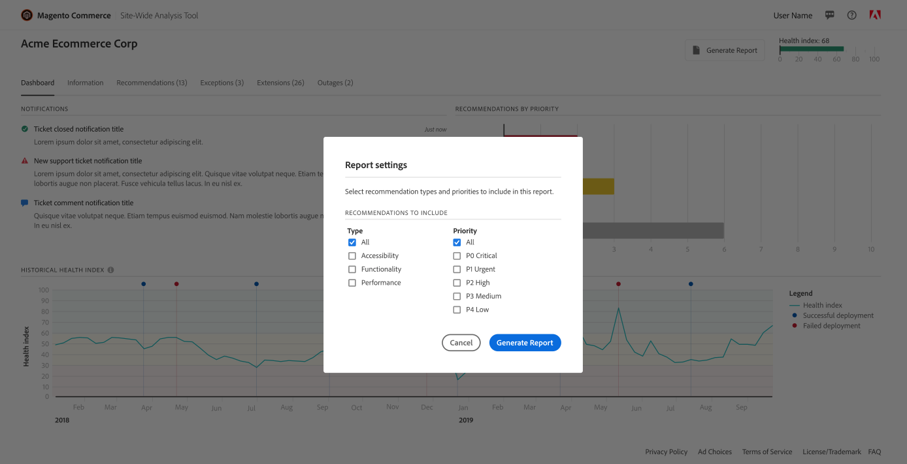

# Så här kommer du åt [!DNL Site-Wide Analysis Tool]

Det finns två sätt att komma åt [!DNL Site-Wide Analysis Tool Dashboard].

Du kommer åt [!DNL dashboard] från [[!DNL Site-Wide Analysis Tool] Webbplats](https://supportinsights.adobe.com/commerce) direkt **(endast för Adobe Commerce i molninfrastruktur)** och logga in med din Adobe ID eller få åtkomst via [!DNL dashboard] från din butik [!DNL Admin Panel].

The [!DNL Site-Wide Analysis Tool] tjänsten är tillgänglig i [produktionsläge](https://docs.magento.com/user-guide/magento/installation-modes.html) for [!DNL Admin] användare med behörighet att komma åt användare [rollresurser](https://docs.magento.com/user-guide/system/permissions-user-roles.html).

>[!NOTE]
>
>Om du har en lokal installation av Adobe Commerce måste du installera en [agent](../site-wide-analysis-tool/installation.md) på din infrastruktur för att använda verktyget.

*[!DNL Site-Wide Analysis Tool]Kontrollpanel*

## Alternativ 1: Logga in på [!DNL Site-Wide Analysis Tool Dashboard] direkt från [!DNL Site-Wide Analysis Tool] domän (endast för Adobe Commerce på molninfrastruktur)

An **[!DNL Adobe ID]krävs** för att få åtkomst till [!DNL Commerce] konto.
Om du redan har en [!DNL Commerce] men du har inget [!DNL Adobe ID]kan du skapa en under inloggningsprocessen.

1. Gå till [https://supportinsights.adobe.com/commerce](https://supportinsights.adobe.com/commerce).

1. Klicka på **[!UICONTROL Sign in with Adobe ID]** och följ anvisningarna.

   
   *[!DNL Adobe ID]inloggningsskärm*

1. Godkänn villkoren.

1. **<u>Anteckning</u>:** Ditt konto bör ha rätt till **[!DNL Support Permissions]** för att få tillgång till [!DNL Site-Wide Analysis Tool Dashboard].
Mer information finns i [Dela en [!DNL Commerce] konto](https://experienceleague.adobe.com/docs/commerce-admin/start/commerce-account/commerce-account-share.html) i vår användarhandbok.

## Alternativ 2: Logga in på [!DNL Site-Wide Analysis Tool Dashboard] från din butik [!DNL Admin Panel]

### Steg 1: Verifiera behörigheter

Verifiera att [!DNL Admin] användarkontot har behörighet att komma åt [!DNL Site-Wide Analysis Tool] genom [tilldelad användarroll](https://docs.magento.com/user-guide/system/permissions-user-roles.html).

>[!IMPORTANT]
>
>The [!DNL Site-Wide Analysis Tool] rollresurs (behörighet) är **not** automatiskt tilldelad. Det MÅSTE aktiveras för användarrollen och den roll som tilldelas individuellt till varje användarkonto i [!UICONTROL Admin].

För den anpassade roll som behöver [!DNL Site-Wide Analysis Tool] åtkomst, gör följande:

1. Välj **[!UICONTROL Reports]** > *[!UICONTROL System Insights]* > **[!UICONTROL Site-Wide Analysis Tool]** rollresurs.

   
   *[!DNL Site-Wide Analysis Tool]behörighet har valts för rollen*

1. Klicka **[!UICONTROL Save Role]**.

1. Meddela alla användare som har tilldelats den rollen att logga ut från [!DNL Admin]och logga in igen.

>[!NOTE]
>
>Om du har verifierat att användarkontot har behörighet att komma åt [!DNL Site-Wide Analysis Tool] och användaren får ett 403-fel när han/hon försöker komma åt verktyget från [!DNL Admin]kan din instans av Adobe Commerce i molninfrastrukturen ha HTTP-åtkomstkontroll aktiverad. The [!DNL Site-Wide Analysis Tool] Instrumentpanelen stöds INTE om du har aktiverat HTTP-autentisering. Mer information om hur du löser det här problemet finns i [Supportartikel](https://support.magento.com/hc/en-us/articles/360057400172-403-errors-when-accessing-Site-Wide-Analysis-Tool-on-Magento?_ga=2.168901729.117144580.1649172612-1623400270.1640858671).

### Steg 2: Åtkomst [!DNL Site-Wide Analysis Tool]

1. På *[!UICONTROL Admin]* sidebar, gå till **[!UICONTROL Reports]** > *[!UICONTROL System Insights]* > **[!UICONTROL Site-Wide Analysis Tool]**.

   
   *[!DNL Site-Wide Analysis Tool]plats i [!DNL Admin Panel] i Adobe Commerce*

1. Läs *Användarvillkor* för [!DNL Site-Wide Analysis Tool] och klicka **[!UICONTROL Accept]** för att fortsätta.

   Varje användare måste godkänna användningsvillkoren för sessionen. Det här steget upprepas för varje inloggad session.

1. Klicka på den flik som du vill visa högst upp på kontrollpanelen.

   
   *[!DNL Site-Wide Analysis Tool]information*

## Generera rapporter från [!DNL Site-Wide Analysis Tool Dashboard]

1. Klicka på i det övre högra hörnet av kontrollpanelen **[!UICONTROL Generate Report]**.

1. Markera kryssrutan för varje **[!UICONTROL Type]** och **[!UICONTROL Priority]** som du vill ta med i rapporten.

1. Klicka **[!UICONTROL Generate Report]**.

   
   *Rapportinställningar*

| TABB | BESKRIVNING |
| --- | --- |
| Kontrollpanel | Visar systemets hälsa med aktuella meddelanden och rekommendationer efter prioritet. |
| Information | Ger kundkontaktinformation och en sammanfattning av aktuella biljetter med detaljerad information om varje installerad Adobe Commerce-produkt. |
| Recommendations | Visar rekommendationer baserade på bästa praxis för att hantera problem som upptäcks på din plats. |
| Undantag | Visar en lista över fel som genererats av programmet och som orsakas av onormala förhållanden utan felhanterare. |
| Tillägg | Visar alla tillägg från tredje part och tredjepartsbibliotek. |

>[!NOTE]
>
>Efter att ha tillämpat en rekommendation kan det ta några dagar innan den har uppdaterats i [!DNL Site-Wide Analysis Tool Dashboard] eller genererad rapport.
