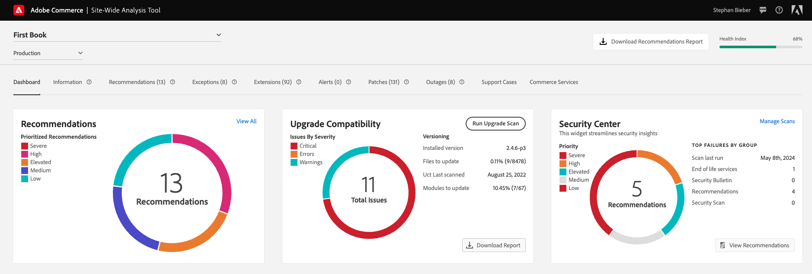

# [!DNL Site-Wide Analysis Tool]

>[!IMPORTANT]
>
>Från och med den 23 april 2024 kommer [!DNL Site-Wide Analysis Tool] att tas bort för alla Adobe Commerce lokala kunder.

Den här guiden ger en helhetsöversikt över [!DNL Site-Wide Analysis Tool]. Den beskriver användningsområdena, steg-för-steg-anvisningar för installation och hur du kommer åt verktyget.

## Vad är [!DNL Site-Wide Analysis Tool]?

[!DNL Site-Wide Analysis Tool] är ett proaktivt självbetjäningsverktyg och en central databas som innehåller detaljerade systeminsikter och rekommendationer för att säkerställa säkerheten och användbarheten för din Adobe Commerce-installation. Den ger prestandaövervakning, rapporter och råd i realtid dygnet runt alla dagar för att identifiera potentiella problem och bättre synlighet för webbplatsens hälsa, säkerhet och programkonfigurationer. Det minskar upplösningstiden och förbättrar webbplatsens stabilitet och prestanda.

>[!NOTE]
>
>[!DNL Site-Wide Analysis Tool] rapporterar om data på systemnivå. Rapporter om Adobe Commerce produkter, försäljning, marknadsföring och andra affärsprogramdata finns i [Adobe Commerce Reports](https://experienceleague.adobe.com/en/docs/commerce-admin/start/reporting/reports-menu).

{zoomable="yes"}

Se den här [introduktionsvideon](https://www.youtube.com/watch?v=KW2R8ki_RG4) om du vill veta mer.

## Verktygsöversikt

- **Instrumentpanel**
   - Visar den övergripande hälsan i systemet med meddelanden om identifierade problem och specifika rekommendationer efter prioritet. 
Den innehåller också ett historiskt diagram som visar hur webbplatsens hälsa förändras över tid.
   - Visar **[!UICONTROL Security Center Widget]** som ger dig åtkomst:
      - [Tech [!DNL Stack] Versionskompatibilitet med [!DNL end of life (EOL)]](https://experienceleague.adobe.com/docs/commerce-operations/installation-guide/system-requirements.html)
      - [Adobe säkerhetsbulletin](https://helpx.adobe.com/security/security-bulletin.html)
      - [Rekommendationer från  [!DNL Security Scan Tool]](https://experienceleague.adobe.com/docs/commerce-admin/systems/security/security-scan.html)
      - [[!DNL Site-Wide Analysis Tool] Rekommendationer för bästa praxis för säkerhet](https://experienceleague.adobe.com/docs/commerce-operations/tools/site-wide-analysis-tool/recommendations.html)

- **Information** - Tillhandahåller kundens kontaktinformation och en sammanfattning av aktuella biljetter med detaljerad information om varje installerad Adobe Commerce-produkt.

- **Rekommendationer** - Tillhandahåller ett [hälsoindexspår för SWAT](#swat-health-index.md) för att spåra webbplatsens hälsa och visar rekommendationer baserade på bästa praxis för att hantera problem som upptäcks på din webbplats:
   - För ändringar som kräver en infrastrukturuppdatering skickar du en supportförfrågan.
   - Gör ändringarna själv för ändringar som kräver en programuppdatering.
   - Om du vill göra ändringar som kräver manuell åtgärd, t.ex. en [koddistribution](https://experienceleague.adobe.com/docs/commerce-cloud-service/user-guide/architecture/pro-develop-deploy-workflow.html#deployment-workflow), ber du systemadministratören eller utvecklarna om hjälp.

- **Undantag** - Visar en lista över fel som uppstått i programmet och som orsakas av onormala förhållanden utan felhanterare.

- **Tillägg** - Visar alla tillägg från tredje part och tredjepartsbibliotek.

- **Patchar** - Integrerat med [!DNL Quality Patches Tool] och innehåller en lista med alla tillgängliga patchar som är specifika för din Adobe Commerce-instans.

## Integrering med andra Adobe Commerce supportverktyg

Se alla viktiga insikter om er webbplats på ett och samma ställe. [!DNL Site-Wide Analysis Tool] ger dig direktåtkomst till och information från [!UICONTROL Security Center Widget], [!DNL Upgrade Compatability Tool] och [!DNL Managed Alerts].

- **[!UICONTROL Security Center Widget]** - Visar säkerhetsinsikter för din webbplats. 
Säkerhetsinformationen som visas omfattar [&#x200B; Tech [!DNL Stack] Versionsefterlevnad med  [!DNL end of life (EOL)]](https://experienceleague.adobe.com/docs/commerce-operations/installation-guide/system-requirements.html), [Adobe Security Bulletin](https://helpx.adobe.com/security/security-bulletin.html), [Recommendations from the [!DNL Security Scan Tool]](https://experienceleague.adobe.com/docs/commerce-admin/systems/security/security-scan.html), and [[!DNL Site-Wide Analysis Tool] Best Practice Security Recommendations &#x200B;](https://experienceleague.adobe.com/docs/commerce-operations/tools/site-wide-analysis-tool/recommendations.html) . 
[[!DNL Security Scan Tool]](https://experienceleague.adobe.com/docs/commerce-admin/systems/security/security-scan.html) Förser Adobe Commerce- och Magento Open-Source-kunder med realtidsinsikter om butikens säkerhetsstatus genom att proaktivt identifiera skadlig kod och meddela dem om butiken är komprometterad.

- [**[!DNL Upgrade Compatability Tool]**](../../upgrade/upgrade-compatibility-tool/overview.md) - Kör Adobe Commerce anpassade instans mot måluppgraderingsversionen och returnerar en sammanfattning av kritiska problem, fel och varningar som måste åtgärdas, vilket gör uppgraderingsanalysen enklare, snabbare och billigare.

- [**[!DNL Managed Alerts]**](https://support.magento.com/hc/en-us/sections/360010758472-Managed-alerts-for-Adobe-Commerce) - Övervaka flera mätvärden för att proaktivt spåra plattformens prestanda och ge specifika instruktioner om hur man felsöker problem så att handlarna kan undvika allvarliga driftavbrott och hålla sig informerade om sin CPU, programprestanda, disk, minne och databas.

## Vem är den här guiden till?

Handlare och partners som vill ha större insyn i sina Adobe Commerce webbplatser. Det ger handlare möjlighet att förbättra sina kunders upplevelse och bättre anpassa sig till rekommendationerna om bästa praxis och till grundläggande frågor.

## [!DNL Site-Wide Analysis Tool] demo

Titta på den här videon om du vill veta mer om [!DNL Site-Wide Analysis Tool]:

>[!VIDEO](https://video.tv.adobe.com/v/344001?quality=12)
