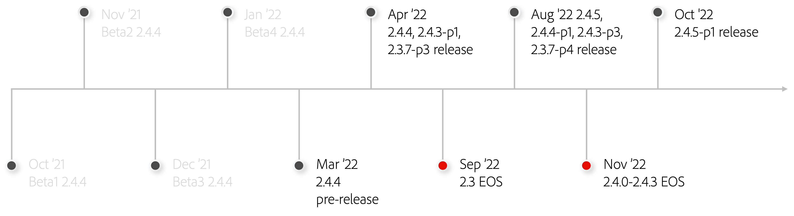

# Översikt över uppgraderingsprocessen

Det är viktigt att du uppgraderar ditt Adobe Commerce- eller Magento Open Source-projekt för att din butik ska vara säker, PCI-kompatibel och fungera med högsta effektivitet. Vi har tagit fram den här guiden för att vägleda dig genom de viktigaste sakerna att tänka på när du förbereder dig för en uppgradering.

Guiden ger en översikt över den typiska uppgraderingsresan mellan Adobe Commerce och Magento Open Source och de bästa sätten att följa under den resan. Den beskriver också den tekniska informationen i uppgraderingsprocessen med ett aktuellt exempel och stegvisa instruktioner för uppgradering till Adobe Commerce/Magento Open Source version 2.4.4. 2.4.4-patchversionen är allmänt tillgänglig den 8 mars 2022, så det är viktigt att du börjar förbereda dig för uppgraderingen tidigt eftersom [Slutet av livscykeln (EOL)](https://devdocs.magento.com/release/lifecycle-policy.html) datum närmar sig både 2.3-raden och 2.4.0-2.4.3 2022. Slutligen tillhandahåller vi planeringsresurser och uppgraderingsverktyg som gör uppgraderingsprocessen effektivare.

## Vem är den här guiden till?

Målgruppen för guiden är:

### E-handelsförvaltare och tekniska direktörer

Den här guiden hjälper kunder i dessa roller att förstå uppgraderingsresan, vikten av att uppgradera regelbundet samt hur man bäst planerar och förbereder sig för en uppgradering.

### Operations- och utvecklingsteam

Den här guiden hjälper dessa team att lära sig de tekniska steg som krävs för att uppgradera till 2.4.4 (eller valfri version av Adobe Commerce/Magento Open Source) och de verktyg de kan använda för att göra processen enklare, snabbare och mer prisvärd.

## Uppgraderingsprocessen förklaras

En av anledningarna till att du har valt Adobe Commerce/Magento Open Source:

- En mängd färdiga funktioner
- SaaS-funktioner som erbjuds separat från kärnkoden
- Robusta erbjudanden om Marketplace-tillägg
- Unik möjlighet att tillåta oändlig flexibilitet så att ni kan anpassa er webbplats så att den bäst passar ert företags och kunders behov.

Fördelen med att vara en mycket utbyggbar och anpassningsbar produkt kan dock ge upphov till potentiella uppgraderingsproblem när anpassningar inte är kodade enligt bästa praxis, vilket leder till högre uppgraderingskostnader än förväntat.

_Så.. varför uppgradera över huvud taget?_

Uppgraderingen ger er möjlighet att hålla er à jour med den snabba och ständigt föränderliga e-handelsindustrin och gör att plattformen alltid är kompatibel med de senaste funktionerna som hjälper er att maximera försäljningen och konverteringarna. Att inkludera uppgraderingar i dina vanliga underhållsplaner är också viktigt för att säkerställa att din butik förblir säker, PCI-kompatibel och fungerar maximalt effektivt.

### Säkerhet

Säkerhet är en av de främsta anledningarna till att uppgradera eftersom 83 % av säkerhetsincidenterna inträffar för inaktuell programvara. Enligt [IBM](https://www.ibm.com/security/data-breach)är den genomsnittliga kostnaden för en dataöverträdelse 3,86 miljoner dollar - mycket större än vad den kostar att minska denna risk genom uppgradering. Adobe erbjuder två sätt att skydda din butik under året:

- **Patch releases**- Inkludera säkerhets-, prestanda-, kvalitets- och högprioriterade felkorrigeringar.
- **Säkerhetsuppdateringar**- Lägg in korrigeringar och förbättringar som gör webbplatsen säker och enklare att implementera.

### Prestanda

Prestanda är en annan viktig orsak till uppgradering. Enligt [HubSpot](https://blog.hubspot.com/marketing/page-load-time-conversion-rates), har de första fem sekundernas laddningstid en betydande effekt på konverteringsgraden och därefter får varje sekund av fördröjning en -4,4 % effekt. Detta, tillsammans med det faktum att sidhastighet är en ledande SEO-rankningsfaktor, visar varför webbplatsprestanda är en viktig del av din webbplats att underhålla och regelbundet förbättra. Varje patch-release innehåller prestandaförbättringar, så att du kan utnyttja de nya releaserna och behålla företagets konkurrenskraft.

### Fördröjningskostnad

Att fördröja eller fördröja uppgraderingen av plattformen beror ofta på den omedelbara kostnaden. Den verkliga kostnaden för att köra en föråldrad version av en programvara är dock mycket större och kan ha en bestående inverkan på verksamheten.

Det kan verka kontraintuitivt, men att utföra regelbundna plattformsuppdateringar kräver mindre insatser totalt sett än att göra ovanliga uppdateringar på grund av den samlade tekniska skuld som uppstår till följd av försening. Vi arbetade nyligen tillsammans med en partner som har en återförsäljare som brukade göra uppgraderingar sällan och inkonsekvent (årligen eller längre). Genom att förändra hur de närmar sig uppgraderingar och efter att ha följt ett regelbundet uppgraderingssätt som rekommenderas av Adobe under en tolvmånadersperiod, kunde partnern spara sina kunder fyra veckors kumulativ utvecklingstid, arbetsinsats och därmed sammanhängande kostnader, som alla omdirigerades till initiativ som driver tillväxten i verksamheten.

När uppdateringarna utförs regelbundet blir ändringarna stegvisa och motsvarande uppgraderingsarbete speglar detta. När plattformsuppdateringar fördröjs under en längre period kan de bli mer involverade. Dessutom kan du använda tillägg från [Marketplace](https://marketplace.magento.com/) och andra integreringar med tredje part kan också påverkas. Slutligen förlängs den tid det tar att undersöka, planera och genomföra en försenad uppgradering, vilket ger oundvikliga kostnader.

Några av de allmänna faktorer som påverkar graden av arbete med att uppgradera ditt projekt är bland annat:

| Teknisk komplexitet | Planering och strategi |
|-----------------------------------------------------------|--------------------------------------------------------------|
| Omfattningen av anpassningar | Klarhet i krav, beslut om våglängd och krypande omfång |
| Antal tillägg | Din uppgraderingsfrekvens |
| Antal integreringar med tredje part (OMS, ERP) | Din teststrategi |
| Kodning enligt bästa praxis |  |

Den fortsatta tillväxten inom den digitala e-handeln har ökat trycket på företagen att utvecklas snabbare, oftare och på ett oförutsägbart sätt. Underlåtenhet att hålla jämna steg med och förutse kundernas köpbeteende har lett till lika konkurrensvillkor för även de största, mest etablerade varumärkena. Ni måste kunna leverera robusta, personaliserade upplevelser över alla kontaktytor, utan avbrott i prestanda och drifttid. Ni måste kunna förnya er snabbare, utan begränsningar, för att ligga steget före globala konkurrenter. Genom att uppgradera kan ni framtidssäkra er om er verksamhet och anpassa er till nya dynamiska kundbehov.

## 2022 års utgåva

Adobe publicerar en [publiceringsschema](https://devdocs.magento.com/release/) årligen för att underlätta handlarnas planeringsprocess och rekommenderar uppgradering av varje korrigeringsrelease-cykel. För att vara PCI-kompatibel måste handlarna finnas på den senaste patchen eller säkerhetsuppdateringen. I följande tidslinje visas de viktigaste utgivnings- och EOL-händelserna 2022.

Viktiga händelser att notera är:

- 2.3.x-serien når slutet av supporten (EOS) i september 2022
- 2.4.0 till 2.4.3 (baserat på PHP 7.4) når EOS i november 2022, när PHP 7.4 når slutet av livscykeln (EOL)
- Baserat på dessa två EOS-händelser **det är viktigt att uppgradera till version 2.4.4 eller senare före november 2022**
- I linje med Adobe Commerce [livscykelprincip](https://devdocs.magento.com/release/lifecycle-policy.html), version 2.4.4 och 2.4.5 får support- och säkerhetsuppdateringar av hög kvalitet fram till november 2024
