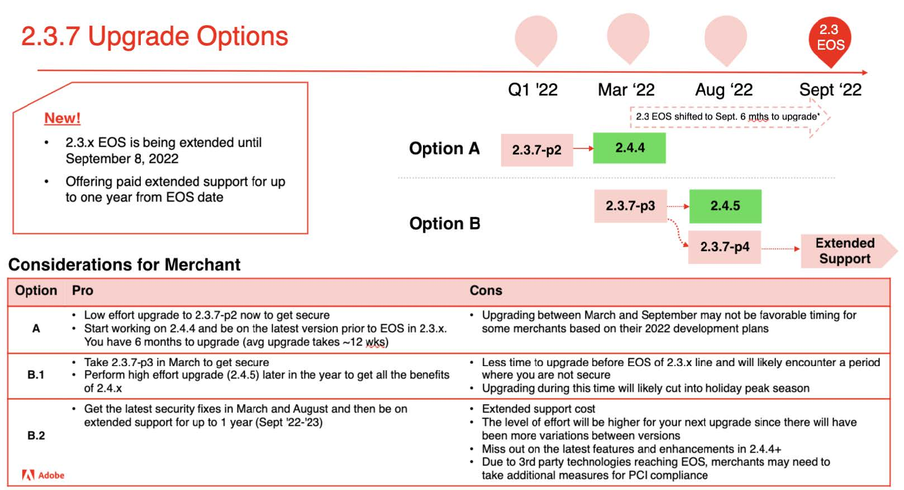

# Rekommenderade uppgraderingsalternativ för 2022

En e-handelsimplementering är en utveckling - den är aldrig riktigt färdig. Företaget måste ligga steget före trenderna genom att introducera de senaste funktionerna som håller kunderna engagerade. Uppgradera till Adobe Commerce 2.4.4 eller senare så kan du ligga steget före med innovationer i toppklass och framtidssäkra din verksamhet med:

- Snabbare åtkomst till innovativa funktioner som SaaS-tjänster ger
- Enklare och mer kostnadseffektivt underhåll och uppgraderingar
- Fortsatt flexibilitet och anpassning för unika affärsbehov
- Betydande prestandaökningar och skalbarhet
- Bättre upplevelser och verktyg för utvecklare
- Möjlighet till djupare integrering med andra Adobe Experience Cloud-program

För att ge våra handlare större flexibilitet när de planerar sin uppgradering till 2.4.4 eller högre uppdaterade vi nyligen vår [2022 års utgåva](https://devdocs.magento.com/release/), förlängde 2.3-datumet (End of Support, EOS) och presenterade nya utökade supportalternativ för utvalda versioner av vår programvara. Mer information om dessa uppdateringar finns i vår blogg.

Nedan följer Adobe Commerce rekommendationer om hur du kan uppgradera till 2.4.4 eller senare för att skydda din webbplats och prestanda samtidigt som du uppgraderar till en av de senaste versionerna.

## Uppgradera från version 2.3.6 och tidigare

## Uppgraderar från 2.3.7

## Uppgradera från 2.4.0 till 2.4.3

## Uppgraderar från 2.4.3 (eller nyuppgraderat)

