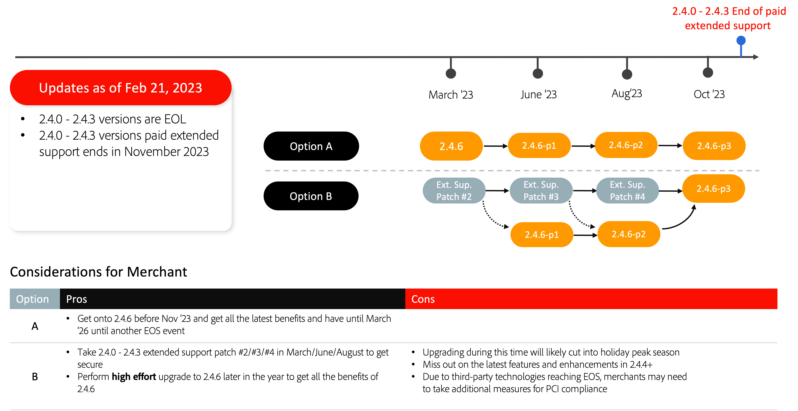

# Rekommenderade uppgraderingsalternativ

En e-handelsimplementering är en utveckling - den är aldrig riktigt färdig. Företaget måste ligga steget före trenderna genom att introducera de senaste funktionerna som håller kunderna engagerade. Uppgradera till den senaste Adobe Commerce-versionen så att du kan ligga steget före med innovationer i toppklass och framtidssäkra din verksamhet med:

- Snabbare åtkomst till innovativa funktioner som SaaS-tjänster ger
- Enklare och mer kostnadseffektivt underhåll och uppgraderingar
- Fortsatt flexibilitet och anpassning för unika affärsbehov
- Betydande prestandaökningar och skalbarhet
- Bättre upplevelser och verktyg för utvecklare
- Möjlighet till djupare integrering med andra Adobe Experience Cloud-program

För att ge våra handlare större flexibilitet vid planering av uppgraderingar har vi nyligen uppdaterat Adobe Commerce [publiceringsschema](../../release/schedule.md), förlängde 2.3-datumet (End of Support, EOS) och presenterade nya utökade supportalternativ för utvalda versioner av vår programvara. Mer information om dessa uppdateringar finns i [Utökat stöd för Adobe Commerce](https://business.adobe.com/blog/the-latest/adobe-announces-expanded-support).

Följande uppgraderingsalternativ rekommenderas av Adobe Commerce för att hålla webbplatsen säker och effektiv när du uppgraderar till en av de senaste versionerna.

## Uppgraderar från 2.3.7

## Uppgradera från 2.4.0 till 2.4.3

## Uppgradera från 2.4.4 och 2.4.5

