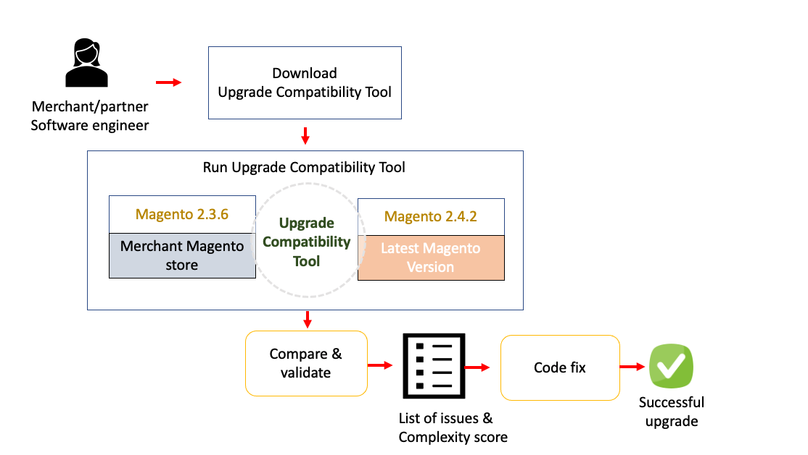

# Installera verktyget Kompatibilitet för uppgradering

Kompatibilitetsverktyget för uppgradering är ett kommandoradsverktyg som kontrollerar en Adobe Commerce-anpassad instans mot en viss version genom att analysera alla moduler som är installerade i den. Den returnerar en lista med fel och varningar som måste åtgärdas innan du uppgraderar till den senaste versionen av Adobe Commerce.

## Arbetsflöde

I följande diagram visas det förväntade arbetsflödet när verktyget Kompatibilitet för uppgradering körs:



## Vem är uppgraderingskompatibilitetsverktyget för?

Följande exempel beskriver den vanliga processen för en Adobe Commerce-partner att uppgradera en klientinstans:

1. En partners programutvecklare laddar ned Upgrade Compatibility Tool-paketet från [Adobe Commerce](https://repo.magento.com/) och kör det under betaversionen av den senaste Adobe Commerce-versionen. Se [Ladda ned uppgraderingskompatibilitetsverktyget](../upgrade-compatibility-tool/install.md#download-the-upgrade-compatibility-tool) för mer information.
1. Software Engineer genererar en vanilj-instans för den specifika version av Adobe Commerce som är installerad. Se [Contributor Guide](https://devdocs.magento.com/contributor-guide/contributing.html#vanilla-pr) för mer information om hur du använder `instance` för att generera en vaniljinstallation.
1. Software Engineer ser att det finns flera skräddarsydda områden som är brutna i inventerings- och katalogmodulerna och de får också ett komplexitetsmoment på X. Se [Utvecklare](../upgrade-compatibility-tool/developer.md) för mer information om komplexitetspoängen.
1. Med den här informationen kan programvaruutvecklaren förstå hur komplicerad uppgraderingen är och kan skicka informationen tillbaka till partnerns Account Manager.
1. Kontohanteraren skapar en tidslinje och en kostnad för uppgraderingen av Adobe Commerce, så att de kan få sina chefers godkännande.
1. Med programvarutillverkarens godkännande arbetar programvaruutvecklaren med de kodändringar som krävs för att åtgärda de trasiga modulerna.
1. Programvaruutvecklaren kör verktyget Kompatibilitet för uppgradering en gång till med en förhandsversion från Adobe Commerce för att säkerställa att det inte finns några nya problem och att deras kodändringar åtgärdade de problem som uppstod under betafasen.
1. Allt checkas ut och programvaruutvecklaren pushar koden till en staging-miljö där regressionstester bekräftar att alla tester är gröna, vilket gör att de kan släppa den senaste Adobe Commerce-versionen i produktion samma dag som Adobe Commerce-förhandsversionen släpps.

   

>[!NOTE]
>
>En vanilj-instans är en ren installation av en angiven versionstagg eller gren för en specifik version.

## Förutsättningar

Se [krav](../upgrade-compatibility-tool/prerequisites.md) för mer information.

>[!NOTE]
>
>Du kan köra verktyget Kompatibilitet för uppgradering i vilket operativsystem som helst. Du behöver inte köra verktyget Kompatibilitet för uppgradering där Adobe Commerce-instansen finns. Du måste ha tillgång till källkoden för Adobe Commerce-instansen för verktyget Kompatibilitet för uppgradering. Du kan till exempel installera verktyget på en server och peka det vid din Adobe Commerce-installation på en annan server.

Om du kör verktyget Kompatibilitet för uppgradering mot en Adobe Commerce-instans med stora moduler och filer kan det kräva mycket RAM-minne, minst 2 GB RAM.

### Rekommenderade åtgärder

Adobe Commerce bästa praxis rekommenderar att du undviker att ha två moduler med samma namn. Om detta inträffar visas ett segmenteringsfel i verktyget Kompatibilitet för uppgradering.

För att undvika det här felet bör du köra `bin` kommando med tillagt alternativ `-m`:

```bash
bin/uct upgrade:check /<dir>/<instance-name> --coming-version=2.4.1 -m /vendor/<vendor-name>/<module-name>
```

>[!NOTE]
>
>The `<dir>` värde är den katalog där din Adobe Commerce-instans finns.

The `-m` Med alternativet kan verktyget för kompatibilitet för uppgradering analysera varje specifik modul separat för att undvika att stöta på två moduler med samma namn i din Adobe Commerce-instans.

Med det här kommandoalternativet kan du även analysera en mapp som innehåller flera moduler med verktyget Kompatibilitet för uppgradering:

```bash
bin/uct upgrade:check /<dir>/<instance-name> --coming-version=2.4.1 -m /vendor/<vendor-name>/
```

Den här rekommendationen hjälper även till med minnesproblem som kan uppstå när verktyget för uppgraderingskompatibilitet körs.

## Ladda ned uppgraderingskompatibilitetsverktyget

Om du vill hämta verktyget för kompatibilitet vid uppgradering kör du följande kommando:

```bash
composer create-project magento/upgrade-compatibility-tool uct --repository https://repo.magento.com
```

## Installera

För att kunna installera verktyget Kompatibilitet för uppgradering måste du installera nödvändiga komponenter:

* Adobe Commerce åtkomstnycklar
* Disposition
* Node.js

### Adobe Commerce åtkomstnycklar

Du måste ha [Adobe Commerce åtkomstnycklar](https://devdocs.magento.com/marketplace/sellers/profile-information.html#access-keys) om du vill hämta och använda verktyget för kompatibilitetsuppgradering. Lägg till dina Adobe Commerce-nycklar i `auth.json` -fil, som finns på `~/.composer` som standard.

>[!WARNING]
>
>Kontrollera **COMPOSER_HOME** systemvariabel för att se var `auth.json` filen finns.

The **publik nyckel** motsvarar _användarnamn_ Med **privat nyckel** är _lösenord_:

### Exempel på Adobe Commerce åtkomstnycklar

```json
    "http-basic": {
        "repo.magento.com": {
            "username": "YOUR_MAGENTO_PUBLIC_KEY",
            "password": "YOUR_MAGENTO_PRIVATE_KEY"
        }
    },
```

### Disposition

Klona databasen för verktyget Kompatibilitet för uppgradering och kör `composer install` i terminalen för att installera beroenden.

>[!WARNING]
>
>Om **Adobe Commerce åtkomstnycklar** inte är korrekt konfigurerade installeras inte verktyget för kompatibilitetsuppgradering och du får felmeddelanden när du kör `composer install` -kommando.

### Node.js

Mer information om hur du installerar Node.js finns i Node.js [dokumentation](https://nodejs.dev/learn/how-to-install-nodejs).

## Tredjepartstillägg

Adobe rekommenderar att du kontaktar din tilläggsleverantör för att avgöra om tillägget är helt kompatibelt med Adobe Commerce 2.4.x.

Se [Kör verktyget](../upgrade-compatibility-tool/run.md) om du vill ha information om hur du kör verktyget Kompatibilitet för uppgradering.
