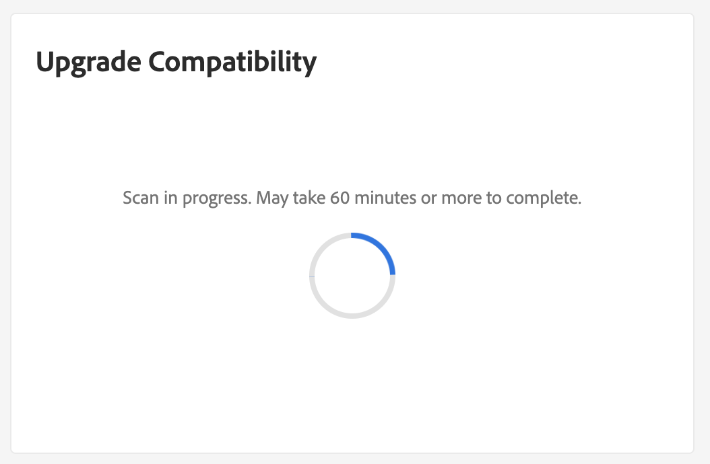

# Integrera [!DNL Site-Wide Analysis Tool]

The [!DNL Site-Wide Analysis Tool] tillhandahåller prestandaövervakning, rapporter och rekommendationer i realtid dygnet runt, alla dagar för att säkerställa säkerheten och användbarheten vid installation av Adobe Commerce.

The [!DNL Upgrade Compatibility Tool] är nu integrerat med [!DNL Site-Wide Analysis Tool] för att ge icke-tekniska personer möjlighet att [!DNL Upgrade Compatibility Tool] och få en [HTML rapport](https://experienceleague.adobe.com/docs/commerce-operations/upgrade-guide/upgrade-compatibility-tool/run.html?lang=en#output) innehåller en lista med problem för varje fil som anger hur allvarlig den är, felkod och felbeskrivning.

Se [[!DNL Site-Wide Analysis Tool] användarhandbok](https://docs.magento.com/user-guide/reports/site-wide-analysis-tool.html) för mer information.

## Kör [!DNL Upgrade Compatibility Tool] från SWAT

Navigera till [!DNL Site-Wide Analysis Tool] kontrollpanel för ditt projekt och leta upp [!DNL Upgrade Compatibility Tool] widget.

Klicka på **[!UICONTROL Run Upgrade Scan]**. Sökningen kan ta lite tid beroende på projektets storlek. En rotationsruta anger att sökningen pågår.

När skanningen är klar visas de högnivåresultat som visas i widgeten.

Klicka **[!UICONTROL Download Report]** för att hämta [!DNL Upgrade Compatibility Tool] HTML rapporterar och granskar detaljerna.
